 **Azure CAF & WAF & Landing Zone**

**Cloud Adoption Framework**

 

\- CAF helps organization on their cloud journey by aligning processes,
people and technology strategies. It is developed by Microsoft, partners
and customers guiding how set up Azure cloud in right way

\- It offers documentation, best practices, templates and also tools to
track progress of your cloud architecture deployment

 

 

CAF walks through following path.

 

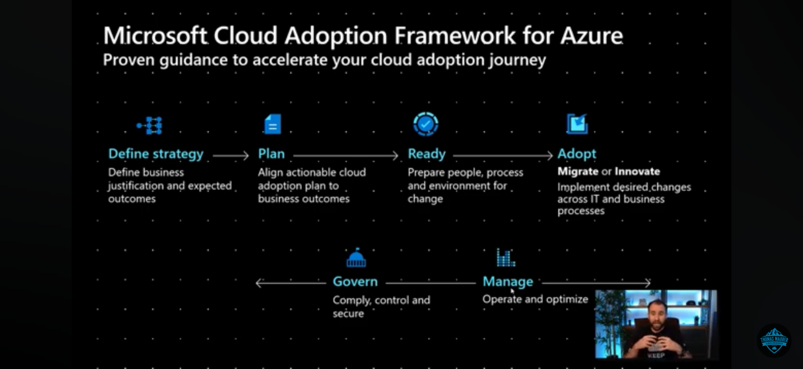

 

 

\- Define strategy - Define business justification and expected outcome

\- Plan - Align actionable cloud adoption plan to reach business outcome

\- Ready- Prepare people, process and environment for change

\- Adopt - Implement desired changes across IT and business processes

\- Manage - operate and optimize the cloud environment

\- Govern- Comply, control and secure

 

Define your strategy

 

\- Define and document your motivations

\- Document business outcomes

\- Evaluate financial considerations

\- Understand technical considerations

 

Make a plan

 

\- Inventory of the existing digital assets and workloads

\- Right people are involved in your migration efforts, both from a
technical and cloud governance standpoint

\- Build the skills they need to operate in the cloud.

\- Build a comprehensive plan that brings together the development,
operations

 

Ready your organization

 

\- Review the Azure setup guide tools and approaches you need to use to
create a landing zone

\- Build out the Azure subscriptions with cloud infrastructure as well
as governance, accounting, and security

\- Refine subscriptions

\- Best practices

 

Adopt the cloud

 

Migrate

 

\- Migrate your first workload

\- Migration scenarios

\- Check in with the Azure cloud migration best practices checklist

\- Identify ways to make the migration process scale

 

Innovate

 

\- New innovations add value to the business and meet customer needs

\- Use Azure innovation guide to build a minimum viable product (MVP)
for your idea

\- Verify your progress maps to recommended practices

\- Check frequently with customers that you're building what they need.

 

Govern and manage your cloud environments.

 

Govern

\- Methodology that incrementally takes you from your first steps to
full cloud governance

\- Use governance benchmark tool to assess your current state

 

 

 

**Azure Landing Zone**

 

You have to consider operating model to align with best landing zone
option.

 

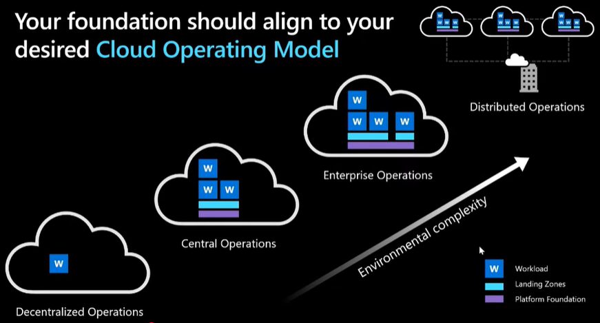

 

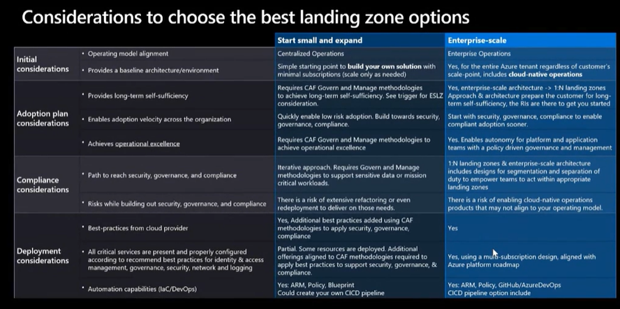

 

A landing zone is a pre-configured and secured environment for deploying
cloud resources, designed to provide a consistent and repeatable method
for managing cloud environments while ensuring compliance and security
against best-practices and needs of the Organization.

 

\- An Azure landing zone is an environment that follows key design
principles across eight design areas. These design areas are :

 

1\. Azure billing and Microsoft Entra tenant

2\. identity and access management

3\. management group and subscription organization

4\. network topology and connectivity

5\. security

6\. management,

7\. governance

8\. Platform automation and DevOps.

 

\- Modules make it easy to deploy and modify specific Azure landing zone
architecture components as your requirements evolve.

\- An Azure landing zone uses subscriptions to isolate and scale
application resources and platform resources. Subscriptions for
application resources are called application landing zones, and
subscriptions for platform resources are called platform landing zones.

 

**Platform landing zone**

 

\- Platform landing zones are subscriptions that provide shared services
(***identity, connectivity, management***) to applications in
application landing zones.

\- Consolidating these shared services often improves operational
efficiency.

\- In conceptual architecture, shows the "Identity subscription,"
"Management subscription," and "Connectivity subscription" represent
three different platform landing zones and representative resources and
policies applied to each platform landing zone.

 

**Application landing zone**

 

\- An application landing zone is a subscription for hosting an
application.

\- Provision application landing zone through code

\- use management groups to assign policy controls

 

There are three main approaches to managing application landing zones.
You should use one of the following management approaches depending on
your needs:

\- Central team approach

\- Application team approach

\- Shared team approach

 

 

**Hub & Spoke Architecture and Landing Zones**

 

We consider merging Hub & Spoke Architecture and Landing Zones together
in your cloud adoption

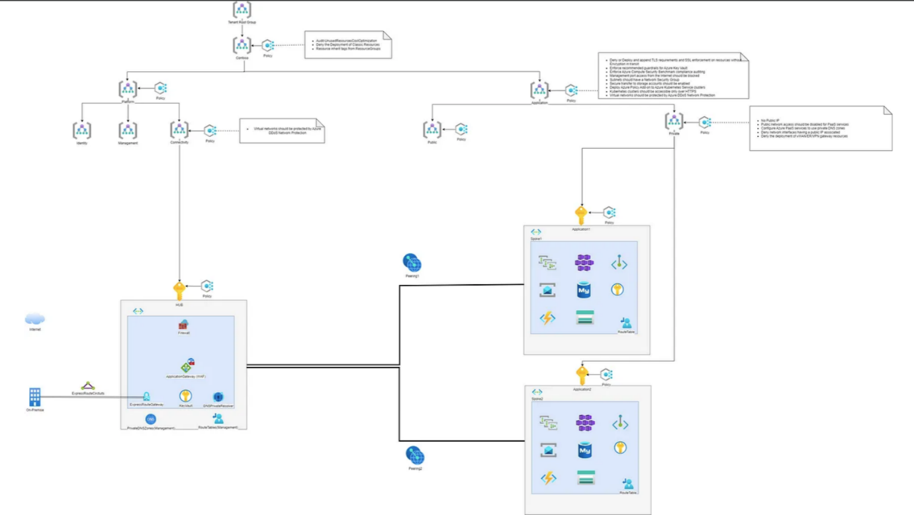

 

What is Hub & Spoke Architecture?

The Hub and Spoke is an architectural model in networks that allows you
to:

 

- Interconnect several networks (spokes) to each other through a central
  network (HUB)

- Interconnect on-premises infrastructure with cloud environment

- Interconnect multi-cloud environments (Azure, AWS, GCP, …)

 

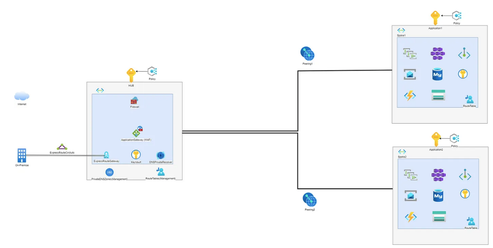

 

There are two types of networks:

 

- The ***HUB*** represents the central network and the point of
  aggregation and management of the traffic in order to connect in safe
  and controlled way the various networks (spokes, on-premise
  environment with spokes, multi-cloud environments, ..)

- ***Spokes*** represent peripheral networks and represent domains of
  specific responsibility. Each can therefore contain the resources
  specific to an application or in general a service (For example a
  spoke can be the PROD environment of a specific application)

 

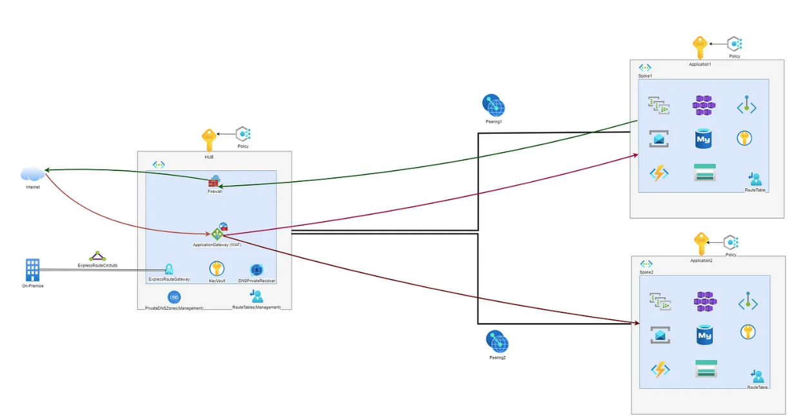

 

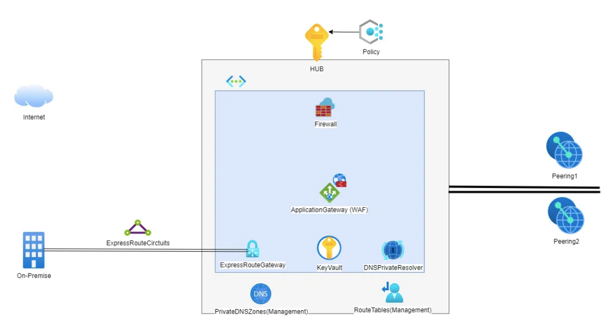

 

The HUB is generally made up of central and shared resources such as:

 

- The Azure Firewall

- The ExpressRoute/VPN Gateway

- NVA: Network Virtual Appliance

- Azure Application Gateway (WAF)

- DNS Forwarder

- Route Tables

- DNSPrivateResolver

- PrivateDNSZones

 

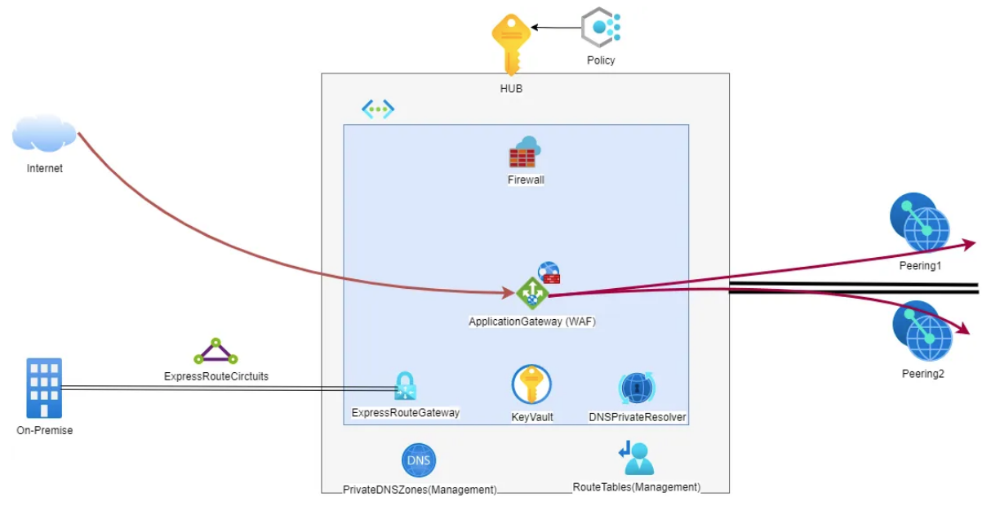

 

Inbound Traffic pass via central shared Application Gateway (WAF) in HUB
and goes to the spokes networks

 

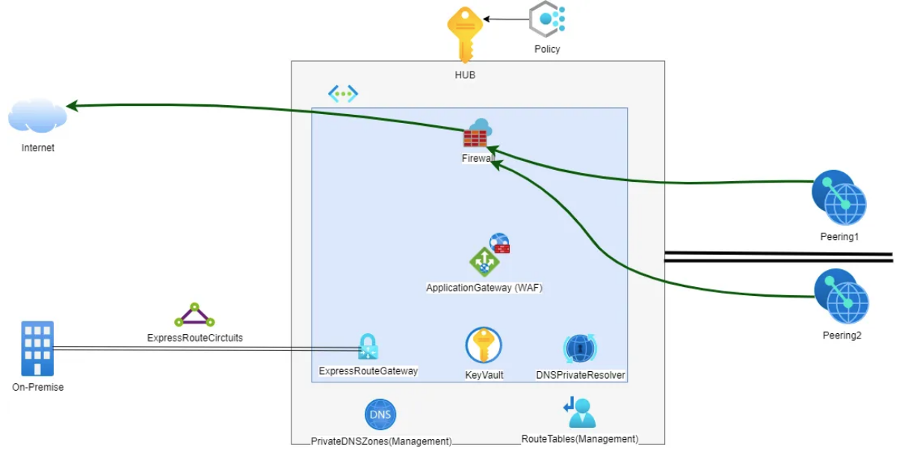

 

Outbound Traffic from spokes networks goes via central shared Firewall
in HUB

 

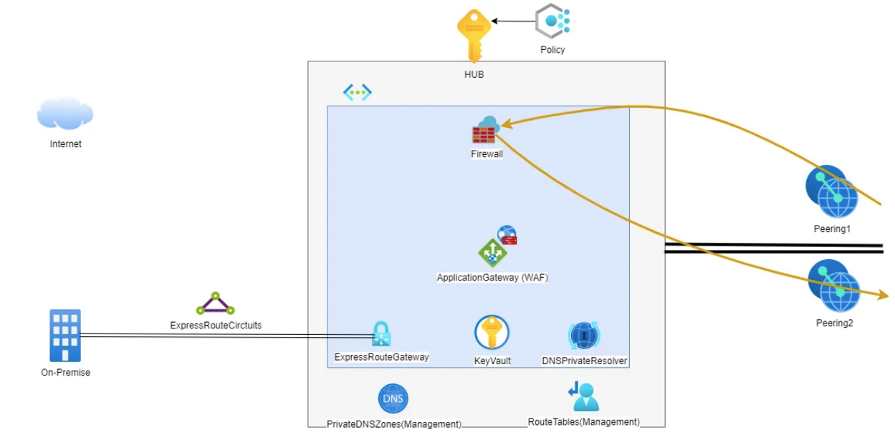

Communication between spokes networks goes via central shared Firewall
inside the HUB

 

The main advantages of HUB and Spoke architecture are:

 

- ***Centralized management:*** The HUB enables simplified management of
  network, security and connectivity policies, ***reducing complexity
  and improving operational efficiency***. acts as a central point for
  governance, administration and connectivity. It allows you to apply
  security and governance configurations and policies, as well as being
  the central point of monitoring network traffic.

- ***Isolation and Security***: Can Ensure connectivity only to the
  spoke and resources that need it, keeping the different spokes and
  resources that don’t need to be connected isolated and separated

- ***Scalability***: Easily add and remove spokes as needed

- ***Redundancy and resilience*** to ensure high availability of
  resources

- ***Separation of responsibilities***: The Hub and Spoke architecture
  allows to separate responsibilities between different applications and
  services. Each spoke can be managed independently and customized to
  meet the specific needs of the application or service.

- ***Cost-Saving***: Hosting central and shared resources allows sharing
  of these between different services, allowing you to save-cost
  compared to having dedicated instances for each service / application.

 

 

How does Hub & Spoke architecture integrate with Landing Zones on Azure?

 

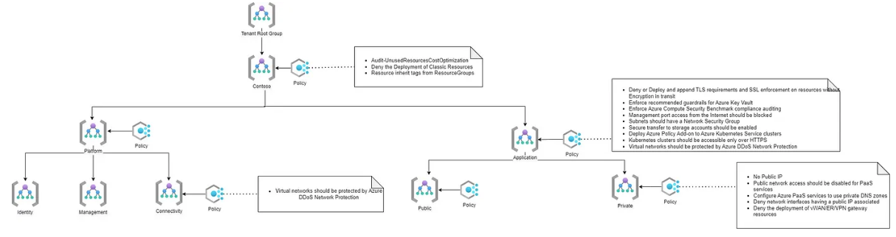

 

So, What is a Landing Zone?

 

A landing zone is a pre-configured and secured environment for deploying
cloud resources, designed to provide a consistent and repeatable method
for managing cloud environments while ensuring compliance and security
against best-practices and needs of the Organization.

 

Implementing a landing zone helps ensure that deployments in Azure meet
your organization’s security and compliance requirements, simplify
resource management, and improve application scalability and
flexibility.

 

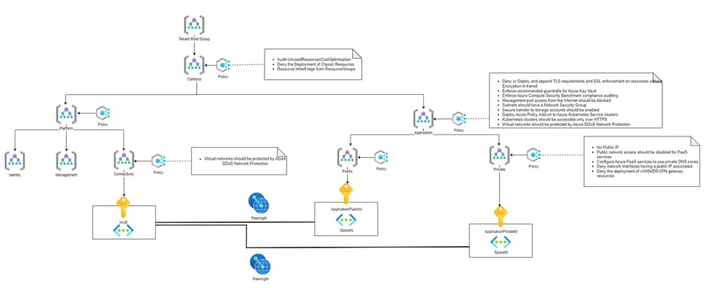

 

In addition, Landing Zones answer the question that we all ask ourselves
when a new project is about to be born: “And now where do I put it?”

Here the Landing Zones provide pre-configured “places”, each suitable to
accommodate a certain type of project.

 

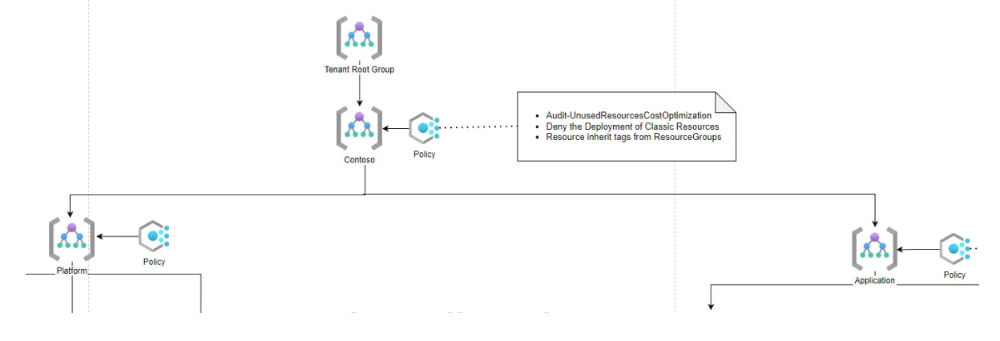

 

The Cloud Adoption Framework distinguishes two main macro landing zones:

 

***Platform***: A platform landing zone provides shared services
(identity, connectivity, management) to applications in application
landing zones.

 

***Application***: An application landing zone is designed to hosting an
application. Its can be divided by Public and Private Applications in
order to offer environment with different requirements. For example in
Private Application Landing Zone can’t be provisioned a Public IP
address.

 

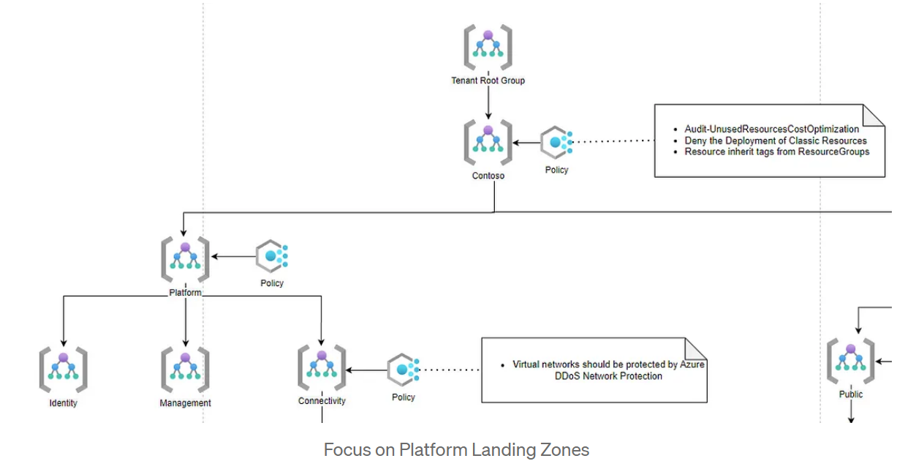

 

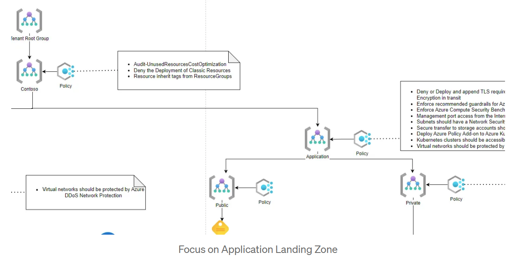

 

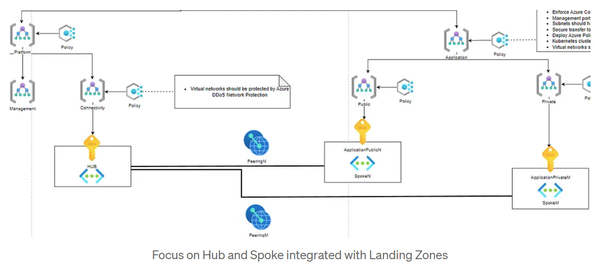

 

The Hub and Spoke architecture and Landing Zones of the Azure Cloud
Adoption Framework can be combined to provide a structured, modular and
scalable approach to the design, deployment and management of cloud
infrastructure in Azure. They enable centralized governance, separation
of responsibilities, standardization and flexibility in application
deployments:

 

***Centralized Governance***: Using the Hub and Spoke architecture with
the Azure Cloud Adoption Framework Landing Zones enables you to
implement centralized governance across your entire cloud
infrastructure. You can define and enforce security, compliance, and
resource management policies consistently across all spoke, while
maintaining flexibility for each Landing Zone.

 

***Separation of responsibilities***: Hub and Spoke architecture and
Landing Zones promote separation of responsibilities. The central hub
can be centrally managed by a team responsible for network
infrastructure and security policies, while the different spoke can be
assigned to specific application teams.

 

***Scalability and standardization***: The combination of Hub and Spoke
and Landing Zones enables greater scalability and standardization in
cloud infrastructure deployment. New spoke (Landing Zones) can be easily
added to the central hub to support new applications or teams, while
ensuring consistency in resource design and configuration.

 

***Hierarchical Structure***: The Hub and Spoke architecture defining a
hierarchical structure in which a central hub is connected to several
spoke, can be aligned with the Azure Cloud Adoption Framework Landing
Zones concepts, which provides an organizational structure for resources
and applications in Azure. Each spoke can represent a Landing Zone, so
an area dedicated to an application.

 

***Isolation and Modularity***: The Cloud Adoption Framework’s modular
and isolated Landing Zones infrastructure design approach aligns with
the Hub and Spoke, where each spoke represents an isolated entity with
its own resources, ensuring a clear separation of responsibilities
between teams.

 

Another useful Landing Zone that the Cloud Adoption Framework suggest to
implemented is a Sandbox landing zone:

 

 

 

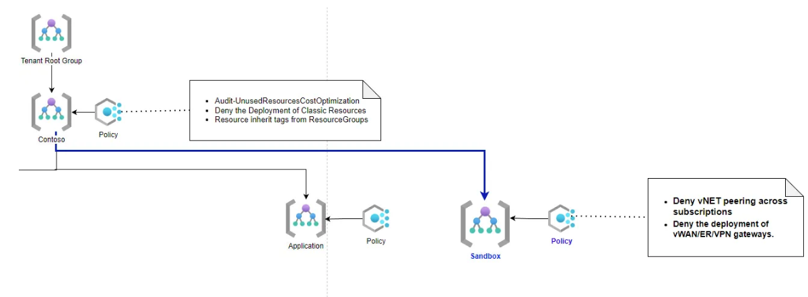

 

 

A sandbox is an isolated environment where you can test and experiment
without affecting other environments, like production, development, or
user acceptance testing (UAT) environments. (Microsoft Azure Docs)

 

These subscriptions will be securely isolated from the application
landing zones.

 

Sandbox environments are the best place for hands-on Azure learning.
Some use cases can include:

 

- A Cloud architect needs a sandbox environment to asses Azure solutions
  or conduct POCs for new projects

- A cloud engineer needs a sandbox environment to understand what
  happens when apply specific configuration on Azure Resources

- A developer wants to experiment with Azure resources for its
  application

 

<https://medium.com/@lupass93/hub-spoke-architecture-and-landing-zones-on-azure-cloud-ad2e1b11c55>

 

 

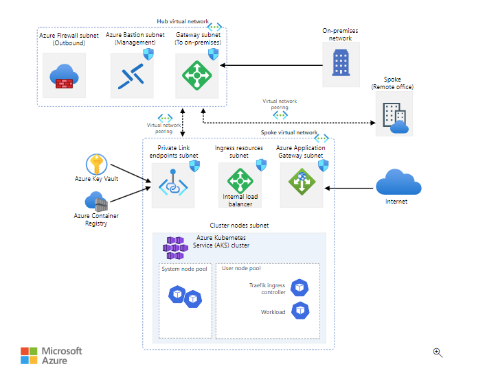

 

 

**Azure Well-Architected Framework**

 

The Azure Well-Architected Framework is a set of quality-driven tenets,
architectural decision points, and review tools intended to help
solution architects to build high quality workloads on Azure whereas
Cloud Adoption Framework focuses on for organizations as whole.

 

**Pillars**

 

***Cost optimization***

 

Design your environment so that it's cost effective for operation and
development. Ensure that the money your organization spends is being
used to maximum effect. This is not about building environment at its
cheaper.

 

- Plan and estimate costs whether it is development of new application
  or migration

- Provision services that are optimized for cost can reduce your work
  effort in the future

- Use monitoring and analytics to gain cost insights

- Identify and eliminate unnecessary expenses by conducting regular
  reviews such as underutilized resource, autoscaling , license
  consumption

 

***Operational Excellence***

 

- Full visibility into how your application is running, and ensuring the
  best experience for users

- Design, build and orchestrate with modern practices such as DevOps and
  CI/CD

- Use monitoring and analytics to gain operational insights

- Automate as much as of your infrastructure as possible

- Test your application deployment and ongoing operations

 

***Performance efficiency*** - For an architecture to perform well and
be scalable, it should be properly match resource capacity to demand

 

- ***Autoscaling*** - Scale up/down and out/in

- Optimize network and storage performance

- Identify performance bottlenecks in your application

 

***Reliability*** -

 

- Build a ***highly available*** architecture considering SLA, use
  ***redundancy, clustering*** and ***load balancing***

- Build an architecture that can recover from failure, examine possible
  data loss, determine RPO(maximum duration of acceptable data loss) and
  RTO(maximum duration of acceptable downtime)

 

***Security*** - protecting the data that your organization uses, stores
and transmits

 

Multilayered approach to securing your environment increases its
security posture

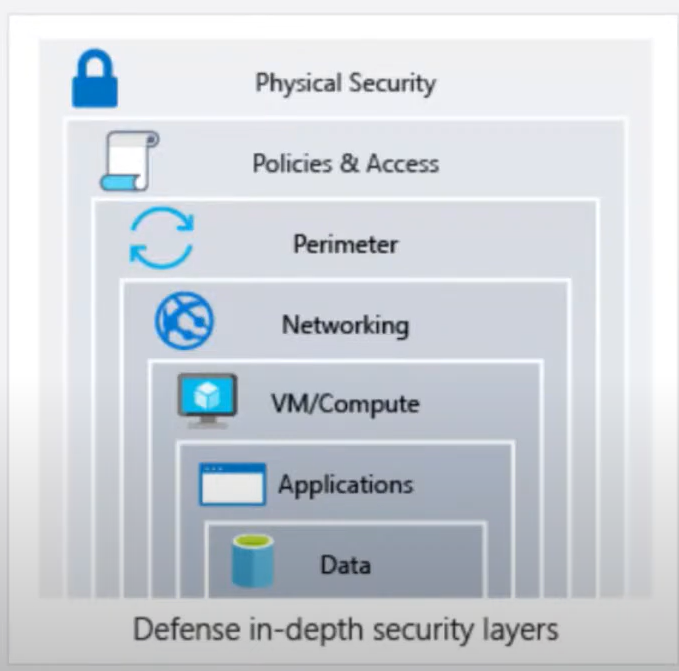

 

 

- Protect from common attacks at different layers

 

Data layer - exposing encryption keys or using weak encryption

Application layer - Malicious code injection and execution, SQL
injection, cross-site scripting

VM/Compute layer - malware, credential exposure, lateral movement
through the environment

Networking layer - open SSH and RDP ports to VM, brute-force attacks

Perimeter layer - Denial-of-service attacks

Policies and access layer - modern authentication protocols such as
OpenID Connect, OAuth, Kerberos-based authentication, compromised
accounts, logins from unusual places

Physical layer - door drafting, theft of security badges

 

**General design principles**

 

Enable architecture evolution - evolve the architecture by taking
advantage of new services, tool, technologies

 

Use data to make decisions - Collect data, analyse and use it take
decisions on architecture how enhance your environment to perform well

 

Educate and enable - Cloud technology evolves quickly. Educate you
development, operation and business team to take right decision so that
you can build solution updated configuration, decisions and best
practices

 

Automate - automation manual activities reduces operational cost,
minimize manual errors, and provide consistency

 

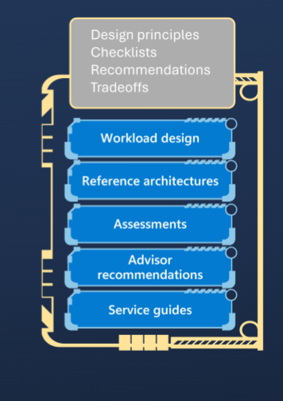

 

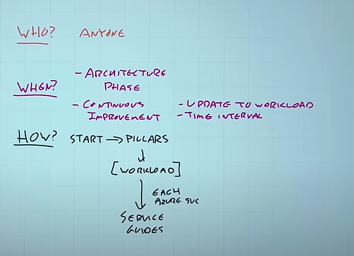

 

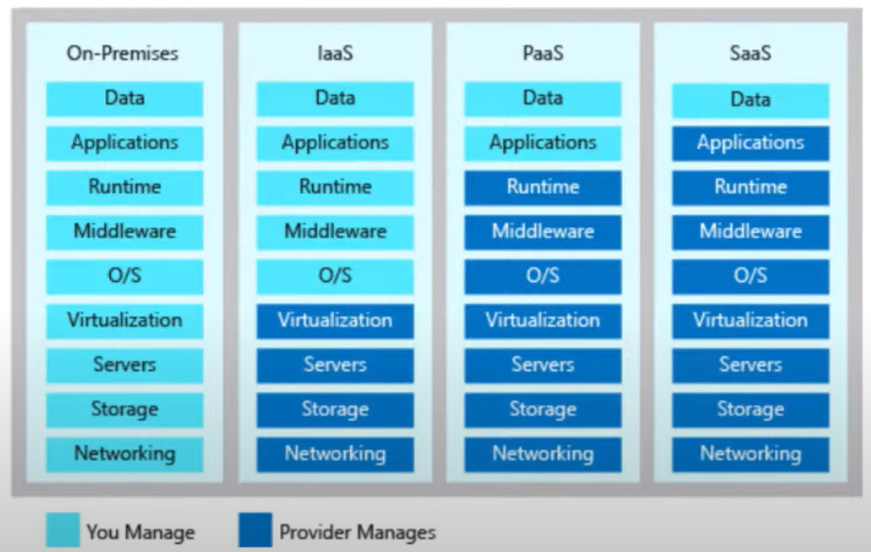

 

 

 

 
