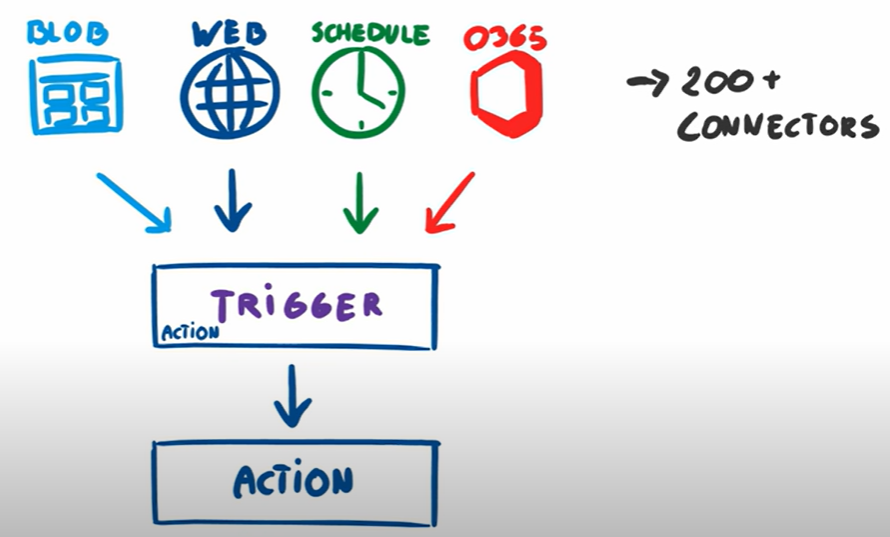
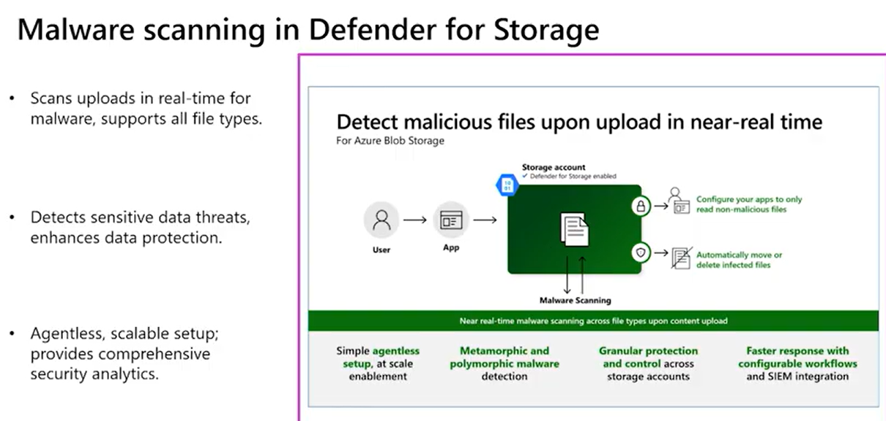
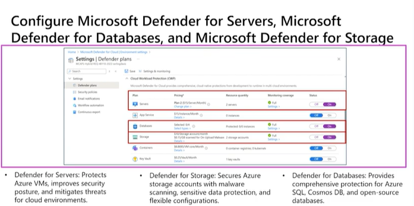
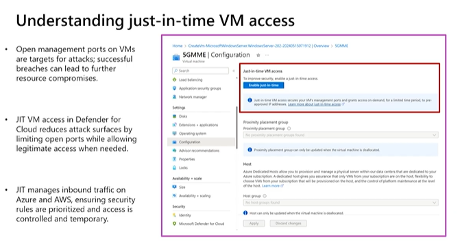
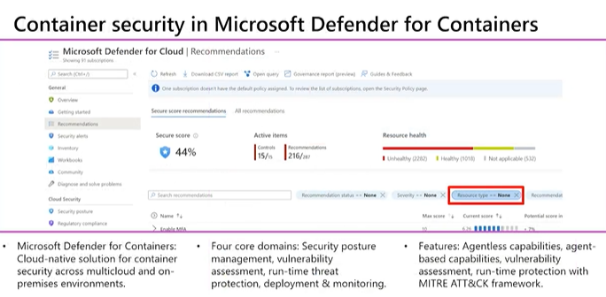
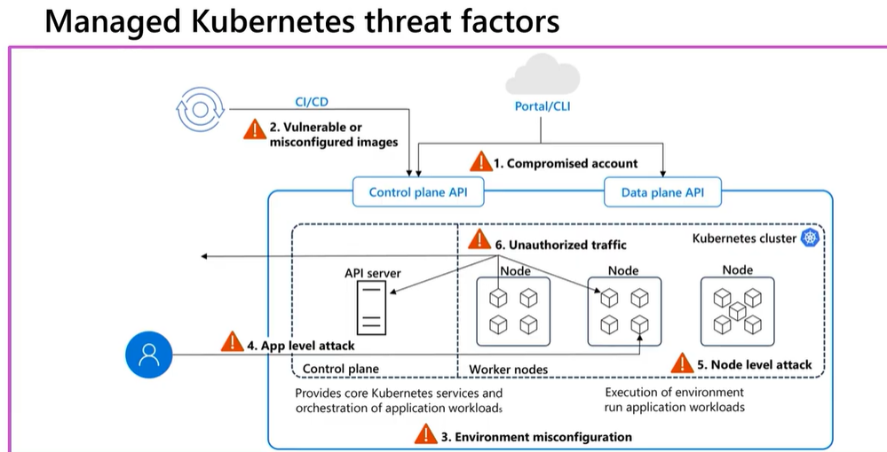
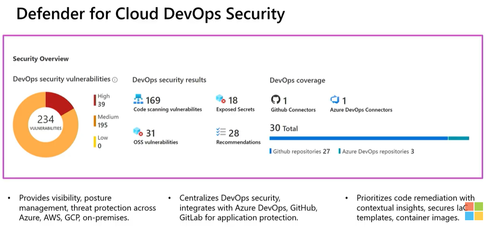
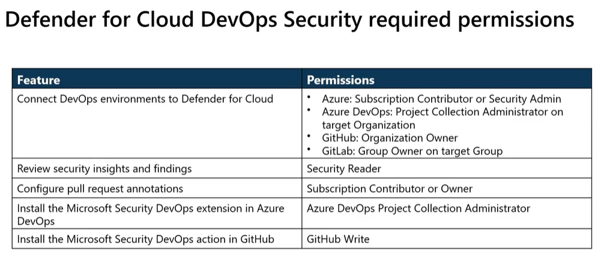
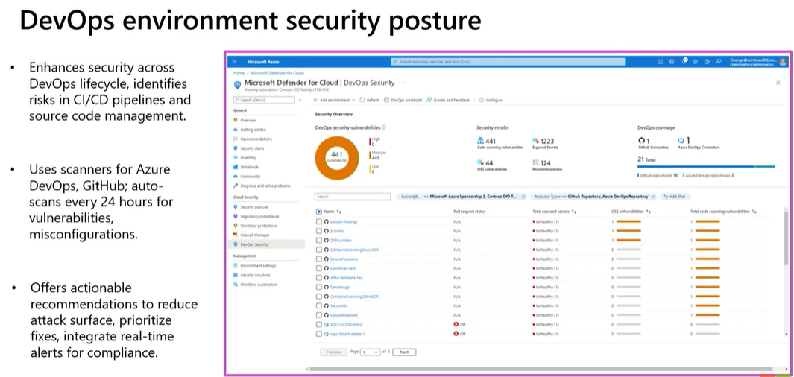
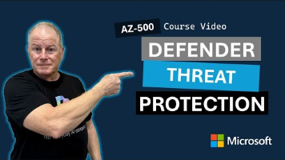

**Azure Integration Services and Security**

**Azure Logic App**

 

Azure Logic Apps is a cloud platform where you can create and run
automated workflows with little to no code. It helps you schedule,
automate, and orchestrate tasks, business processes, and workflows when
you need to integrate apps, data, systems and services across enterprise
or organizations.

 

By using the visual designer and selecting from prebuilt operations, you
can quickly build a workflow that integrates and manages your apps,
data, services, and systems.

 

-Each workflow starts with a trigger

-The trigger is fired via a specific event

-When the trigger is fired, the logic app engine creates a logic app
instance that runs the workflow.

-Connectors for Azure Logic Apps

-These connectors provide easy access to event, data, and actions that
are send from external applications, services, systems or platforms

-You have built-in connectors that can connect to Azure services such as
Azure functions, Azure API Apps etc

-You have managed connectors that can connect to platforms such as
Office 365, Microsoft Dynamics

 

 

This list describes just a few example tasks, business processes, and
workloads that you can automate using Azure Logic Apps:

- Schedule and send email notifications using Office 365 when a specific
  event happens, for example, a new file is uploaded.

- Route and process customer orders across on-premises systems and cloud
  services.

- Move uploaded files from an SFTP or FTP server to Azure Storage.

- Monitor tweets, analyze the sentiment, and create alerts or tasks for
  items that need review.

 

 

 

**Building Blocks of Azure Logic Apps**

 

 

- **Logic App Resource**: This is the Azure resource group where you
  define and manage your logic app.

<!-- -->

- **Triggers**: Triggers are what start a new instance of a workflow
  based on specific events, like receiving an email or a file getting
  uploaded to an FTP server.

- **Actions**: Actions are the steps that follow the trigger. They are
  the operations carried out when a specific trigger fires.

- **Connectors**: Connectors provide an interface for connecting your
  logic apps to an existing service, whether it be cloud-based or
  on-premises.

- **Workflow Definition Language**: This JSON-based language provides
  more control over the workflow's design if you want to code directly
  rather than use the visual designer.

- **Run History**: This feature allows you to track the execution
  details of each run, including timing, inputs, and outputs.

 

**Creating and deploying a logic app**

 

 

- **Create a Logic App Resource**: The first step is to create a logic
  app resource in the Azure portal. This essentially means setting up
  the environment where your logic app will reside.

- **Build Your Workflow**: Once the resource is created, you can start
  building your workflow. Using the Logic App Designer, you can add
  triggers and actions to define your workflow. Each trigger or action
  represents a specific operation.

- **Configure Your Connectors**: After defining your workflow, you need
  to configure your connectors. This involves specifying the services
  that your logic app will interact with and providing any necessary
  details for authentication.

- **Deploy Your Logic App**: Once everything is set up, you can deploy
  your logic app. Deployment makes your logic app live and ready to
  respond to the specified triggers.

- **Monitor Your Logic App**: After deployment, you can monitor your
  logic app through the Azure portal. This allows you to track the
  performance of your logic app and troubleshoot any issues that may
  arise.

 

 

 

* *

 

<https://turbo360.com/guide/azure-logic-apps>

**Microsoft Defender Cloud**

 

-Enable workload protection services with threat detection and
protection for VM, containers, SQL databases, Web application

-Protect multi cloud environment such AWS, GCP and on-premise

-This detects threat and generate an alert which provide details about
affected resources, suggested remediation steps and options to trigger a
logic apps in response

 

**Defender for Servers**

 

-Protect multi cloud and on premises Windows and Linux VMs

-Provide recommendations to improve security posture and help to
remediate vulnerabilities

-Support agentless and agent-based scanning. Agentless scanning enabled
by default and support VA, malware detection and software inventory.

-Seamlessly integrates with Microsoft Defender for Endpoint that provide
EDR

-Offers 2 plans, plan 1 and plan 2(offers Agentless scanning, malware
detection and file integrity monitoring)

 

 

**Defender for Storage**

 

-Provides threat protection for Azure Blob, Azure Files and Azure Data
Lake Storage

-Detects threats and prevents malicious upload, data exfiltration and
corruption

-Use Microsoft Threat Intelligence, Defender AntiVirus, Sensitive Data
Discovery which is integrated with Microsoft Purview sensitivity
information types and classification labels

\- agentless solution, scalable setup

 

 

-Engine scans across all supported storage accounts, results generates
within 24 hours, newly created storage account within 6 hours of it
being created. By default reoccurring scans are scheduled to occur
weekly

-Role : From **subscription owner** to **storage account owner** roles

-Agentless scanning is available in CSPM and Defender for Servers Plan 2

 

 

 

 

**Defender for Containers**

 

 

-Uses threat intelligence and machine learning to detect suspicious
activities such as unauthorized access, privilege escalation and
malicious code execution

-It scans container images for known vulnerabilities and provides
actionable recommendation

-Defender for containers integrates seamlessly with CICD pipeline that
allows to incorporate security checks into deployment and development
process

 

 

 

**Defender for Cloud DevOps Security**

 

 

 

 

[Configure and manage threat protection by using Microsoft Defender for
Cloud AZ-500](https://www.youtube.com/watch?v=4J-OKy4n0dk&t=330s)

 

