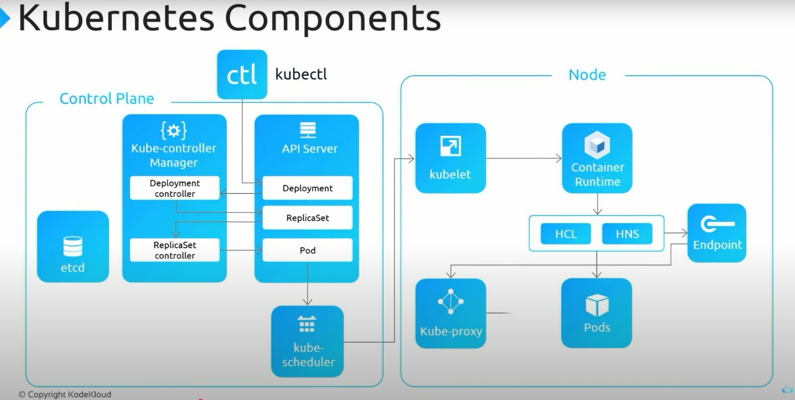
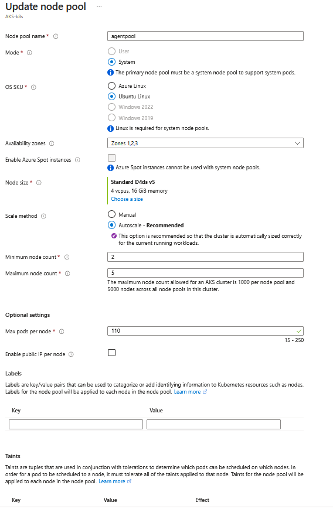
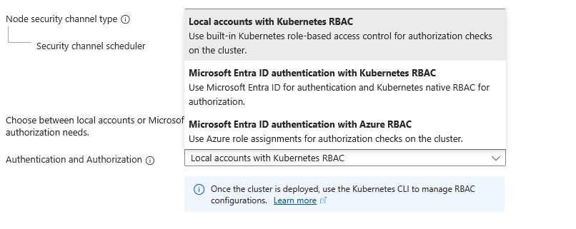
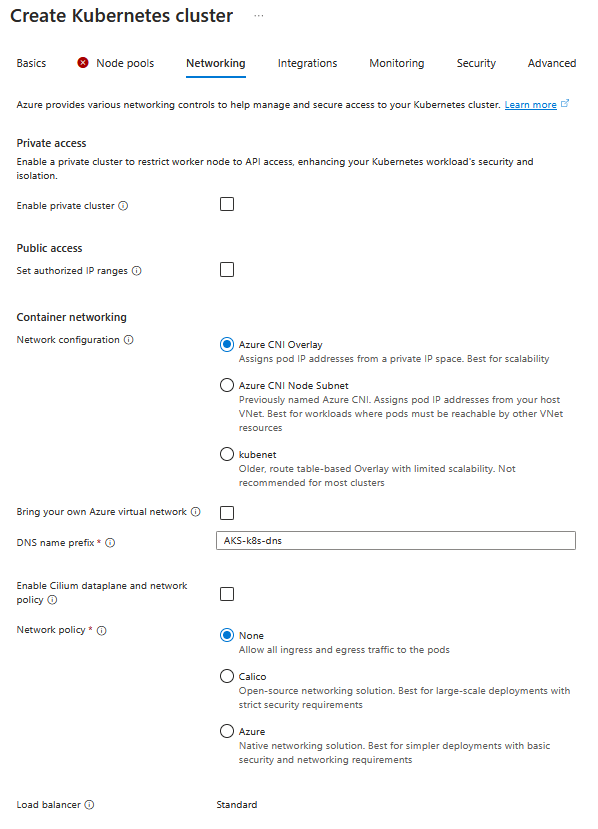

**Azure Kubernetes Service (AKS)**

 

Kubernetes is a container management platform when solution is built and
deployed as microservices.

 

To install kubectl client locally ; az aks install-cli

 

**AKS Terminology**

 

Pools - groups of nodes with identical configurations.

 

Nodes - individual virtual machines running containerized applications

 

Pods - run single instance of an application. A pod can contain multiple
containers

 

Container - a lightweight and portable executable image that contains
software and all of its dependencies.

 

Deployment has one or more identical pods managed by Kubernetes.

 

Manifest is the YAML file describing a deployment

 

 

 

When you create AKS cluster, it defines the following.

 

Basics

\- Subscription

\- Resource group

\- Cluster name

\- Region

\- Availability zone

\- Kubernetes version

\- Primary node pool - node count(maximum 1000), node size ( VM size
cannot be changed once after set up, primary node pool always includes
Linux nodes), scale method(Manual, Autoscale)

 

Node pool

\- Node pool - If you need to run windows containers, you should create
another node pool with Windows nodes.

\- Virtual nodes - enabling this feature allows burstable scaling backed
by serverless ACI

\- VM scale sets - enabling this feature allows auto scaling, multiple
node pools and Windows support

-Max pods per node - between 15-250

-Labels

-Taints

 

 

Authentication

 

\- Cluster infrastructure- Service principal or system-assigned managed
identify

\- Kubernetes authentication and authorization- RBAC or AKS- managed
Azure AD which can incorporate with AD group synched

\- Node pool OS disk encryption- encryption at-rest with
platform-managed key or customer-managed key

 

 

Networking

 

\- Network configuration- Kubenet , Azure CNI which allows to manage
virtual network on the cluster

\- DNS name prefix - DNS name to access the cluster

\- Traffic routing - load balancer and enable HTTP application routing
which require to enable for API

\- Security- enable private cluster, set authorized IP ranges(specify ip
addresses of organization), Network policy(Calico, Azure)

 

 

Integrations

 

\- Azure Container Registry- connect to pull the images from private
image repository

\- Azure Monitor- enable container monitoring by creating log analytics
workspace to understand performance of containers and servers in the
cluster

\- Azure policy - enforce compliance, security through built in or
custom policies

 

Tags - logical grouping

 

You can manage Kubernetes cluster through Azure cloud shell where it
provides 2 options bash or PowerShell.

Azure cloud shell requires an azure file share to persist files. Hence
it will create a storage account.

 

Connect to the cluster create through bash upon the instruction given.

 

az account set - -subscription \<subscription id\>

az aks get-credentials - -resource-group \<name RG\> - -name \<name of
AKS\> ; this created Kubernetes config file in the cluster

 

AKS cluster and node architecture

 

 

An AKS cluster contains one or more nodes (Azure Virtual Machines) as
well as A Kubernetes cluster contains one or more node pools(groups of
nodes) that run the Kubernetes node components

and the container runtime.

 

The initial number of nodes and size are defined when you create an AKS
cluster, which creates a default node pool.

 

A Kubernetes cluster is divided into two components:

 

Azure-managed nodes

\- provide the core Kubernetes services and orchestration of application
workloads

\- When you create an AKS cluster, a cluster node is automatically
created and configured

\- pay only for running agent nodes

 

Customer-managed nodes

\- run your application workloads.

 

kubelet is the Kubernetes agent that processes the orchestration
requests from the Azure-managed node, and scheduling of running the
requested containers

 

kube-proxy on each node routes network traffic and manages IP addressing
for services and pods

 

container runtime is the component that allows containerized
applications to run and interact with additional resources such as the
virtual network and storage.

 

Moby (upstream docker) as its container runtime \> Kubernetes version
1.19 node pools\> containerd as its containers runtime

 

 

AKS networking

\- Kubernetes provides an abstraction layer to virtual networking for
application components to communicate with each other

\- provide inbound and outbound connectivity for pods

\- In Kubernetes, Services logically group pods to allow for direct
access via an IP address or DNS name and on a specific port

\- routing of application traffic can also be achieved with Ingress
Controllers or load balancer

\- Security and filtering of the network traffic for pods is possible
with Kubernetes network policies

\- When you create a Kubernetes load balancer, the underlying Azure load
balancer resource is created and configured

 

Services

 

Kubernetes uses Services to logically group a set of pods together and
provide network connectivity.

 

Cluster IP- Creates an internal IP address for use within the AKS
cluster which is for internal-only applications that support other
workloads within the cluster

 

NodePort- allows the application to be accessed directly with the node
IP address and port

 

LoadBalancer- configures an external IP address, and connects the
requested pods to the load balancer backend pool

 

ExternalName - Creates a specific DNS entry for easier application
access

 

\>az login --tenant TENANT_ID

 

PS C:\WINDOWS\system32\> az login --tenant
b43228ec-e70c-4f4f-a15d-b343d9745b06

Select the account you want to log in with. For more information on
login with Azure CLI, see
<https://go.microsoft.com/fwlink/?linkid=2271136>

 

Retrieving subscriptions for the selection...

 

\[Tenant and subscription selection\]

 

No Subscription name Subscription ID Tenant

----- -------------------- ------------------------------------
------------------------------------

\[1\] \* Azure subscription 1 890b07e0-e085-4912-884b-52ca7299f107
b43228ec-e70c-4f4f-a15d-b343d9745b06

 

The default is marked with an \*; the default tenant is
'b43228ec-e70c-4f4f-a15d-b343d9745b06' and subscription is 'Azure
subscription 1' (890b07e0-e085-4912-884b-52ca7299f107).

 

Select a subscription and tenant (Type a number or Enter for no
changes): 1

 

Tenant: b43228ec-e70c-4f4f-a15d-b343d9745b06

Subscription: Azure subscription 1
(890b07e0-e085-4912-884b-52ca7299f107)

 

\[Announcements\]

With the new Azure CLI login experience, you can select the subscription
you want to use more easily. Learn more about it and its configuration
at <https://go.microsoft.com/fwlink/?linkid=2271236>

 

If you encounter any problem, please open an issue at
<https://aka.ms/azclibug>

 

\[Warning\] The login output has been updated. Please be aware that it
no longer displays the full list of available subscriptions by default.

 

 

 

PS C:\WINDOWS\system32\> az account show

{

"environmentName": "AzureCloud",

"homeTenantId": "b43228ec-e70c-4f4f-a15d-b343d9745b06",

"id": "890b07e0-e085-4912-884b-52ca7299f107",

"isDefault": true,

"managedByTenants": \[\],

"name": "Azure subscription 1",

"state": "Enabled",

"tenantId": "b43228ec-e70c-4f4f-a15d-b343d9745b06",

"user": {

"name": "nibhath_aka@outlook.com",

"type": "user"

}

}

PS C:\WINDOWS\system32\>az configure --defaults AKS-HRP

 

PS C:\WINDOWS\system32\>az aks get-credentials --name AKS-cluster ;
download the credentials and merge it into current user context

 

PS C:\WINDOWS\system32\>kubectl config current-context ; check the
current context

 

 

[How to Create AKS Cluster in Azure \| AKS Cluster Creation & App
Deployment (Demo)](https://www.youtube.com/watch?v=RUoejLILgyA)

**Deploy AKS Cluster In Azure With Terraform Custom Modules**

 

1.  Create resource group

2.  Create service principal to deploy AKS cluster - grant contributor
    access

3.  Create Azure key vault - to store client id, tenant id

4.  Create secret in the key vault - to store secret of service
    principal

5.  Provision AKS cluster using service principal secret

 

 

[Day 20/28 - Deploy AKS Cluster In Azure With Terraform Custom Modules
\| Real time Project \#1](https://www.youtube.com/watch?v=ujJlnZYRMZI)

 
