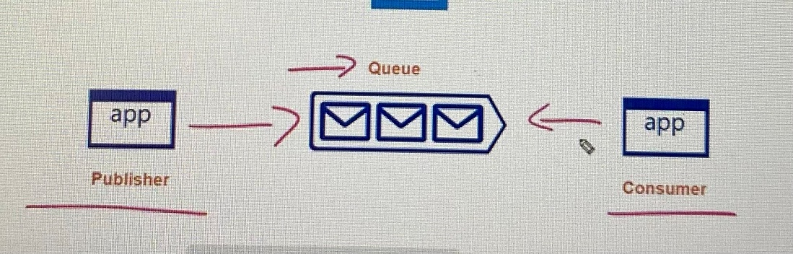
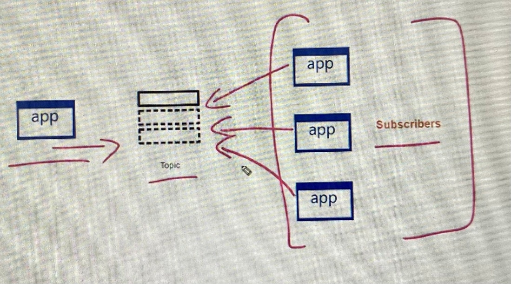
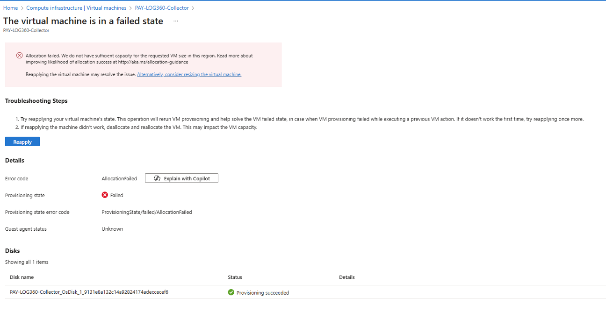

**Azure Compute Resources**

Automate deployment of virtual machines (VMs) by using Azure Resource
Manager templates

Modify an ARM Template

 

Virtual Hard Disk(VHD) Template

 

Before you upload Windows VM from on-premise to Azure;

\- Prepare virtual hard disk VHDX or VHD format

\- Azure supports generation 1 VMs that are in VHD file format and have
fixed sized disk

\- Maximum size allow for VHD file is 1023 GB

\- BitLocker must be disabled before you enable replication for VM

\- Maximum OS disk size supports for a generation VM is 2048 GB

\- Maximum data disk size is 4096 GB

 

The Add-AzVhd cmdlet uploads on-premises virtual hard disks, in .vhd
file format, to a blob storage account as fixed virtual hard disks.

 

 

Deployment as an ARM Template

 

Virtual Machine Extensions

 

\- a way to automate the tasks of creating, maintaining, and removing
virtual machines

\- small applications that provide post-deployment configuration and
automation tasks on Azure VMs

\- When a virtual machine requires software installation, anti-virus
protection, or a configuration script inside

\- VM extensions can be managed with Azure CLI, PowerShell, Azure
Resource Manager templates, and the Azure portal

\- There are different extensions for Windows and Linux machines and a
large choice of first and third-party extensions.

 

Custom script extensions (CSE)

 

\- Use to automatically launch and execute virtual machine customization
tasks post configuration such as stopping VM, installing software
component

\- can install the CSE from the Azure portal by accessing the virtual
machines Extensions blade. Once CSE resource is created, it will provide
PowerShell script file where you can pass in arguments. After file is
uploaded, it executes immediately

\- Custom Script extensions have 90 minutes to run. If your deployment
exceeds this time, it is marked as a timeout

\- Make connection if your extension requires networking or storage
access

\- Be sure to account for any errors that might occur when running your
script

\- CSE may need sensitive information such as credentials, storage
account names, and storage account access keys.

 

Configure a SetupComplete.cmd batch file in the %windir%\setup\scripts
directory ; Setupcomplete.cmd is a custom script extension that runs
during or after the Windows Setup process where you can specify which
files need to be downloaded from storage account and which file it need
to execute. They can install apps or run other tasks using
cscript/wscript scripts.

 

Desired State Configuration(DSC)

 

\- management platform in Windows PowerShell

\- deploying and managing configuration data for software services and
managing the environment in which these services run

\- provides a set of Windows PowerShell language extensions, Windows
PowerShell cmdlets, and resources

\- Use DSC when the CSE will not work for your application

\- DSC script consists of a Configuration block(Configuration keyword
and providing a name), Node block(computers or VMs)and one or more
resource blocks

\- Use to configure VM as they come online so they are running the
production software

 

When we redeploy a VM, it moves VM to new node within Azure
infrastructure and power it back on, retaining all your application and
associated resources.

 

DSC applies any new configurations. After initial application of a new
configuration, if the target node drifts from the desired state, DSC
reports the discrepancy in logs, and then re-applies the current
configuration.

 

PowerShell Desired State Configuration (DSC) extension for Windows: This
extension allows you to manage the configuration of your Windows VMs
using DSC in an automated fashion. DSC leverages declarative scripts to
specify the desired state of the system, and the extension ensures that
the VMs converge towards that configuration state. This method
simplifies management and reduces administrative effort, as you can
configure settings centrally through DSC scripts rather than manually on
each VM.

 

1\. Create an Azure Automation account.

2\. Compile the Desired State Configuration (DSC) configuration.

3\. Install the custom Desired State Configuration (DSC) extension on
the virtual machines.

4\. Onboard the virtual machines to the Azure Automation account.

 

The Register-AzureRmAutomationDscNode cmdlet registers an Azure virtual
machine as an APS Desired State Configuration (DSC) node in an Azure
Automation account.

 

Scenario: Current Technical Issue

 

The test servers are configured correctly when first deployed, but they
experience configuration drift over time. Azure Automation State
Configuration fails to correct the configurations.

 

Azure Automation State Configuration nodes are registered by using the
following command.

 

 

 

ConfigurationMode

 

\- ApplyOnly: DSC applies the configuration and does nothing further
unless a new configuration is pushed to the target node or when a new
configuration is pulled from a service. After initial application of a
new configuration, DSC does not check for drift from a previously
configured state. Note that DSC will attempt to apply the configuration
until it is successful before

 

\- ApplyAndAutoCorrect: DSC applies any new configurations. After
initial application of a new configuration, if the target node drifts
from the desired state, DSC reports the discrepancy in logs, and then
re-applies the current configuration.

 

Local Configuration Manager (LCM) is the engine of Desired State
Configuration (DSC). The LCM runs on every target node, and is
responsible for parsing and enacting configurations that are sent to the
node.
<https://learn.microsoft.com/en-us/powershell/dsc/managing-nodes/metaconfig?view=dsc-1.1#basic-settings> -
ConfigurationMode Specifies how the LCM actually applies the
configuration to the target nodes

 

Configure VMs

 

Azure Virtual Machines is one of several types of on-demand, scalable
computing resources that Azure offers with an operating system, storage,
and networking capabilities. Virtual machines are part of the
Infrastructure as a Service (IaaS) which quickly scale up and down with
demand and pay only for what you use.

 

Plan Virtual Machine

 

Start with the network

\- provide private connectivity between Azure Virtual Machines and other
Azure services outside the virtual network.

\- Network addresses and subnets are not trivial to change later,
however virtual network cannot be changed unless recreate VM on desired
Vnet. Inside the assigned NIC of VM, there is an option to change the
subnet in IPConfiguration

\- We cannot move VM between virtual networks, delete the VM identifying
the disk used and recreate the new VM in targeted virtual network, then
attach the original disk to it.

\- To create a recovery service vault to protect virtual machine, the
vault must be in same region as the virtual machine where resources
group doesn’t need to be in same region

 

Name the VM

\- used as the computer name, which is configured as part of the
operating system

\- specify a name of up to 15 characters on a Windows VM and 64
characters on a Linux VM

\- Computer name is not trivial to change later

\- Naming convention of VM should include followings.

1\. environment -dev, prod, QA

2\. Location- uw (US West), ue (US East)

3\. Instance - when have more than one named instance

4\. Product or Service- resource type that supports

5\. Role- sql, web, messaging

 

For example, devusc-webvm01 might represent the first development web
server hosted in the US South Central location.

 

Location for VM

\- must select a region where you want the resources (CPU, storage,
etc.) to be allocated for VM

\- locate your VMs as close as possible to your users to improve
performance and to meet any legal, compliance, or tax requirements

\- some configurations are not available in all regions.

\- check your required configuration in multiple regions to find the
lowest price.

 

Pricing options for VM

 

There are two separate costs the subscription will be charged for every
VM: compute and storage.

 

Compute costs

\- Compute expenses are priced on a per-hour basis but billed on a
per-minute basis. For example, you are only charged for 55 minutes of
usage if the VM is deployed for 55 minutes.

\- The hourly price varies based on the VM size and OS you select.

\- VM includes the charge for the Windows operating system but
Linux-based instances are cheaper as no OS license charges

 

Storage costs

\- charged separately for the storage the VM uses even when a VM is
stopped/deallocated

 

Payment options for compute costs

 

Consumption-based

\- you pay for compute capacity by the second

\- Use this option if you run applications with short-term or
unpredictable workloads that cannot be interrupted

 

Reserved Virtual Machine Instances(RI)

\- advance purchase of a virtual machine for one or three years in a
specified region

\- you get up to 72% price savings compared to pay-as-you-go pricing

\- Use this option if the VM has to run continuously for at least a year
or you need budget predictability

 

Sizing for VM

\- Azure provides a wide range of VM size options with appropriate mix
of compute, memory, and storage

\- when the existing size no longer meets your needs, you can resize a
VM if your current hardware configuration is allowed in the new size
which provides a fully agile and elastic approach to VM management

\- When you stop and deallocate the VM, you can select any size
available in your region.

\- Resizing may require a restart that can cause a temporary outage or
change configuration settings like the IP address

 

Determine VM storage

\- Azure use disks as a place to store an operating system,
applications, and data

\- All Azure virtual machines have at least two disk( OS disk and
Temporary disk) and one or more data disk

\- All disks are stored as VHDs

 

OS disk That OS disk has a pre-installed OS, which was selected when the
VM was created. It’s registered as a SATA drive and labeled as the C:
drive by default.

 

 

Temporary Disk provides short-term storage for applications and
processes such as page or swap files. Data on the temporary disk may be
lost during a maintenance event or when you redeploy a VM. Data persist
when get standard reboot however data may not persist, such as moving to
a new host.

 

\- On Windows virtual machines, labeled as the D: drive by default

\- On Linux virtual machines, the disk is typically /dev/sdb and is
formatted and mounted to /mnt by the Azure Linux Agent

 

Data disk is managed disk to store application data or other data which
can be labeled with any letter. At sizing VM, we determine how many data
disks are required.

 

Attach data disk from a VM to another VM on Azure portal

 

1\. Select the VM that has data disk you want to detach from and stop
the VM to deallocate VM

2\. Detach disk from VM

3\. Start the VM that disk is detached from

4\. The disk stays in storage but no longer attached to a VM

5\. Reattach disk to other VM

 

Storage option for VM

 

Azure Premium Storage delivers high-performance, low-latency disk
support for virtual machines (VMs) with input/output (I/O)-intensive
workloads using SSD.

 

Unmanaged disk- manage the storage accounts that you use to store the
virtual hard disk (VHD) files

 

Managed disk- Azure-managed disks are stored as page blobs, blob
containers, and Azure storage accounts. The available types of disks are
Ultra Solid State Drives (SSD), Premium SSD, Standard SSD, and Standard
Hard Disk Drives (HDD)

 

Create VM in the portal

 

When you are creating virtual machines in the portal, one of your first
decisions is the image to use.

 

Basic - Project details, Administrator account, Inbound port rules

 

Disks - OS disk type, data disks

 

Networking - Virtual networks, load balancing

 

Management - Monitoring, Auto-shutdown, Back up

 

Advanced - Add additional configuration, agents, scripts, or
applications via virtual machine extensions or cloud-init.

 

Cloud-unit.txt is used to customize a Linux VM on first boot up. It can
be used to install package and write files or to configure users and
security.

 

Once Cloud-unit.txt is created, you can deploy the VM with az vm create
cmdlet, sing the-custom-data parameter to provide the full path to the
cloud-init.txt

 

az vm create command ; For Ubuntu deployment we use bash shell

 

We cannot just move virtual machine between virtual networks where we
need to identify disks used by VM, delete VM itself while retaining
disk. Then recreate a VM in the targeted virtual network and attach
original disk to new VM.

 

Connect to VM

 

Windows based VM

\- via RDP

\- Azure PowerShell Get-AzRemoteDesktopFile cmdlet provides the same
functionality

\- Windows Remote Management (WinRM) allows you to establish a
command-line session to an Azure VM that runs any supported version of
Windows. By default, WinRM uses TCP port 5986

 

Linux based VM

\- need a secure shell protocol (SSH) client, use Putty

\- using passwords with SSH connections still leaves the VM vulnerable
to brute-force attacks or guessing of passwords, so it uses
public-private key pair, also known as SSH keys.

 

 

Bastion connection

\- The Azure Bastion service is a new fully platform-managed PaaS
service

\- provision inside your virtual network

\- It provides secure and seamless RDP/SSH connectivity to your virtual
machines directly in the Azure portal over SSL

\- do not need a public IP address with bastion

\- protects your virtual machines from exposing RDP/SSH ports to the
outside world

\- don't need an additional client, agent, or piece of software as you
connect over Azure portal

 

Monitor performance of VM using Azure Monitor VM insights

 

 

 

High availability and scalability of VMs

 

There are three scenarios that VM in Azure being impact.

 

unplanned hardware maintenance

\- when the Azure platform predicts that the hardware or any platform
component associated to a physical machine, is about to fail

\- Azure uses Live Migration technology to migrate the Virtual Machines
from the failing hardware to a healthy physical machine

 

unexpected downtime

 

\- when the hardware or the physical infrastructure for the virtual
machine fails unexpectedly

\- can include local network failures, local disk failures, or other
rack level failures.

\- Azure platform automatically migrates (heals) your virtual machine to
a healthy physical machine

\- VM experience reboot or loss of temporary drive

 

planned maintenance

\- periodic updates made by Microsoft to the underlying Azure platform
to improve overall reliability, performance, and security of the
platform infrastructure

\- No impact on VM or cloud service

 

Microsoft does not automatically update your VM's OS or software however
underlying software host and hardware are periodically patched to ensure
reliability and performance.

 

Azure Dedicated Hosts

 

Azure Dedicated Host is a service that provides physical servers - able
to host one or more virtual machines - dedicated to one Azure
subscription. Dedicated hosts are the same physical servers used in our
data centers, provided as a resource. You can provision dedicated hosts
within a region, availability zone, and fault domain. Then, you can
place VMs directly into your provisioned hosts

 

 

Availability options for Azure VM

 

**Availability Zones**

 

\- unique physical locations within an Azure region

\- There are three Availability Zones per supported Azure region

\- Each Availability Zone has a distinct power source, network, and
cooling

\- Availability zones don't support all virtual machine sizes and aren't
available in all Azure regions.

\- If one zone is compromised, then replicated apps and data are
instantly available in another zone.

\- The physical separation of Availability Zones within a region
protects applications and data from datacenter failures

\- With Availability Zones, Azure offers industry best 99.99% VM uptime
SLA.

\- if you create three or more VMs across three zones in an Azure
region, your VMs are effectively distributed across three fault domains
and three update domains

\- Azure platform recognizes this distribution across update domains to
make sure that VMs in different zones are not updated at the same time.

\- VM should use managed disk if you want to move them to an
availability zone by using site recovery

 

 

Azure services that support Availability Zones fall into two categories:

\- Zonal services. Pins the resource to a specific zone (for example,
virtual machines, managed disks, Standard IP addresses).

\- Zone-redundant services. Platform replicates automatically across
zones (for example, zone-redundant storage, SQL Database).

 

 

**Availability sets**

 

\- logical grouping of VMs that consists one or more VMs

\- they aren't all subject to a single point of failure and not all
upgraded at the same time during a host operating system upgrade in the
datacenter.

\- VMs placed in Availability set should perform identical set of
functions and same software installed

\- Combine a Load Balancer with Availability Sets.

\- VMs you place within an Availability Set run across multiple physical
servers, compute racks, storage units, and network switches.

\- When you create an Availability Set, the hardware in a location is
divided into multiple update domains and fault domains.

\- availability set does not protect your application from operating
system or application specific failures.

\- Availability set should be created in a resource group.

\- You can create an availability set using New- AzAvailabilitySet

\- create Availability Sets through the Azure portal in the disaster
recovery section and using Resource Manager templates. scripting, or API
tools.

\- VMs must be created within the availability set to make sure they're
correctly distributed across the hardware

\- A VM can only be added to an Availability Set when it is created.
When you create a VM with New-AzVM, you use the -AvailabilitySetName
parameter to specify the name of the availability set.

\- To change the Availability Set, you need to delete and then recreate
the VM.

\- no cost for the availability set itself, you only pay for each VM
instance that you create.

\- Each availability set can be configured with up to 3 fault domains
and 20 update domains.

\- If you need to resize a VM in availability set, you have to stop all
VMs in availability set and restart VMs one by one after resizing is
completed

 

**Service Level Agreement(SLA)**

 

\- For all Virtual Machines that have two or more instances deployed
across two or more Availability Zones in the same Azure region, we
guarantee you will have Virtual Machine Connectivity to at least one
instance at least 99.99% of the time.

\- For any Single Instance Virtual Machine using premium storage for all
Operating System Disks and Data Disks, we guarantee you will have
Virtual Machine Connectivity of at least 99.9%.

 

**Review update and fault domain**

 

\- Update Domains and Fault Domains helps Azure maintain high
availability and fault tolerance when deploying and upgrading
applications

\- Each virtual machine in an availability set is placed in an update
domain and an fault domain.

 

 

**update domain**

 

\- logical group of VMs and underlying physical hardware that can be
updated and rebooted at the same time

\- allows Azure to perform incremental or rolling upgrades across a
deployment

\- During scheduled maintenance, only one update domain is updated at
any given time.

\- Update domains aren't necessarily updated sequentially. So, we need
two update domains.

\- By default, there are five (non-user-configurable) update domains,
but you configure up to 20 update domains.

 

**fault domain**

 

\- group of virtual machines that share a common set of power source,
network switches, in a single point of failure

\- In unplanned maintenance, Two fault domains mitigate against hardware
failures, network outages, power interruptions, or software updates

 

**Vertical scaling**

 

\- scale up and scale down, means increasing or decreasing virtual
machine sizes in response to a workload

\- A service built on virtual machines is under-utilized (for example at
weekends). Reducing the virtual machine size can reduce monthly costs.

\- Increasing virtual machine size to cope with larger demand

\- Vertical scaling dependent on the availability of larger hardware and
can vary by region

\- also usually requires a virtual machine to stop and restart.

 

**Horizontal scaling**

 

\- scale out and scale in, where the number of VMs is altered depending
on the workload

\- Horizontal scaling is more flexible in a cloud

 

Reprovisioning means removing an existing virtual machine and replacing
it with a new one.

 

**Virtual Machine Scale Sets**

 

\- let you create and manage a group of load balanced identical VMs with
same OS image

\- The number of VM instances can automatically increase or decrease in
response to demand or a defined schedule which is known as autoscale

\- allow you to centrally manage, configure, and update many VMs

\- No more than 20% of the Scale Set upgrading at any time, then 2
machines out of 10 will have maintenance, the 8 remaining VMs will be
up.

\- Virtual machine scale sets are created with five fault domains by
default in Azure regions with no zones. For the regions that support
zonal deployment of virtual machine scale sets and this option is
selected

\- Virtual machine instance, lifecycle, creation, update and deletion is
managed by scale set

\- no cost for the scale set itself, you only pay for each VM instance
that you create

\- Virtual machines in a scale set can also be deployed into a single
Availability zone, or regionally

\- to build large-scale services targeting big compute, big data, and
containerized workloads

\- All VM instances are created from the same base OS image and
configuration

\- use of the Azure load balancer for basic layer-4 traffic
distribution, and Azure Application Gateway for more advanced layer-7
traffic distribution and SSL termination.

\- Scale sets support up to 1,000 VM instances. If you create and upload
your own custom VM images, the limit is 600 VM instances

\- If you need to deploy multiple instance in VM scale set as quickly as
possible, use ScaleSetVM orchestration mode

\- VM created outside of the scale sets can be explicitly added into
scale sets

\- If you resize the Scale Set, all the VMs get resized at once

 

ScaleSetVM orchestration mode

 

Virtual machine instances added to the scale set are based on the scale
set configuration model. The virtual machine instance lifecycle -
creation, update, deletion - is managed by the scale set. It the current
default VMSS behavior. (Scale set VMs are created in a single shot)

 

VM (virtual machines) orchestration mode

 

Virtual machines created outside of the scale set can be explicitly
added to the scale set. The orchestration mode VM will only create an
empty VMSS without any instances, and you will have to manually add new
VMs into it by specifying the VMSS ID during the creation of the VM.
(Separately VMs are created and added to scale set later)

 

When you create scale sets,

\- Initial instance count

\- Instance size

\- Azure spot instance- run several workload at low cost

\- Use managed disks

\- Spreading algorithm

 

 

 

Virtual machine scale sets let you treat a group of virtual machines as
a single resource, and apply availability, management, scaling and
orchestration policies as a group. Your existing dedicated hosts can
also be used for virtual machine scale sets.

 

When creating a virtual machine scale set you can specify an existing
host group to have all of the VM instances created on dedicated hosts.

 

The following requirements apply when creating a virtual machine scale
set in a dedicated host group:

\- Automatic VM placement needs to be enabled.

\- The availability setting of your host group should match your scale
set.

\- A regional host group (created without specifying an availability
zone) should be used for regional scale sets.

\- The host group and the scale set must be using the same availability
zone.

\- The fault domain count for the host group level should match the
fault domain count for your scale set. The Azure portal lets you specify
max spreadingfor your scale set, which sets the fault domain count of 1.

\- Dedicated hosts should be created first, with sufficient capacity,
and the same settings for scale set zones and fault domains.

\- The supported VM sizes for your dedicated hosts should match the one
used for your scale set.

 

Not all scale-set orchestration and optimizations settings are supported
by dedicated hosts. Apply the following settings to your scale set:

\- Overprovisioning is not recommended, and it is disabled by default.
You can enable overprovisioning, but the scale set allocation will fail
if the host group does not have capacity for all of the VMs, including
the overprovisioned instances.

\- Use the ScaleSetVM orchestration mode

\- Do not use proximity placement groups for co-location

 

Benefits of autoscale

\- Automatically adjust capacity- When those defined thresholds are met,
autoscale rules act to adjust the capacity of your scale set

\- Scale out - If your application demand increases, the load on the VM
instances in your scale set increases.

\- Scale in - On an evening or weekend, your application demand may
decrease. you can configure autoscale rules to decrease the number of VM
instances in the scale set

\- Schedule events - Schedule events to automatically increase or
decrease the capacity of your scale set at fixed times

 

autoscale rule consists following parameters;

 

\- Minimum number of VMs

\- Maximum number of VMs

\- Scale out CPU threshold

\- Number of VMs to increase by

\- Scale in CPU threshold

\- Number of VMs to decrease by.

 

Proximity placement group

 

To get VMs as close as possible, achieving the lowest possible latency,
you should deploy them within a proximity placement group which is a
logical grouping used to make sure that Azure compute resources are
physically located close to each other

 

Proximity placement groups are useful for workloads where low latency is
a requirement.

 

\- Low latency between stand-alone VMs.

\- Low Latency between VMs in a single availability set or a virtual
machine scale set.

\- Low latency between stand-alone VMs, VMs in multiple Availability
Sets, or multiple scale sets. You can have multiple compute resources in
a single placement group to bring together a multi-tiered application.

\- Low latency between multiple application tiers using different
hardware types. For example, running the backend using M-series in an
availability set and the front end on a D-series instance, in a scale
set, in a single proximity placement group.

 

 

 

Load balancer

 

\- Combine the Azure Load Balancer with an availability zone or
availability set to get the most application resiliency

\- distributes traffic between multiple virtual machines

\- For our Standard tier virtual machines, the Azure Load Balancer is
included but not for all VMs

 

Azure Site Recovery

 

\- It helps business continuity and disaster recovery (BCDR) strategy
that keeps your data safe, and your apps and workloads online, when
planned and unplanned outages occur.

\- Site Recovery replicates workloads running on physical and virtual
machines (VMs) from a primary site to a secondary location

\- When an outage occurs at your primary site, you fail over to
secondary location and fail back once primary site is running again

 

Azure Migrate

 

Azure Migrate provides a centralized hub to assess and migrate
on-premises servers, infrastructure, applications, and data to Azure.

 

Discovery and assessment tool discovers and assesses on-premises VMware
VMs, Hyper-V VMs, and physical servers for migration to Azure.

 

Azure readiness: Assesses whether on-premises servers, SQL Servers and
web apps are ready for migration to Azure.

 

Azure sizing: Estimates the size of Azure VMs/Azure SQL
configuration/number of Azure VMware Solution nodes after migration

 

Azure cost estimation: Estimates costs for running on-premises servers
in Azure.

 

Dependency analysis: Identifies cross-server dependencies and
optimization strategies for moving interdependent servers to Azure.
Learn more about Discovery and assessment with dependency analysis.

 

\- Azure Migrate Collector communicates with Azure Migrate service and
on-premise servers over SSL 443

\- The number of cores in the machine must be equal or less than maximum
number of cores(128 cores) supported for an Azure VM

\- If there is performance history, Azure migrate considers utilized
cores is multiplied by the comfort factor if it is specified

\- If there is no performance history, Azure migrate use the allocated
cores, without applying comfort factor

\- Azure Migrate supports VMware VMs that are managed VMware Vcenter
version 5.5, 6.0, 6.5

 

Azure migrate follows these steps

 

Assess

 

\- Run VM discovery and migrate assistant to determine VM size,
operating systems and Kernal version supported, size of data and cost
estimate

\- Create Azure migrate project using an account with necessary
permission

\- Create virtual network and subnets

 

Discover

 

\- Create a new VM in the network that source VM located in

\- Set up replication appliance on the VM. The replication appliance
comprises with two components.

 

1\. Configuration server - coordinate the communication between source
and destination VM

2\. Process server - act as replication gateway

 

\- Install mobility service agent on source VM

 

Migrate

 

\- Run the replication on Azure Migrate project

\- Track and monitor replication status by running test replication

\- Perform full migration

 

 

Assess appropriate size of VM in Azure

\- Create Azure Migrate assessment from the Azure portal

\- Download an OVA file from Azure portal

\- Run the Deploy OVF template wizard

\- From VM, connect to the collector VM and run the Azure Migrate
Collector

\- Create Azure Migrate project

 

An OVA file is a virtual appliance used by virtualization applications
such as VMware Workstation and Oracle VM Virtualbox. It is a package
that contains files used to describe a virtual machine, which includes
an .OVF descriptor file, optional manifest (.MF) and certificate files,
and other related files.

 

The OVA file is saved in the Open Virtualization Format (OVF), which is
a standard format used to package and distribute software that is run in
virtual machines. OVA files are simply an OVF directory saved in a
single archive using .TARpackaging for distribution purposes.

 

To discover which on-premise VM to assess for migration,

 

\- Download the OVA file for collector appliance

\- Create a collector virtual machine

\- Configure collector and start discovery

 

Azure Container Instances(ACI)

 

\- Containers offer a standardized and repeatable way to package, deploy
and manage cloud applications

\- let you run a container in Azure without managing virtual machines
and higher-level service

\- apps can share the hardware resources that hosts on-prem, in Azure
and other cloud providers, but shouldn't access resources used by other
apps.

\- can operate in isolated containers, including simple applications,
task automation, and build jobs

 

Compare containers to VM

\- Containers represent the next stage in the virtualization of
computing resources

\- Container-based virtualization allows you to virtualize the operating
system

\- Thus, you can run isolated multiple applications within the same
instance of an operating system

 

Containers

\- provides lightweight isolation from the host and other containers

\- Doesn’t provide strong security boundary

\- Runs the user mode portion of an operating system

\- can be tailored to contain just the needed services for app, using
fewer system resources.

\- Deploy individual containers by using Docker via command line; deploy
multiple containers by using an orchestrator such as Azure Kubernetes
Service.

\- Use Azure Disks for local storage for a single node, or Azure Files
(SMB shares) for storage shared by multiple nodes or servers

\- If a cluster node fails, any containers running on it are rapidly
recreated by the orchestrator on another cluster node

 

 

Virtual Machine

\- complete isolation from the host operating system and other VMs

\- Provide strong security boundary

\- Runs a complete operating system including the kernel, thus requiring
more system resources (CPU, memory, and storage)

\- Deploy individual VMs by using Windows Admin Center or Hyper-V
Manager; deploy multiple VMs by using PowerShell or System Center
Virtual Machine Manager.

\- Use a virtual hard disk (VHD) for local storage for a single VM, or
an SMB file share for storage shared by multiple servers.

\- VMs can fail over to another server in a cluster, with the VM's
operating system restarting on the new server.

 

Container advantage

\- Increased flexibility when developing and sharing the application
code

\- Simplified application testing

\- Streamlined and accelerated application deployment

\- Improve resource utilization upon workload density

 

Features of Azure Containers

\- Fast Startup Times- start in seconds

\- Public IP Connectivity and DNS Names(FQDN)

\- Hypervisor-level Security- Container applications are as isolated in
a container

\- Custom Sizes - dynamically scale to match actual resource demands for
an application

\- Persistent Storage - support direct mounting of Azure File Shares.

\- Linux and Windows Containers - specify the OS type when you create
your container groups

\- Coscheduled Groups - supports scheduling of multi-container groups
that share host machine resources.

\- Virtual Network Deployment

 

In Azure container instances, you can mount Azure File shares for
persistent storage. Azure files are used as persistent disks for docker
images. It doesn't matter the type of the image or its functionality.

 

Persistent shared storage for containers. Easily share data between
containers using NFS or SMB file shares. Azure Files is tightly
integrated with Azure Kubernetes Service (AKS) for easily storing and
managing data.

 

Container Group

\- collection of containers that get scheduled on the single host
machine

\- The containers in a container group share a lifecycle, resources,
local network, and storage volumes

\- It's similar in concept to a pod in Kubernetes.

\- Is assigned a DNS name label

\- Exposes a single public IP address, with one exposed port

 

Deployment options

 

Resource Manager template : when you deploy container instance and need
to deploy additional Azure service resources such as Azure Files shares

 

YAML file : when your deployment includes only container instances

 

Resource allocation

 

Azure Container Instances allocates resources such as CPUs, memory, and
optionally GPUs to a multi-container group by adding the resource
requests of the instances in the group

 

Networking

 

\- Container groups can share an external-facing IP address, one or more
ports on that IP address

\- a DNS label with a fully qualified domain name (FQDN)

\- port mapping isn't supported

\- A container group's IP address and FQDN will be released when the
container group is deleted

 

Common scenarios

\- Multi-container groups are useful where you want to divide a single
functional task into a small number of container images

\- These images can then be delivered by different teams

 

1\. container serving a web application

2\. logging container collects the logs and metrics output by the main
application

3\. monitoring container periodically makes a request to the application
to ensure that it's running and responding correctly, and raises an
alert if it's not

4\. front-end container- serve a web application

5\. back end container -running a service to retrieve data

 

Docker Platform

 

Docker is a platform that enables developers to host applications within
a container.

 

A container is essentially a standalone package that contains everything
that is needed to execute a piece of software. The package includes:

\- The application executable code.

\- The runtime environment (such as .NET Core).

\- System tools.

\- Settings.

 

The Docker platform is available on both Linux and Windows and can be
hosted on Azure

 

The software can be developed, tested and deployed locally within a
Docker container. Once deployed, the application can easily be scaled up
and down using the Azure Container Instances (ACI)

 

Docker Terminology

 

Container

\- Container is an instance of a Docker image

\- It represents the execution of a single application, process, or
service

\- When scaling a service or a batch job, you create multiple instances
of a container from the same image

\- Docker containers running on Linux share the host OS kernel and don't
require a container OS as long as the binary can access the OS kernel
directly

\- However, Windows containers need a container OS

 

Container Image

\- package with all the dependencies and information required to create
a container such as frameworks, deployment and execution configuration

\- An image is immutable once it has been created.

 

Build

\- action of building a container image based on the information and
context provided by the Dockerfile

\- You build images by using the Docker docker build command

 

Pull

\- process of downloading a container image from a container registry

Push

\- process of uploading a container image to a container registry

 

Dockerfile

\- text file that contains instructions on how to build a Docker image

\- Dockerfile is like a batch script

\- first line identifies the base image

\- rest of the file includes the build actions

 

 

Docker mitigates the following challenges that user encounters with.

 

\- Management of hosting environments for hardware and software

\- Continuity in software delivery- Each deployment package must include
all system dependencies such as packages, binaries, libraries,
configuration files

\- Efficient use of hardware - deploy multiple applications isolated in
same hardware

\- Application portability- instant redeployment of our software to a
new environment except underlying infrastructure is different

 

Docker

\- containerization platform used to develop, ship, and run containers

\- Docker doesn't use a hypervisor

\- can run Docker on multiple OSS, your desktop or laptop, VMs and
clouds if you're developing and testing applications

\- The desktop version of Docker supports many variants of Linux,
Windows, and macOS

\- In server environment, Docker supports many variants of Linux and
Microsoft Windows Server 2016 and above

 

Docker Engine

\- Docker engine runs on host OS

\- Consist components that configured as a client-server implementation
where the client and server run simultaneously on the same host

\- client communicates with the server using a REST API

 

Docker Client

\- command-line application named docker that provides CLI to interact
with Docker server

\- docker command uses the Docker REST API to send instructions to
either a local or remote server

 

Docker server

\- Docker server is a daemon named dockerd

\- dockerd daemon responds to requests from the client via the Docker
REST API and can interact with other daemons

 

Docker objects

\- objects that you'll create and configure to support your container
deployments such as networks, storage volumes, plugins, and other
service objects

 

Docker Hub

\- Docker Hub is a Software as a Service (SaaS) Docker container
registry which is repositories that we use to store and distribute the
container images we create

\- you can also use Azure Container Registry to store Docker containers
to use in several Azure container-enabled services

 

Software packaged into container

\- refer to application code, system packages, binaries, libraries,
configuration files, and the operating system running in the container

\- stack of software that will run our web application as part of
container image, building is a .NET Core, deploy the application using
Nginx as a reverse proxy server

 

Azure Kubernetes Service(AKS)

 

Kubernetes is a container management platform when solution is built and
deployed as microservices.

 

To install kubectl client locally ; az aks install-cli

 

AKS Terminology

 

Pools - groups of nodes with identical configurations.

 

Nodes - individual virtual machines running containerized applications

 

Pods - run single instance of an application. A pod can contain multiple
containers

 

Container - a lightweight and portable executable image that contains
software and all of its dependencies.

 

Deployment has one or more identical pods managed by Kubernetes.

 

Manifest is the YAML file describing a deployment

 

 

 

 

When you create AKS cluster, it defines the following.

 

Basics

\- Subscription

\- Resource group

\- Cluster name

\- Region

\- Availability zone

\- Kubernetes version

\- Primary node pool - node count(maximum 1000), node size ( VM size
cannot be changed once after set up, primary node pool always includes
Linux nodes)

 

Node pool

\- Node pool - If you need to run windows containers, you should create
another node pool with Windows nodes.

\- Virtual nodes - enabling this feature allows burstable scaling backed
by serverless ACI

\- VM scale sets - enabling this feature allows auto scaling, multiple
node pools and Windows support

 

Authentication

 

\- Cluster infrastructure- Service principal or system-assigned managed
identify

\- Kubernetes authentication and authorization- RBAC or AKS- managed
Azure AD which can incorporate with AD group synched

\- Node pool OS disk encryption- encryption at-rest with
platform-managed key or customer-managed key

 

Networking

 

\- Network configuration- Kubenet , Azure CNI which allows to manage
virtual network on the cluster

\- DNS name prefix - DNS name to access the cluster

\- Traffic routing - load balancer and enable HTTP application routing
which require to enable for API

\- Security- enable private cluster, set authorized IP ranges(specify ip
addresses of organization), Network policy(Calico, Azure)

 

Integrations

 

\- Azure Container Registry- connect to pull the images from private
image repository

\- Azure Monitor- enable container monitoring by creating log analytics
workspace to understand performance of containers and servers in the
cluster

\- Azure policy - enforce compliance, security through built in or
custom policies

 

Tags - logical grouping

 

You can manage Kubernetes cluster through Azure cloud shell where it
provides 2 options bash or PowerShell.

Azure cloud shell requires an azure file share to persist files. Hence
it will create a storage account.

 

Connect to the cluster create through bash upon the instruction given.

 

az account set - -subscription \<subscription id\>

az aks get-credentials - -resource-group \<name RG\> - -name \<name of
AKS\> ; this created Kubernetes config file in the cluster

 

AKS cluster and node architecture

 

 

An AKS cluster contains one or more nodes (Azure Virtual Machines) as
well as A Kubernetes cluster contains one or more node pools(groups of
nodes) that run the Kubernetes node components

and the container runtime.

 

The initial number of nodes and size are defined when you create an AKS
cluster, which creates a default node pool.

 

A Kubernetes cluster is divided into two components:

 

Azure-managed nodes

\- provide the core Kubernetes services and orchestration of application
workloads

\- When you create an AKS cluster, a cluster node is automatically
created and configured

\- pay only for running agent nodes

 

Customer-managed nodes

\- run your application workloads.

 

kubelet is the Kubernetes agent that processes the orchestration
requests from the Azure-managed node, and scheduling of running the
requested containers

 

kube-proxy on each node routes network traffic and manages IP addressing
for services and pods

 

container runtime is the component that allows containerized
applications to run and interact with additional resources such as the
virtual network and storage.

 

Moby (upstream docker) as its container runtime \> Kubernetes version
1.19 node pools\> containerd as its containers runtime

 

 

AKS networking

\- Kubernetes provides an abstraction layer to virtual networking for
application components to communicate with each other

\- provide inbound and outbound connectivity for pods

\- In Kubernetes, Services logically group pods to allow for direct
access via an IP address or DNS name and on a specific port

\- routing of application traffic can also be achieved with Ingress
Controllers or load balancer

\- Security and filtering of the network traffic for pods is possible
with Kubernetes network policies

\- When you create a Kubernetes load balancer, the underlying Azure load
balancer resource is created and configured

 

Services

 

Kubernetes uses Services to logically group a set of pods together and
provide network connectivity.

 

Cluster IP- Creates an internal IP address for use within the AKS
cluster which is for internal-only applications that support other
workloads within the cluster

 

NodePort- allows the application to be accessed directly with the node
IP address and port

 

LoadBalancer- configures an external IP address, and connects the
requested pods to the load balancer backend pool

 

ExternalName - Creates a specific DNS entry for easier application
access

 

Pods

\- A pod represents a single instance of your application

\- Pods typically have a 1:1 mapping with a container

\- When you create a pod, you can define maximum resource limits to
request a certain amount of CPU or memory resources from the underlying
node

\- A pod is a logical, ephemeral, disposable resource, but the container
(or containers) is where the application workloads run

\- The Kubernetes Scheduler attempts to schedule the pods to run on a
node with available resources to meet the request.

\- pods are usually deployed and managed by Kubernetes controllers, such
as the Deployment controller.

 

AKS Storage

\- application workloads may require storage that persists on more
regular data volumes in Azure platform

\- Multiple pods may need to share the same data volumes, or reattach
data volumes if the pod is rescheduled on a different node during a
maintenance event, especially in StatefulSets

 

This section introduces the core concepts that provide storage to your
applications in AKS

 

Volumes

\- represents a way to store, retrieve, and persist data across pods and
through the application lifecycle

\- Volumes are defined and created as part of the pod lifecycle only
exist until the pod is deleted

\- can create data volumes manually and automatically by Kubernetes
itself

\- data volumes can use Azure Disks or Azure Files

\- Azure Disks can be used to create a Kubernetes DataDisk resource
where it is only available to a single node

\- Azure Files can be used to mount an SMB 3.0 share backed by an Azure
Storage account to pods and Files let you share data across multiple
nodes and pods

 

Persistent volumes

\- storage resource dynamically created and managed by the Kubernetes
API server

\- can be statically created by a cluster administrator

\- can exist beyond the lifetime of an individual pod

\- Azure Disks or Files are used to provide the PersistentVolume as same
as volumes

\- If a pod is scheduled and requests storage that is not currently
available, Kubernetes can create the underlying Azure Disk or Files
storage and attach it to the pod

\- Dynamic provisioning uses a StorageClass to identify what type of
Azure storage needs to be created

 

Storage classes

\- To define different tiers of storage, such as Premium and Standard

\- StorageClass also defines the reclaimPolicy which controls the
behavior of the underlying Azure storage resource when the pod is
deleted and the persistent volume may no longer be required

\- StorageClasses are created for cluster using the in-tree storage
plugins:

1\. default - Uses Azure StandardSSD storage to create a Managed Disk

2\. managed-premium - Uses Azure Premium storage to create a Managed
Disk.

3\. azurefile - Uses Azure Standard storage to create an Azure File
Share

4\. azurefile-premium - Uses Azure Premium storage to create an Azure
File Share

 

\- create a StorageClass for additional needs using kubectl which
controls nodes in Kubernetes cluster

 

 

Persistent volume claims

\- A PersistentVolumeClaim requests either Disk or File storage of a
particular StorageClass, access mode, and size

 

AKS scaling

\- As the number of application instances you need change, the number of
underlying Kubernetes nodes may also need to change

\- To manually scale, you define the replica(pods) or node count, and
the Kubernetes API schedules creating new pods or draining nodes

 

 

 

kubectl autoscale command to auto scale number of pods in
azure-vote-front deployment. If average CPU utilization across all pods
exceeds 50% of requested usage, the autoscaler increases pods up to
maximum 10 instances. A minimum 3 instances is defined for the
deployment.

 

az aks update command to enable and configure the cluster autoscaler on
the node pool for the existing cluster.

 

Set-AzAks- creates or updates an AKS cluster, the correct cmdlet is
Set-AzAksCluster.

 

AKS clusters can scale in one of two ways: -

 

The cluster autoscaler watches for pods that can't be scheduled on nodes
because of resource constraints. The cluster then automatically
increases the number of nodes.

 

The horizontal pod autoscaler uses the Metrics Server in a Kubernetes
cluster to monitor the resource demand of pods. If an application needs
more resources, the number of pods is automatically increased to meet
the demand.

 

To deploy container image to AKS cluster,

 

\- You should sign in and push a container image to container registry

\- Run az acr build command to build and push the container image. az
acr build will build and push the image at the same time. Queues a quick
build, providing streaming logs for an Azure Container Registry.

 

az acr build \\

\- image contoso-website \\

-registry \$ACR_Name\\

-file Dockerfile

 

 

Horizontal Pod Autoscaler(HPA)

\- Kubernetes uses the HPA to monitor the resource demand and
automatically scale the number of replicas

\- HPA checks the Metrics API every 30 seconds for any required changes
in replica count

\- When changes is required, number of replicas is increased or
decreased accordingly

\- HPA is part of AKS cluster that have deployed the Metrics Server for
Kubernetes 1.8+

\- define the minimum and maximum number of replicas that can run, when
you configure HPA for deployment

\- Define metric to monitor and base the scale decision such as CPU
usage

 

Cooldown of scaling events

 

As the horizontal pod autoscaler checks the Metrics API every 30
seconds, previous scale events may not have successfully completed
before another check is made. This behavior could cause the horizontal
pod autoscaler to change the number of replicas before the previous
scale event has been able to receive application workload and the
resource demands to adjust accordingly.

 

To minimize these race events, cooldown or delay values can be set.
These values define how long the horizontal pod autoscaler must wait
after a scale event before another scale event can be triggered.

 

By default, the delay on scale up events is 3 minutes, and the delay on
scale down events is 5 minutes

 

to more quickly increase the number of replicas in use, reduce the
--horizontal-pod-autoscaler-upscale-delay when you create your
horizontal pod autoscaler definitions using kubectl

 

Cluster Autoscaler

\- To respond to changing pod demands, Kubernetes has a cluster
autoscaler that adjusts the number of nodes based on the requested
compute resources in the node pool

\- By default, the cluster autoscaler checks the API server every 10
seconds for any required changes in node count.

\- The cluster autoscaler works with RBAC-enabled AKS clusters that run
Kubernetes 1.10.x or higher

\- Cluster autoscaler is typically used alongside the horizontal pod
autoscaler

\- cluster autoscaler adjusts the number of nodes as needed to run those
additional pods accordingly

 

Scale up events

\- Pods can start scheduling process as long as node pool has sufficient
compute resources

\- So the number of nodes within the node pool is increased to provide
the extra compute resources

 

Scale down events

\- If the node pool has more compute resources than are required, and
that the number of nodes can be decreased.

\- A node that passes a threshold for no longer being needed for 10
minutes by default is scheduled for deletion

\- When this situation occurs, pods are scheduled to run on other nodes
within the node pool,

\- Your applications may experience some disruption as pods are
scheduled on different nodes when the cluster autoscaler decreases the
number of nodes. To minimize disruption, avoid applications that use a
single pod instance

 

AKS scaling to Azure Container Instances

\- To rapidly scale your AKS cluster, you can integrate with Azure
Container Instances (ACI)

\- If ACI integration is configured, trigger the cluster autoscaler to
deploy additional nodes in the node pool. It may take a few minutes for
those nodes to successfully provision.

\- When you connect with AKS, ACI becomes a secured, logical extension
of your AKS cluster

\- The Virtual Kubelet component is installed in your AKS cluster that
presents ACI as a virtual Kubernetes node

\- Virtual nodes are deployed to another subnet in the same virtual
network as your AKS cluster

\- This virtual network configuration allows the traffic between ACI and
AKS to be secured.

 

Azure Container Registry

 

Enable geo-replication for container images.

 

Best practice: Store your container images in Azure Container Registry
and geo-replicate the registry to each AKS region.

 

To deploy and run your applications in AKS, you need a way to store and
pull the container images. Container Registry integrates with AKS, so it
can securely store your container images or Helm charts. Container
Registry supports multimaster geo-replication to automatically replicate
your images to Azure regions around the world.

 

Geo-replication is a feature of Premium SKU container registries.

 

Note:

 

When you use Container Registry geo-replication to pull images from the
same region, the results are:

 

Faster: You pull images from high-speed, low-latency network connections
within the same Azure region.

 

More reliable: If a region is unavailable, your AKS cluster pulls the
images from an available container registry.

 

Cheaper: There's no network egress charge between datacenters.

 

**Azure App Service**

 

-It is a platform as a service(PaaS)

-You don't have to maintain the underlying compute infrastructure

-It has feature such as autoscaling and security

-It has DevOps capabilities which includes continuous deployment

 

**App Service Plan**

 

\- App Service plan defines a set of compute resources for a web app to
run

\- When you create an App Service plan in a certain region (for example,
West Europe), a set of compute resources are created for that plan in
that region as one or more apps can be configured on same compute
resources

\- Each App Service plan defines: Region (West US, East US, etc.),
Number of VM instances, Size of VM instances (Small, Medium, Large)

-App service plan can be either based on Windows or Linux

\- When you create an app or multiple apps in App Service, they
associates with an App Service plan and it runs on all the VM instances
configured in the App Service plan

\- can continue to add apps to an existing plan as long as the plan has
enough resources to handle the load

-Can upgrade or downgrade existing app service plan

\- If you enable diagnostic logs, perform backups, or run WebJobs, they
also use CPU cycles and memory on these VM instances.

\- If the plan is configured for autoscaling, then all apps in the plan
are scaled out together based on the autoscale settings

\- Overloading an App Service plan can potentially cause downtime for
your new and existing apps

\- You can move an to another app service plan as long as source plan
and target plan in same resource group and geographical region.

\- The region in which your app runs is the region of the app service
plan it’s in, you cannot change the app service plan’s region

\- It is possible to add more than one web app with different runtime
stack to same service plan if runtime stack is supported with given OS
type.

 

.NET Core 3.0 - support on Windows and Linux

ASP .NET V4.7 - Windows only

PHP - Windows and Linux

Ruby - Linux only

 

-You can define connection string in application settings and refer the
connection string in web application code. The connection string is
encrypted at rest and transmitted over encrypted channel

-Can change ***runtime stack, always on*** feature controls apps from
being idled out due to inactivity, support ***Web sockets***, enable
***remote debugging***

-Configure authentication provider to access the application such Azure
AD, Facebook, Google

-Can enable backup as long as App service plan to be Standard or higher

-Networking offers Vnet integration, Hybrid connections, Azure Front
Door with WAF, Azure CDN, Access restrictions(restrict access from
particular IP addresses)

 

***Basics***

 

Subscription, Resource Group

Name of the web app - ***\<name_of_webapp\>.azurewebsites.net***

Publish - code, Docker Container, Static Web App

Runtime stack - .NET 6 or .NET 8

Operating Systems- Linux, Windows

Region

Under App Service Plan, SKU and size -(Dev/Test, Production, Isolated)
and (Basic, Standard)

 

***Deployment***

 

GitHub Actions settings - Enable/disable Continuous deployment

GitHub Actions details - GitHub account

 

***Networking***

 

Enable network injection - on/off

 

***Monitoring***

 

Disable Application insight

 

\- Publish the app from VS to Azure creating publish profiles as
*target* specifying Azure app service as *specific target*,
subscription/Resource group/choose app service instance as App service,
Publish(generates pubxml file) as deployment type, then publish

\- Visual Studio first build the application and create publish version
of the application, the copy it onto Azure App service

 

 

App Service has two variations:

\- The dedicated compute pricing tiers, which include the Basic,
Standard, Premium, Premium v2, and Premium v3.

\- The App Service Environment, which deploys directly into your virtual
network with dedicated supporting infrastructure and is using the
Isolated and Isolated v2 pricing tiers

 

 

***Virtual network integration*** gives your app access to resources in
your virtual network, but it doesn't grant inbound private access to
your app from the virtual network. Private site access refers to making
an app accessible only from a private network, such as from within an
Azure virtual network. Virtual network integration is used only to make
outbound calls from your app into your virtual network. The virtual
network integration feature behaves differently when it's used with
virtual networks in the same region and with virtual networks in other
regions. The virtual network integration feature has two variations:

 

\- Regional virtual network integration: When you connect to virtual
networks in the same region, you must have a dedicated subnet in the
virtual network you're integrating with.

\- Gateway-required virtual network integration: When you connect
directly to virtual networks in other regions or to a classic virtual
network in the same region, you need an Azure Virtual Network gateway
created in the target virtual network.

 

The virtual network integration feature: Requires a supported Basic or
Standard, Premium, Premium v2, Premium v3, or Elastic Premium App
Service pricing tier.

 

App Service plan pricing

 

\- The pricing tier of an App Service plan determines what App Service
features you get and how much you pay for the plan which highly depends
based on the size and number of instances you run

\- Features includes in a tier of an App Service plan

 

1\. usage- dev/test

2\. number Web, mobile, or API apps

3\. disk space

4\. autoscale

5\. deployment slots

6\. max instance

 

\- Service Plan: Free, Shared, Basic, Premium, Isolated( run in virtual
network)

The Standard pricing tier is the cheapest that supports Always On.

 

Free tier provides 60 CPU minutes per day. Shared provides 240 CPU
minutes per day. But Basic tier has no such capacity limit.

 

B1(Basic) would minimize cost compared P1v2(Premium) and S1(standard)

 

 

**Cross Origin Resource Sharing (CORS)**

 

\- CORS is an HTTP feature that enables a web application running under
one domain to access resource in another domain.

\- To reduce cross-site scripting attack, all modern browsers implement
security restriction known as same-origin policy which prevents web page
from calling API in different domain. CORS allows secure way to allow
one origin to call APIs in another origin

\- Once you set the CORS rule for service, then properly authenticated
request made against service from a different domain will be evaluated
to determine whether it is allowed with CORS rule.

 

**Scaling app service plan**

 

Web app scaling can be done following ways by manually or autoscale

 

Scale up : Get more CPU, memory, disk space, and extra features like
dedicated virtual machines (VMs), custom domains and certificates,
staging slots, autoscaling

 

Scale out: Increase the number of VM instances that run your app. You
can scale out to as many as 30 instances, depending on your pricing
tier. The scale instance count can be configured manually or
automatically (autoscale)

 

\- The scale settings take only seconds to apply and affect all apps in
your App Service plan. They don't require you to change your code or
redeploy your application.

\- If your app depends on other services, such as Azure SQL Database or
Azure Storage, you can scale up these resources separately

 

Autoscale rules include a trigger and a scale action.

 

Metric-based - Metric-based rules measure application load and add or
remove VMs based on that load. Examples of metrics are CPU time, Average
response time, and Requests.

Time-based- Time-based (schedule-based) rules allow you to scale when
you see time patterns in your load

 

\- Ensure the maximum and minimum values of instances are different and
have an adequate margin between them.

\- Always select a safe default instance count. The default instance
count is important because autoscale scales your service to that count
when metrics are not available.

\- Always configure autoscale notifications. Autoscale can notify one or
more email addresses or make calls to one or more webhooks.

 

**Implement Azure App Service**

 

Azure App Service brings together everything you need to create
websites, mobile backends, and web APIs for any platform or device.

 

**Reason to use App Service**

 

\- Multiple languages and frameworks- ASP.NET, Node.js , Ruby, PHP,
Java, Python(on Linux), HTML. You can run PowerShell and other scripts
executable

\- DevOps optimization- Set up continuous integration and deployment
with Azure DevOps, GitHub, BitBucket, Docker Hub, or Azure Container
Registry

\- Global scale with high availability- Scale up or out manually or
automatically.

\- Connections to SaaS platforms and on-premises data- Choose from more
than 50 connectors for enterprise systems such as SAP, Salesforce,
Facebook

\- Security and compliance- App Service is ISO, SOC, and PCI compliant.
Authenticate users with Azure Active Directory or with social login
(Google, Facebook, Twitter, and Microsoft).

\- Application templates- Choose from an extensive list of application
templates in the Azure Marketplace, such as WordPress, Joomla, and
Drupal.

\- Visual Studio integration- Dedicated tools of creating, deploying,
and debugging.

\- API and mobile features- App Service provides turn-key CORS support
for RESTful API scenarios

 

Create an app service

 

When creating an App Service, you will need to specify a resource group
and service plan. There are few other configuration choices.

 

\- Name- The name must be unique and will be used to locate your app.
For example, webappces1.azurewebsites.net. You can map a custom domain
name, if you prefer to use that instead

\- Publish- The App service can host either Code or a Docker Container.

\- Runtime stack- The software stack to run the app, including the
language and SDK versions .NET Core, .NET Framework, Node.js, PHP,
Python, and Ruby

\- Operating system- Choices are Linux and Windows

\- Region- Your choice will affect app service plan availability

 

Continuous Integration and Deployment(CI/CD)

 

\- The Azure portal provides out-of-the-box continuous integration and
deployment with Azure DevOps, GitHub, Bitbucket, FTP, or a local Git
repository on your development machine

\- Connect your web app with any of the above sources and App Service
will do the rest for you by auto-syncing code and any future changes on
the code into the web app

\- with Azure DevOps, you can define your own build and release process
that compiles your source code, runs the tests, builds a release, and
finally deploys the release into your web app every time you commit the
code

\- All that happens implicitly without any need to intervene.

 

The continuous delivery deployment group allows to integrate VM in
Visual Studio Team Service(VSTS) CI/CD workflow.

 

 

 

Automated deployment or continuous integration, is a process used to
push out new features and bug fixes in a fast and repetitive pattern
with minimal impact on end users. Azure supports automated deployment
directly from several sources.

 

\- Azure DevOps: You can push your code to Azure DevOps (previously
known as Visual Studio Team Services), build your code in the cloud, run
the tests, generate a release from the code, and finally, push your code
to an Azure Web App.

\- GitHub: Azure supports automated deployment directly from GitHub.
When you connect your GitHub repository to Azure for automated
deployment, any changes you push to your production branch on GitHub
will be automatically deployed for you.

\- Bitbucket

 

Manual deployment

 

There are a few options that you can use to manually push your code to
Azure:

\- Git: App Service web apps feature a Git URL that you can add as a
remote repository. Pushing to the remote repository will deploy your
app.

\- CLI: webapp up is a feature of the command-line interface that
packages your app and deploys it

\- Visual Studio

\- FTP/S

 

Deployment slots

 

\- Deployment slots are live apps with their own
hostnames(production.websites.com, staging.websites.com)

\- App content and configurations elements can be swapped between two
deployment slots, including the production slot

\- New deployment slots can be empty or cloned where cloned
configuration is editable

 

To modify current version of production web app without affecting,
create Azure web app slot in a given resource group that uses specified
service plan and data center

 

New-AzureRMWebAppSlot -ResourceGroupName () -Name () -AppServicePlan ()
SourceWebApp () -Slot staging

 

When you deploy your web app, web app on Linux, mobile back end, or API
app to Azure App Service, you can use a separate deployment slot instead
of the default production slot when you're running in the Standard,
Premium, or Isolated App Service plan tier. Deployment slots are live
apps with their own host names.

 

App content and configurations elements can be swapped between two
deployment slots, including the production slot.

 

Deploying your application to a non-production slot has the following
benefits:

 

\* You can validate app changes in a staging deployment slot before
swapping it with the production slot.

 

\* Deploying an app to a slot first and swapping it into production
makes sure that all instances of the slot are warmed up before being
swapped into production.

 

This eliminates downtime when you deploy your app.

 

\* After a swap, the slot with previously staged app now has the
previous production app. If the changes swapped into the production slot
aren't as you expect, you can perform the same swap immediately to get
your "last known good site" back.

 

Advantages

\- You can validate app changes in a staging deployment slot before
swapping it with the production slot.

\- Deploying an app to a slot first and swapping it into production
ensures that all instances of the slot are warmed up before being
swapped into production. This eliminates downtime when you deploy your
app.

\- no requests are dropped because of swap operations

\- If the changes swapped into the production slot are not as you
expected, you can perform the same swap immediately to get your “last
known good site” back

 

Deploying your application to a non-production slot has the following
benefits:

 

1\. You can validate app changes in a staging deployment slot before
swapping it with the production slot.

2\. Deploying an app to a slot first and swapping it into production
makes sure that all instances of the slot are warmed up before being
swapped into production.

 

Auto swap streamlines Azure DevOps scenarios where you want to deploy
your app continuously with zero cold starts and zero downtime for
customers of the app. When auto swap is enabled from a slot into
production, every time you push your code changes to that slot, App
Service automatically swaps the app into production after it's warmed up
in the source slot. Auto swap isn't currently supported in web apps on
Linux

 

Besides swapping, testing in the production is a killer feature where
you can route specific percentage of user traffic to one or more of your
deployment slots.

 

Swapping the slots means the destination website URL will run source
slot code with destination slot settings.

 

When you swap deployment slot, Azure swaps virtual IP addresses of
source and destination slot, thereby swapping the URL of slots.

 

Deployment slots are live apps with their own host names. App content
and configurations elements can be swapped between two deployment slots,
including the production slot.

 

Deploying your application to a non-production slot has the following
benefits:

 

1\. You can validate app changes in a staging deployment slot before
swapping it with the production slot.

2\. Deploying an app to a slot first and swapping it into production
makes sure that all instances of the slot are warmed up before being
swapped into production.

 

Deployment slot settings fall into three categories.

\- Slot-specific app settings and connection strings, if applicable.

\- Continuous deployment settings, if enabled.

\- App Service authentication settings, if enabled.

 

 

Settings that are swapped:

\- General settings, such as framework version, 32/64-bit, web sockets

\- App settings (can be configured to stick to a slot)

\- Connection strings (can be configured to stick to a slot)

\- Handler mappings

\- Public certificates

\- WebJobs content

\- Hybrid connections \*

\- Service endpoints \*

\- Azure Content Delivery Network \*

 

Settings that aren't swapped:

\- Publishing endpoints

\- Custom domain names

\- Non-public certificates and TLS/SSL settings

\- Scale settings

\- WebJobs schedulers

\- IP restrictions

\- Always On

\- Diagnostic settings

\- Cross-origin resource sharing (CORS)

\- Virtual network integration

 

App Service Environment(ASE)

 

The Azure App Service Environment v2 is an Azure App Service feature
that provides a fully isolated and dedicated environment for securely
running App Service apps at high scale.

 

Customers can create multiple ASEs within a single Azure region or
across multiple Azure regions. This flexibility makes ASEs ideal for
horizontally scaling stateless application tiers in support of high
requests per second (RPS) workloads

 

ASE are considerably more expensive than regular App Services and its
recommended when you need more than 30 app service instances.

 

Secure an App Service

 

\- provides built-in authentication and authorization support including
federation, encryption, JSON web tokens (JWT) management, grant types,
and so on with writing minimal or no code in your web app, API, and
mobile back end

\- The authentication and authorization module runs in the same sandbox
as your application code.

 

When it's enabled, every incoming HTTP request passes through it before
being handled by your application code. This module handles several
things for your app:

\- Authenticates users with the specified identity provider.

\- Validates, stores, and refreshes tokens.

\- Manages the authenticated session.

\- Injects identity information into request headers.

 

The module runs separately from your application code and is configured
using app settings. No SDKs, specific languages, or changes to your
application code are required

 

You can configure App Service authorization with a number of behaviors:

 

1\. Allow Anonymous requests (no action): This option defers
authorization of unauthenticated traffic to your application code. For
authenticated requests, App Service also passes along authentication
information in the HTTP headers

2\. Allow only authenticated requests: If the anonymous request comes
from a native mobile app, the returned response is an HTTP 401
Unauthorized

 

If you enable application logging, you will see authentication and
authorization traces directly in your log files

 

To use of HTTPS, the certificate format for HTTP access is PFX file
which contains public key file(SSL certificate) and its unique private
key file. The web app will distribute public key ( the CER file) to
clients who connect the web app.

 

The CER file is SSL certificate which has public key of the external
service. The external service will have private key associated with
public key contained in the CER file.

 

Create custom domain names

 

\- When you create a web app, Azure assigns it to a subdomain of
azurewebsites.net.

\- Azure also assigns a virtual IP address

\- Reserve your domain name through buying from Azure Portal or third
party site

\- Create DNS records that map the domain to your Azure web app. For web
apps, you’ll create either an A record or a CNAME record. However, some
domain registrars do not allow CNAME records for the root domain or for
wildcard domains

\- Enable the custom domain- validate the custom domain and add it to
your web app

\- To map a custom DNS name to a web app, the web app's App Service plan
must be a paid tier.

 

Backup an app service

 

\- The Backup and Restore feature in Azure App Service lets you easily
create app backups manually or on a schedule

\- backups to be retained up to an indefinite amount of time

\- can restore the app to a snapshot of a previous state by overwriting
the existing app or restoring to another app.

\- App Service can back up the following information to an Azure storage
account and container

 

1\. App configuration.

2\. File content.

3\. Database connected to your app (SQL Database, Azure Database for
MySQL, Azure Database for PostgreSQL, MySQL in-app)

 

\- The Backup and Restore feature requires the App Service plan to be in
the Standard tier or Premium tier.

\- In the storage account, each backup consists of a.zip file that
contains the backup data and an .xml file that contains a manifest of
the .zip file contents

\- Full backups are the default. When a full backup is restored, all
content on the site is replaced

\- Partial backups are supported. Partial backups allow you choose
exactly which files you want to back up

\- Backups can be up to 10 GB of app and database content

\- Using a firewall enabled storage account as the destination for your
backups is not supported.

 

Azure app service uses application insights to monitor your live
application.

 

Host web application with Azure App Service

 

\- can create a web app using the Azure portal, the Azure Command Line
Interface (CLI), a script, or an IDE.

\- you can create a staging deployment slot where you can push your code
to test on Azure. Once you are happy with your code, you can easily swap
the staging deployment slot with the production slot.

\- Connect your web app with any DevOps optimization tool, App Service
will do the rest for you by automatically syncing your code and any
future changes on the code into the web app

\- Depending on the usage of the web app, you can scale your app up/down
by increasing/decreasing the resources of the underlying machine

 

Creating a web app

Creating web app on Azure App Service requires following fields,

\- Subscription

\- Resource group

\- App name- unique becomes part of the app's URL.
AppName.azurewebsites.net

\- Publish- can deploy your application to App Service as code or as a
ready-to-run Docker image(code or docker container)

\- Runtime stack- runtime your application uses (examples include
Node.js, Python, Java, and .NET)

\- Operating system- can host applications on Windows or Linux server

\- Region

\- App Service Plan

 

It can take a minute for deployment to complete.

 

With the URL of web app, The placeholder page that loads indicates that
your web app is up and running, and is ready to receive deployment of
your app's code

 

Prepare the web application code

 

Learn how to create the code for your web application, and integrate it
into a source control repository.

 

\- Use any SDK of runtime stack you suppose to use for creating the code
for a new web application

\- After your web application code is ready, the next step is usually to
put the code into a source control repository, such as Git

\- If you have Git installed on your machine, running these commands on
your source code folder will initialize a local Git repository

 

git init

git add .

git commit -m "Initial commit"

 

\- It is able to keep a history of your changes with commits and also be
able to synchronize your local repository with a remote repository such
as GitHub

\- This will allow you to set up continuous integration and continuous
deployment (CI/CD)

 

Using CI/CD enables more frequent code deployment in a reliable manner,
by automating builds, tests and deployments for every code change. It
allows delivering new features and bug fixes for your application faster
and more effectively.

 

Write to implement new web application

 

\- Download and install appropriate version of dotnet on cloud shell

\- create a new ASP.NET Core MVC application with appropriate name

\- To test your application locally on Azure, run your web application

 

cd BestBikeApp

dotnet run

 

\- run the following command to browse to your web application.

 

curl -kL <http://127.0.0.1:5000/>

 

Deploy code to App Service

 

Automated Deployment

 

Azure supports automated deployment directly from several sources.

 

\- Azure DevOps: You can push your code to Azure DevOps (previously
known as Visual Studio Team Services), build your code in the cloud, run
the tests, generate a release from the code, and finally, push your code
to an Azure Web App

\- GitHub: When you connect your GitHub repository to Azure for
automated deployment, any changes you push to your production branch on
GitHub

\- Bitbucket: With its similarities to GitHub

\- OneDrive: Microsoft's cloud-based storage. You must have a Microsoft
Account linked to a OneDrive account to deploy to Azure

\- Dropbox: similar to OneDrive

 

Manual Deployment

 

\- Git: Pushing to the remote repository will deploy your app.

\- az webapp up: webapp up is a feature of the az command-line interface
that packages your app and deploys it

\- ZIP deploy: Use az webapp deployment source config-zip to send a ZIP
of your application files to App Service

\- WAR deploy: It's an App Service deployment mechanism specifically
designed for deploying Java web applications using WAR packages.

\- Visual Studio: Visual Studio features an App Service deployment
wizard

\- FTP/S: FTP or FTPS is a traditional way of pushing your code to many
hosting environments

 

 

 

**Azure Functions**

 

Azure Functions is a serverless solution that allows you to write less
code as functions, maintain less infrastructure, and save on costs.

 

\- develop and upload the code to an Azure Functions, and Azure
Functions handles the rest.

-Only get billed for the amount of time the code is run

\- If you are building a web API, responding to database changes,
processing IoT data streams, or even managing message queues, Azure
Functions provides "compute on-demand" in two significant ways

\- Pricing tiers; Isolated, shared, standard

-Use variety of programming language C#, Jave, Javescript, PowerShell,
and Python

-Use libraries by using NuGet and NPM packages

-Invoke your functions in different ways, HTTP trigger, Timer trigger,
other Azure service( Blob storage, Queue storage, Event Hubs)

 

Standard is the cheapest pricing tier with feature ‘Always on’

 

1\. to implement your system's logic into readily available blocks of
code

2\. as requests increase, Azure Functions meets the demand with as many
resources and function instances as necessary as well as extra resources
and functions drops off automatically when requests fall.

 

Azure functions runs in two different pricing plan

 

\- ***Consumption plan*** - Only pay for the time the code runs. your
app scaled out when need to handle load, scaled in when app is not
running automatically

\- ***App service plan*** - If you already have App Service plan that
runs Web application, you can reuse same plan to run Azure Function.
This will save the cost if you already have app service plan. It must
manage the scaling of functions app

\-***Premium plan*** - You get a number of pre-warmed instances that are
always online and ready to run your functions. The plan also
automatically adds more compute when required.

 

-Changing plan of existing function app to another plan is not easy

 

Function name : \<function name\>.azurewebsites.net

Publish: Code, Docker Container

Runtime stack

Version :

Region

Operating system for runtime stack: Linux, Windows

Plan

Monitoring: Application Insights

 

 

**Azure Service Bus**

 

-messaging solution in Azure

-It has two services: Queue and Topics

-Create namespace for service bus first \<Namespace
name\>.servicebus.windows.net

-Pricing tiers: Basic, Standard, Premium

-Can update pricing tier anytime after you create namespace

 

**Azure Service Bus Queue**

 

A point-to-point messaging system where messages are sent to a single
queue and consumed by one receiver

 

- FIFO (First-In-First-Out) delivery

- Message sessions for ordered processing

- Dead-letter queues for failed messages

- The application that is Publisher sends messages onto the queue,
  consumer get the message from the queue

- Available in all pricing tiers

- Specify max queue size, message time to live, lock duration(lock
  message for single consumer at a time)

- Send,Receive,Peek message using Service Bus Explorer

 

Use cases

 

- Order processing system where each order should be processed by only
  one worker.

- Background job processing (e.g., image processing, billing).

 

 

 

**Azure Service Bus Topics**

 

A publish-subscribe messaging system where messages are sent to a topic
and delivered to multiple subscribers.

 

- Each subscriber gets its own copy of the message

- Supports filters and actions for selective message delivery

- Ideal for broadcasting events to multiple systems

- Only available in Standard, Premium pricing tiers

- Specify max topic size, message time to live

- Create multiple subscription for subscribers with max delivery count,
  message time to live

 

Use cases

 

- Event broadcasting to multiple services (e.g., when a new user
  registers, notify billing, email, and analytics systems).

- Decoupling microservices where multiple consumers need the same event.

 

 

 

 

| **Feature** | **Service Bus Queue** | **Service Bus Topic** |
|----|----|----|
| Pattern | Point-to-Point | Publish-Subscribe |
| Consumers | One consumer per message | Multiple subscribers receive the message |
| Use Case | Single processing | Broadcast to multiple systems |

 

 

 

**Azure Event Grid**

 

Event Grid is a fully managed event routing service that enables
reactive, event-driven architectures.

 

- uses a publish-subscribe model

- events from sources (like Azure Blob Storage, Resource Groups, or
  custom apps) are sent to subscribers (like Azure Functions, Logic
  Apps, or Webhooks)

- Push-based delivery (near real-time)

- Supports filtering and routing

- Ideal for discrete events (e.g., “Blob created”, “VM deleted”)

 

***Use Cases***

 

- Triggering an Azure Function when a blob is uploaded.

- Automating workflows when a resource changes state.

- Serverless event-driven apps.

 

**Azure Event Hub**

 

Event Hub is a big data streaming platform and event ingestion service.
It’s designed for high-throughput data streams from multiple sources for
real-time analytics and processing.

 

- Handles millions of events per second

- Integrates with Stream Analytics, Databricks, etc.

- Ideal for telemetry and log data ingestion

 

***Use Cases***

 

- Collecting telemetry from IoT devices.

- Streaming logs for real-time analytics.

- Ingesting clickstream data for big data processing.

 

| **Feature** | **Event Grid** | **Event Hub** |
|----|----|----|
| Purpose | Event routing for reactive apps | High-throughput event ingestion |
| Event Type | Discrete events (state changes) | Continuous data streams (telemetry) |
| Delivery Model | Push (to subscribers) | Pull (consumers read from partitions) |
| Scale | Thousands of events/sec | Millions of events/sec |
| Integration | Azure Functions, Logic Apps | Stream Analytics, Databricks, Kafka |

 

 

 

 

Azure CLI

\- The Azure CLI is Microsoft's cross-platform command-line tool for
managing Azure resources

\- It's available for macOS, Linux, and Windows, or in the browser using
Azure Cloud Shell

 

Manage Virtual Machine with the Azure CLI

 

Create Windows VM in Azure

\- Azure VMs are an on-demand scalable cloud computing resource

\- similar to virtual machines that are hosted in Windows Hyper-V

\- They include processor, memory, storage, and networking resources

\- define and deploy VM using the Azure portal, a script (using the
Azure CLI or Azure PowerShell), or through an Azure Resource Manager
template

\- manage them from the Azure portal or with the Azure CLI

\- use a Remote Desktop Protocol (RDP) client to connect directly

\- Azure Marketplace also provides pre-configured images that include
both an OS and popular software tools installed

 

These must either exist (and be selected during VM creation), or they
will be created with the VM.

 

1\. A virtual machine that provides CPU and memory resources.

2\. An Azure Storage account to hold the virtual hard disks.

3\. Virtual disks to hold the OS, applications, and data.

4\. Virtual network (VNet) to connect the VM to other Azure services or
your own on-premises hardware.

5\. A network interface to communicate with the VNet.

6\. A public IP address so you can access the VM. This is optional.

 

Choose VM image

\- An image is a template that's used to create a VM

\- templates include an OS and often other software, such as development
tools or web hosting environments

\- You can also create and upload your own images

 

Sizing VM image

\- The VM size that you choose will determine the VMs processing power,
memory, and max storage capacity

\- There are quota limits on each subscription that can impact VM
creation. By default, you cannot have more than 20 virtual cores across
all VMs within a region.

\- It is possible to change the size of a VM after it's been created,
but the VM must be stopped

 

Choose storage

\- Options include a traditional platter-based hard disk drive (HDD) or
a more modern solid-state drive (SSD) which have Standard and Premium

\- By default, two virtual hard disks (VHDs) will be created for your
Windows VM

 

1\. Operating System disk- This is your primary or C: drive and has a
maximum capacity of 2048 GB

2\. Temporary disk- This provides temporary storage for the OS or any
apps. based on the VM size, making it an ideal location for the Windows
paging file

3\. Data disk- create and attach additional disks to the VM

 

Network Communications

\- VM communicates with external resources using a virtual network
(VNet)

\- have the option of creating a new virtual network, or using an
existing VNet in your region

 

Configure new VM

 

Project details

\- Subscription

\- Resource group- use existing or create new

 

Instance details

\- Virtual machine name- must be unique in current resource group and
between 1 and 15 characters, cannot contain non-ASCII or special
character

\- Region

\- Availability options - Accept default No infrastructure redundancy
required. This option is used to ensure the VM is highly available by
grouping multiple VMs together

\- Image

\- Azure Spot instance

\- Size

 

Administrator account

\- Username

\- Password

\- Confirm password

 

Network configuration

 

By default, Azure will create a virtual network, network interface, and
public IP for your VM. It's not trivial to change networking options
after the VM has been created so always double-check the network
assignments for services you create in Azure.

 

Use RDP to connect Windows Azure VM

 

To install our custom software onto it. There are several options to
choose from:

\- Remote Desktop Protocol (RDP)

\- Custom scripts

\- Custom VM images (with the software preinstalled)

 

Remote Desktop Protocol (RDP)

 

Microsoft provides RDP clients for the following operating systems:

\- Windows (built-in)

\- macOS

\- iOS

\- Android

\- Open-source Linux; Remmina

 

Public IP addresses in Azure is they're often dynamically allocated. IP
address can change when VM is restarted.

 

You can pay more to assign static addresses if you want to connect
directly to an IP address instead of a name and need to ensure that the
IP address won't change.

 

Top of properties of your VM, show you the IP addresses assigned to the
VM and give you the option to download a preconfigured.rdp file. If
you're using dynamic IP addressing, the .rdp file only remains valid
while the VM is running. If you stop and restart the VM, you must
download another .rdp file.

 

When you connect, you'll typically receive two warnings. These are:

\- Publisher warning - caused by the .rdp file not being publicly
signed.

\- Certificate warning - caused by the machine certificate not being
trusted

 

In production environments, the .rdp file can be signed using
RDPSIGN.EXE and the machine certificate placed in the client's Trusted
Root Certification Authorities store.

 

if you're connecting over VPN or ExpressRoute, you can select the
internal IP address. You can also select the port number for the
connection

 

Configure Azure VM network settings

 

You can make configuration changes, manage networks, open or block
traffic, and more through the Azure portal, Azure CLI, or Azure
PowerShell tools

 

Open ports in Azure VM

\- By default, new VMs are locked down.

\- Apps can make outgoing requests

\- only inbound traffic allowed is from the virtual network and from
Azure's Load Balancer (probe checks)

\- To open required ports, need to change on firewall. The process for
this involves two steps:

 

1\. Create a Network Security Group.

2\. Create an inbound rule allowing traffic on required ports

 

Network Security Groups (NSGs)

\- the main tool use to enforce and control network traffic rules at the
networking level

\- provides a software firewall by filtering inbound and outbound
traffic on the VNet

\- associates to a network interface (for per-host rules), a subnet in
the virtual network (to apply to multiple resources), or both levels.

\- If no security group is applied, then all traffic is allowed by
Azure.

\- If the VM has a public IP, this could be a serious risk, particularly
if the OS doesn't provide some sort of firewall

 

Security group rules

\- to allow or deny traffic moving through the network

\- Each rule identifies the source and destination address (or range),
protocol, port (or range), direction (inbound or outbound), a numeric
priority, and whether to allow or deny the traffic that matches the
rule.

\- Each security group has a set of default security rules to apply the
default network rules described above. These default rules cannot be
modified, but can be overridden

\- The rules are evaluated in priority-order, starting with the lowest
priority rule

\- Deny rules always stop the evaluation

\- Deny rule is a default rule added to every security group for both
inbound and outbound traffic with a priority of 65500

\- That means to have traffic pass through the security group you must
have an allow rule

\- SMTP (port 25) is a special case, depending on your subscription
level and when your account was created, outbound SMTP traffic may be
blocked. You can make a request to remove this restriction with business
justification.

 

Protect VM settings with Azure Automation State Configuration

 

\- When VMs deploy to production, they must have same services and same
versions of software installed

\- Create a desired state configuration(DSC) script that checks that IIS
is installed

\- Azure Automation State Configuration addresses many of the problems
associated with deploying at scale and managing configuration drift

 

Azure Automation State Configuration

\- To make sure VMs in the cluster are in a consistent state

\- Azure service built on PowerShell which allows you to consistently
deploy, reliably monitor, and automatically update the desired state of
all your resources.

\- Azure Automation provides tools to define configurations and apply
them to real and virtual machines.

\- Azure Automation State Configuration has a built-in pull server. You
can target nodes to automatically receive configurations from this pull
server

 

To use Azure Automation State Configuration to manage ongoing
consistency of VM configuration

 

\- Upload a configuration into Azure Automation State Configuration-
import configuration into automation account

\- Compile configuration into a node configuration - A DSC configuration
defines that state must be compiled into one or more node
configuration(MOF document) and place on Automation DSC pull server

\- Assign the node configuration

\- Check the compliance status of the node- Each time Azure Automation
State Configuration performs a consistency check on managed node, node
send status report back to pull server. You can view these reports on
the page which shows whether node is compliant or failed

 

Step 1: Create and upload a configuration to Azure Automation

Step 2: Compile a configuration into a node configuration

Step 3: Register a VM to be managed by State Configuration

Step 4: Specify configuration mode settings

Step 5: Assign a node configuration to a managed node Step 6: Check the
compliance status of a managed node

 

 

PowerShell DSC

\- PowerShell DSC is a declarative management platform that Azure
Automation State Configuration uses to configure, deploy, and control
systems.

\- You specify the desired state and let DSC do the work to get there.
You don't have to know how to implement or deploy a feature when a DSC
resource is available

 

Local Configuration Manager(LCM)

\- The local configuration manager (LCM) is a component of the Windows
Management Framework (WMF) that's on a Windows operating system.

\- It is responsible for updating state of node to desired state like VM

\- Every time the LCM runs, it completes the following steps:

 

1\. Get: Get the current state of the node.

2\. Test: Compare the current state of a node against the desired state
by using a compiled DSC script (.mof file).

3\. Set: Update the node to match the desired state described in the
.mof file.

 

 

 

Push and pull architecture in DSC

 

The LCM on each node can operate in two modes.

 

Push mode

\- An administrator using their workstation manually sends, or pushes,
the configurations toward one or more nodes

\- The LCM makes sure that the state on each node matches what the
configuration specifies.

\- Push mode doesn’t need its owned dedicated infrastructure

 

Pull mode

\- A pull server holds the configuration information. The LCM on each
node polls the pull server at regular intervals, by default every 15
minutes, to get the latest configuration details.

\- The pull server sends the details about any configuration changes
back to each node.

\- In pull mode, each node has to be registered with the pull service.

\- If an external tool or team applies hotfixes that result in
configuration drift on individual machines, those machines are quickly
brought back in line with the configuration you've set

\- Suit for enterprise deployment with large number of machines

 

Azure Automation DSC supports;

 

Platform: Azure Cloud Services and other cloud providers, your
on-premises infrastructure, or a hybrid

 

Operating Systems: Windows Server, Linux

 

For Windows machines, the Azure Desired State Configuration (DSC) VM
extension uses WMF 4.0 or later to manage the versions of Windows
features like Windows PowerShell DSC and Windows Remote Management
(WinRM). It installs an OS-compatible version of WMF on all Windows
versions

 

 

DSC needs the following port and URLs to communicate with Azure
Automation:

\- Port: Only TCP 443 is required for outbound internet access.

\- Global URL: \*.azure-automation.net

\- Agent service: <https://.agentsvc.azure-automation.net>

 

DSC Resources

\- to configure and deploy an Azure resource in a consistent way across
a set of VMs

\- Windows Server has a set of built-in PowerShell DSC resources which
can see by running Get-DSCResource PowerShell cmdlet

\- Can use DSC Resource Kit for complex resources like Active Directory
Integration

\- resource you want to configure must already be part of the VM or part
of the VM image

 

Pull the configuration for node

 

The following diagram shows how to set up Azure Automation State
Configuration. We'll explore these steps more in the next unit.

 

 

Azure VD

\- Azure AD Premium P2

\- Azure Active Domain Service

\- Price calculator

 

Azure Logic App Service

 

Azure Logic Apps is a cloud platform where you can create and run
automated workflows with little to no code. By using the visual designer
and selecting from prebuilt operations, you can quickly build a workflow
that integrates and manages your apps, data, services, and systems.

 

 

This list describes just a few example tasks, business processes, and
workloads that you can automate using Azure Logic Apps:

\- Schedule and send email notifications using Office 365 when a
specific event happens, for example, a new file is uploaded.

\- Route and process customer orders across on-premises systems and
cloud services.

\- Move uploaded files from an SFTP or FTP server to Azure Storage.

\- Monitor tweets, analyze the sentiment, and create alerts or tasks for
items that need review.

 

If Azure logic app needs to query with on-premise data source such as
Microsoft SQL server;

 

\- Download and Install on premise data gateway on on-premise computer

\- From Azure portal, create on premise data gateway, then you can
create Azure resource for gateway where gateway resource need to
associate with Azure subscription

\- Add connector in Logic Apps Designer in Azure portal

\- Add connector that supports on-premise connection so that you can
create connection between Azure Logic App with on-premise data source by
using gateway.

 

**Azure Batch**

 

\- Use Azure Batch to run large-scale parallel and high-performance
computing (HPC) batch jobs efficiently in Azure.

\- Azure Batch creates and manages a pool of compute nodes (virtual
machines), installs the applications you want to run, and schedules jobs
to run on the nodes without job scheduler software to install

\- use Batch APIs and tools, command-line scripts, or the Azure portal
to configure, manage, and monitor your jobs.

\- no additional charge for using Batch. You only pay for the underlying
resources consumed, such as the virtual machines, storage, and
networking

\- Batch works well with intrinsically parallel (also known as
"embarrassingly parallel") workloads which have applications which can
run independently. But they don't communicate with other instances of
the application

 

 

Some examples of intrinsically parallel workloads you can bring to
Batch:

\- Financial risk modeling using Monte Carlo simulations

\- VFX and 3D image rendering

\- Image analysis and processing

\- Media transcoding

\- Genetic sequence analysis

\- Optical character recognition (OCR)

\- Data ingestion, processing, and ETL operations

\- Software test execution

 

 

\- Or use Batch to run tightly coupled workloads, where the applications
you run need to communicate with each other. Tightly coupled
applications normally use the Message Passing Interface (MPI) API

 

 

Some examples of tightly coupled workloads:

\- Finite element analysis

\- Fluid dynamics

\- Multi-node AI training

 

\- Batch supports large-scale rendering workloads with rendering tools
including Autodesk Maya, 3ds Max, Arnold, and V-Ray.

\- run Batch jobs as part of a larger Azure workflow to transform data,
managed by tools such as Azure Data Factory.

 

 

A common scenario for Batch involves scaling out intrinsically parallel
work, such as the rendering of images for 3D scenes, on a pool of
compute nodes. This pool can be your "render farm" that provides tens,
hundreds, or even thousands of cores to your rendering job.

 

The following diagram shows steps in a common Batch workflow, with a
client application or hosted service using Batch to run a parallel
workload.

 

 

A common scenario for Batch involves scaling out intrinsically parallel
work, such as the rendering of images for 3D scenes, on a pool of
compute nodes. This pool can be your "render farm" that provides tens,
hundreds, or even thousands of cores to your rendering job.

 

The following diagram shows steps in a common Batch workflow, with a
client application or hosted service using Batch to run a parallel
workload.

 

 

 

 

Weblogic server

 

\- Application server : Java EE 7 compliant

\- Deploy and run distribute Java Applications

\- Access services like Database, messaging, external enterprise systems
such as SAP

\- Used in SOA, OBIEE, OAM/OIM, EBS R12, Fusion application, OEM 13c

\- 12c version supports multi tenancy; one domain supports multiple
tenants

\- Can be deployed in docker containers

\- Other competitors: IBM Web sphere, Apache tomcat

 

Admin tasks

\- Install Weblogic server, configure domain

\- Deploy application

\- Migrate domain to Test to Prod

\- Integrate: IDM/LDAP & third party systems

\- Troubleshoot issues

\- Performance tuning

\- Monitoring and management

\- High availability and disaster recovery setup

 

Admin tools

\- Weblogic admin console

\- Fusion middleware control

\- Weblogic scripting tool : WLST

\- RESTful Management resource

\- Configuration wizard

\- Apache ANT

\- SNMP Agent

 

 

 

Microsoft SQL

 

SQL stands for structured query language to store, manipulate and
retrieve the data from Relational Database Management Systems. With SQL,
it allows to do the following.

 

\- Query against the database

\- Create database

\- Create stored procedures on database

\- Update, delete on the database

 

Microsoft SQL is a RDBMS software developed by Microsoft.

 

 

Azure CycleCloud

 

Azure CycleCloud is the simplest way to manage HPC workloads.

 

Azure CycleCloud is an enterprise-friendly tool for orchestrating and
managing High Performance Computing (HPC) environments on Azure. With

 

CycleCloud, users can provision infrastructure for HPC systems, deploy
familiar HPC schedulers, and automatically scale the infrastructure to
run jobs efficiently at any scale. Through CycleCloud, users can create
different types of file systems and mount them to the compute cluster
nodes to support HPC workloads.

 

CycleCloud allows you to: Deploy full clusters and other resources,
including scheduler, compute VMs, storage, networking, and cache
Orchestrate job, data, and cloud workflows Give admins full control over
which users can run jobs, as well as where and at what cost Customize
and optimize clusters through advanced policy and governance features,
including cost controls, Active Directory integration, monitoring, and
reporting Use your current job scheduler and applications without
modification Take advantage of built-in autoscaling and battle-tested
reference architectures for a wide range of HPC workloads and industries

 

Azure Service Fabric

 

\- Azure Service Fabric is a distributed systems platform that makes it
easy to package, deploy, and manage scalable and reliable microservices
and containers.

\- Azure Service Fabric enables you to create Service Fabric clusters on
premises or in other clouds.

\- Azure Service Fabric is low-latency and scales up to thousands of
machines.

\- Allow independent upgrades to each microservice.

\- Set policies for performing automatic repairs to the microservices.

 

Azure KMS

 

Azure uses different endpoints for KMS (Key Management Services)
activation depending on the cloud region where the VM resides. When
using this troubleshooting guide, use the appropriate KMS endpoint that
applies to your region.

 

Azure public cloud regions: kms.core.windows.net:1688 or
azkms.core.windows.net:1688

 

Azure China 21Vianet national cloud regions:
kms.core.chinacloudapi.cn:1688 or azkms.core.chinacloudapi.cn:1688

 

Azure Germany national cloud regions: kms.core.cloudapi.de:1688

 

Azure US Gov national cloud regions: kms.core.usgovcloudapi.net:1688

 

 

**Azure SQL Database Service**

 

**Azure SQL Server**

 

**Infrastructure as a service**

 

-You have full control over the SQL Engine

-It's easy to migrate from on-premise instance, because you can install
your own database version

-You have private IP addressing via the Virtual Network

 

BUT

 

-You have to manage the underlying VM

-You have to manage the SQL Instance

-You have to implement your own high availability solution

-You need to manage the backups

 

**Platform as a service**

 

-Here 99.99% availability is guaranteed

-It has features such as built-in backups, patching and recovery

-has built-in advanced intelligence and security

-Pricing model ;

 

Database Transaction Unit(DTU) : Blended measure of CPU, Memory and
read-write rates

vCore-based: you can independently scale the compute and storage, use of
Azure Hybrid Benefit where save on costs if you have existing SQL server
license

 

-\<database name\>.database.windows.net

 

BUT

 

-Migration from an existing on-premise instance might be more difficult

-Some SQL feature may not be available

-You don't have the concept of private IP addressing instead manage
access via firewalls

 

**Azure SQL managed instance**

 

-Allows easy migration on-premise SQL Server databases

-Provides 100% compatibility with the latest SQL Server on-premises
(Enterprise Edition) Database Engine

-Provides native virtual network implementation

-No management of infrastructure

 

 

***SQL migration***

 

It request minimum downtime. Because of reusing the license requirement
from other question with same situation, this migration uses SQL managed
instance. There is no need of storage account to create a SQL managed
instance.

 

\- The migration entails establishing a network connection between SQL
Server and SQL Managed Instance, and opening communication ports.

 

\- Uses Always On availability group technology to replicate database
near real-time, making an exact replica of the SQL Server database on
SQL Managed Instance.

 

\- The database can be used for read-only access on SQL Managed Instance
while migration is in progress.

 

\- Provides the best performance during migration with minimum downtime.
Managed Instance link is for customers who require the most performant
minimum downtime migration.

 

SQL Managed Instance is available in two service tiers:

 

General purpose: Designed for applications with typical performance and
I/O latency requirements.

 

Business critical: Designed for applications with low I/O latency
requirements and minimal impact of underlying maintenance operations on
the workload.

 

The auto-failover groups feature allows you to manage the replication
and failover of a group of databases on a server or all databases in a
managed instance to another region. It is a declarative abstraction on
top of the existing active geo-replication feature, designed to simplify
deployment and management of geo- replicated databases at scale. You can
initiate a geo-failover manually or you can delegate it to the Azure
service based on a user-defined policy. The latter option allows you to
automatically recover multiple related databases in a secondary region
after a catastrophic failure or other unplanned event that results in
full or partial loss of the SQL Database or SQL Managed Instance
availability in the primary region.

 

**Azure SQL Database Elastic Pool**

 

Azure SQL Database elastic pools are a simple, cost-effective solution
for managing and scaling multiple databases that have varying and
unpredictable usage demands. The databases in an elastic pool are on a
single server and share a set number of resources at a set price.
Elastic pools in SQL Database enable software as a service (SaaS)
developers to optimize the price performance for a group of databases
within a prescribed budget while delivering performance elasticity for
each database.

 

SQL Database Reserved Capacity

 

Reservation can be assigned to either a single Azure Subscription or
shared, and there’s vCore Size Flexibility as well where the Reservation
can be applied dynamically to any databases and elastic pools within a
performance tier and region.

 

Dynamic scalability is different from autoscale. Autoscale is when a
service scales automatically based on criteria, whereas dynamic
scalability allows for manual scaling with a minimal downtime. Single
databases in Azure SQL Database can be scaled manually, or in the case
of the Serverless tier, set to automatically scale the compute
resources. Elastic pools, which allow databases to share resources in a
pool, can currently only be scaled manually.

 

Active geo-replication is a feature that lets you to create a
continuously synchronized readable secondary database for a primary
database. The readable secondary database may be in the same Azure
region as the primary, or, more commonly, in a different region. This
kind of readable secondary databases are also known as geo-secondaries,
or geo-replicas.

 

There are two high availability architectural models:

 

\* Standard availability model that is based on a separation of compute
and storage. It relies on high availability and reliability of the
remote storage tier. This architecture targets budget-oriented business
applications that can tolerate some performance degradation during
maintenance activities.

 

\* Premium availability model that is based on a cluster of database
engine processes. It relies on the fact that there is always a quorum of
available database engine nodes. This architecture targets
mission-critical applications with high IO performance, high transaction
rate and guarantees minimal performance impact to your workload during
maintenance activities.

 

Serverless Azure SQL Databases allow for zone redundant configuration.
This feature utilizes Azure Availability Zones to replicate databases
across multiple physical locations within an Azure region. By selecting
zone redundancy, you can make your serverless databases resilient to a
much larger set of failures, including catastrophic datacenter
outagesג€"without any changes of the application
logic.

 

The SQL Database serverless compute tier optimizes price-performance and
simplifies performance management for single databases with
intermittent, unpredictable usage by auto-scaling compute and billing
for compute used per second.

 

Azure IoT Hub, Azure Event Hubs, or Kafka on HDInsight ingest data from
one or more data sources into the stream processing layer. The stream
processing layer processes the data, and can hand off the processed data
to a machine learning service for predictive analytics. An analytical
data store like Azure Data Explorer, HBase, Azure Cosmos DB, or Azure
Data Lake stores the processed data.

 

Azure Cosmos DB

 

Solutions that benefit from Azure Cosmos DB Any web, mobile, gaming, and
IoT application that needs to handle massive amounts of data, reads, and
writes at a global scale with near-real response times for a variety of
data will benefit from Cosmos DB's guaranteed high availability, high
throughput, low latency, and tunable consistency. Learn about how Azure
Cosmos DB can be used to build IoT and telematics, retail and marketing,
gaming and web and mobile applications.

 

Azure Cosmos DB is Microsoft's fast NoSQL database with open APIs for
any scale. It offers turnkey global distribution across any number of
Azure regions by transparently scaling and replicating your data
wherever your users are. The service offers comprehensive 99.99% SLAs
which covers the guarantees for throughput, consistency, availability
and latency for the Azure Cosmos DB Database Accounts scoped to a single
Azure region configured with any of the five Consistency Levels or
Database Accounts spanning multiple Azure regions, configured with any
of the four relaxed Consistency Levels. Azure Cosmos DB allows
configuring multiple Azure regions as writable endpoints for a Database
Account. In this configuration, Azure Cosmos DB offers 99.999% SLA for
both read and write availability.

 

\*Many time series-based systems, such as Internet of things (IoT)
scenarios, capture data in real time by using a real-time processing
architecture.

 

 

An analytics and reporting application or service like Power BI or
OpenTSDB for HBase can display the time series data for analysis.

 

Time Series Insights is a fully managed service for time series data. In
this architecture, Time Series Insights performs the roles of stream
processing, data store, and analytics and reporting. It accepts
streaming data from either IoT Hub or Event Hubs and stores, processes,
analyzes, and displays the data in near real time.

 

Azure Data Factory(ADF)

 

Azure Data Factory is Azure's cloud ETL service for scale-out serverless
data integration and data transformation. It offers a code-free UI for
intuitive authoring and single-pane-of-glass monitoring and management.
You can also lift and shift existing SSIS packages to Azure and run them
with full compatibility in ADF. SSIS Integration Runtime offers a fully
managed service, so you don't have to worry about infrastructure
management.

 

Data Factory pipelines that copies data from Azure Blob Storage to Azure
SQL Database. The configuration pattern applies to copying from a file-
based data store to a relational data store.

 

Required steps:

 

\- Create a data factory.

\- Create Azure Storage and Azure SQL Database linked services.

\- Create Azure Blob and Azure SQL Database datasets.

\- Create a pipeline contains a Copy activity.

\- Start a pipeline run.

\- Monitor the pipeline and activity runs.

 

The Integration Runtime (IR) is the compute infrastructure used by Azure
Data Factory and Azure Synapse pipelines to provide the following data
integration capabilities across different network environments:

 

Data Flow: Execute a Data Flow in a managed Azure compute environment.

 

Data movement: Copy data across data stores in a public or private
networks (for both on-premises or virtual private networks). The service
provides support for built-in connectors, format conversion, column
mapping, and performant and scalable data transfer.

 

Activity dispatch: Dispatch and monitor transformation activities
running on a variety of compute services such as Azure Databricks, Azure
HDInsight, ML Studio (classic), Azure SQL Database, SQL Server, and
more. SSIS package execution: Natively execute SQL Server Integration
Services (SSIS) packages in a managed Azure compute environment.

 

Azure Data Lake Storage(ADLS)

 

Azure Data Explorer integrates with Azure Blob Storage and Azure Data
Lake Storage (Gen1 and Gen2), providing fast, cached, and indexed access
to data stored in external storage. You can analyze and query data
without prior ingestion into Azure Data Explorer. You can also query
across ingested and uningested external data simultaneously.

 

Azure Data Lake Storage is optimized storage for big data analytics
workloads.Use cases: Batch, interactive, streaming analytics and machine
learning data such as log files, IoT data, click streams, large
datasets.

 

Microsoft's enterprise big data analytics solution for the cloud. Azure
Data Lake Storage Gen2 offers a hierarchical file system as well as the
advantages of Blob storage. : 5 PiB.

 

Blob storage supports Azure Data Lake Storage Gen2

 

Azure SQL Database Hyperscale

 

Azure SQL Database Hyperscale is optimized for OLTP and high throughput
analytics workloads with storage up to 100TB.

 

A Hyperscale database supports up to 100 TB of data and provides high
throughput and performance, as well as rapid scaling to adapt to the
workload requirements. Connectivity, query processing, database engine
features, etc. work like any other database in Azure SQL Database.

 

Hyperscale is a multi-tiered architecture with caching at multiple
levels. Effective IOPS will depend on the workload.

