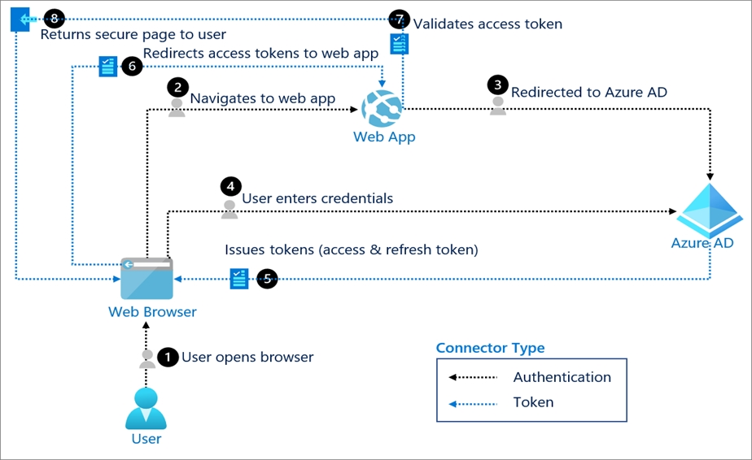
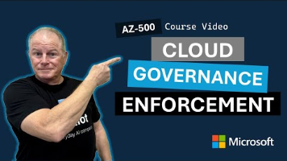
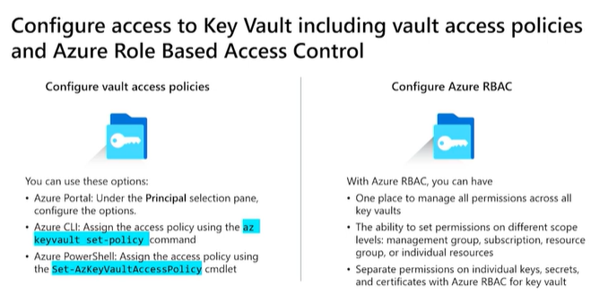
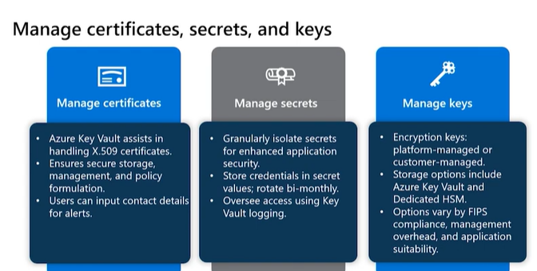
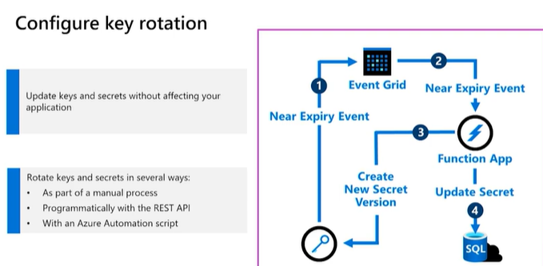
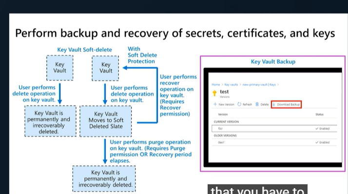

**Azure Identities and governance**

**Manage Azure AD Objects**

 

**Entra ID**

 

Entra ID is multi-tenant cloud-based directory that provides identity
and access management for cloud services (IDaaS) including identity
protection. It's also not intended as a complete replacement for an
on-premises Active Directory. Active Directory uses authentication
protocol Kerberos, NTLM whereas Azure AD use SAML, OAuth, Open ID
Connect and WS-Federation.

 

Azure AD defines users in three ways:

\- Cloud identities - These users exist only in Azure AD. Their source
is Azure Active Directory or External Azure Active Directory if the user
is defined in another Azure AD instance but needs access to subscription
resources controlled by this directory.

\- Directory-synchronized identities - These users exist in an
on-premises Active Directory.

\- Guest users - These users exist outside Azure.

 

The default directory is an instance of Azure AD which can be referred
as tenant that represents the organization.

 

Change subscription directory in the Azure portal in order to configure
default sign in tenant if there are multiple tenant in Azure AD. It is
available for service admin with Microsoft account, but now it’s
available for user with AAD account as well.

 

The UPN suffix of the users in AD domain will be changed to the
default.onmicrosoft.com after synchronization if the domain is not
verified.

 

The classic portal feature edit directory allows you to associate an
existing subscription to Azure AD. It used to be available for service
admin with Microsoft account but now it’s available users with AAD
account

 

Connect Active Directory to Azure AD with Azure AD Connect

 

Azure AD Connect uses an on-premises Windows Server Active Directory
solution can integrate their existing users and groups with Azure Active
Directory.

 

Azure AD Connect provides several components that you can install to
create a hybrid identity system.

 

\- Sync services. This component is responsible for creating users,
groups, and other objects. It also makes sure that identity information
for your on-premises users and groups matches that in the cloud

\- Health monitoring. Azure AD Connect Health supplies robust monitoring
and a central location in the Azure portal for viewing this activity.

\- AD FS. configure a hybrid environment via an on-premises AD FS
infrastructure. Organizations can use this to address complex
deployments, such as domain join SSO, enforcement of the Active
Directory sign-in policy, and smart card or third-party multi-factor
authentication.

\- Password hash synchronization. This feature is a sign-in method that
synchronizes a hash of a user’s on-premises Active Directory password
with Azure AD.

\- Pass-through authentication. This allows users to sign in to both
on-premises and cloud-based applications using the same passwords.

\- You need AD DS Enterprise Administrator( has permission for all
domains) credentials and Azure AD Global administrator credentials (
create Azure AD connecter account is used synchronizing changes to Azure
AD) at implementation of Azure AD Connect.

 

In Azure Active Directory (Azure AD), each Azure AD organization is
fully independent: a peer that is logically independent from the other
Azure AD organizations that you manage. This independence between
organizations includes resource independence, administrative
independence, and synchronization independence.

 

**Resource Independence**

 

\- If you create or delete an Azure AD resource in one organization, it
has no impact on any resource in another organization, with the partial
exception of external users.

\- If you register one of your domain names with one organization, it
can't be used by any other organization.

 

**Administrative Independence**

 

If a non-administrative user of organization 'Contoso' creates a test
organization 'Test,' then:

 

\- By default, the user who creates a organization is added as an
external user in that new organization, and assigned the global
administrator role in that organization.

\- The administrators of organization 'Contoso' have no direct
administrative privileges to organization 'Test,' unless an
administrator of 'Test' specifically grants them these privileges.
However, administrators of 'Contoso' can control access to organization
'Test' if they control the user account that created 'Test.'

\- If you add or remove an Azure AD role for a user in one organization,
the change does not affect the roles that the user is assigned in any
other Azure AD organization.

 

**Synchronization Independence**

 

You can configure each Azure AD organization independently to get data
synchronized from a single instance of either:

\- The Azure AD Connect tool, to synchronize data with a single AD
forest.

\- The Azure Active Directory Connector for Forefront Identity Manager,
to synchronize data with one or more on-premises forests, and/or
non-Azure AD data sources.

 

**MFA Providers**

 

There are two types of Auth providers, and the distinction is around how
your Azure subscription is charged.

 

The per-authentication option calculates the number of authentications
performed against your tenant in a month

 

The per-enabled user option calculates the number of individuals in your
tenant who perform two-step verification in a month.

 

You cannot change the usage model settings (per enabled user or per
authentication) after an MFA provider is created.

 

 

**Users and groups**

 

In Azure Active Directory (Azure AD), all user accounts are granted a
set of default permissions. An user's account access consists of the
type of user, their role assignments, and their ownership of individual
objects.

 

Once user is authenticated, Azure AD builds an access token to authorize
, and determine what resources user can access, and what user can do
with those resources.

 

Member users is a native member of the Azure AD organization that has a
set of default permissions like being able to manage their profile
information.

 

In PowerShell, run the cmdlet New-AzureADUser.

In PowerShell, run the cmdlet Remove-AzureADUser.

 

In the Azure CLI, use az ad user create.

In the Azure CLI, run the cmdlet az ad user delete

 

Administrators have the highest level of access, followed by the member
user accounts

 

Guest users have the most restricted level of access. To add guest users
to Azure AD, you can either send an invitation email that contains a
redemption link or send a direct link to an app you want to share. Guest
users sign in with their own work, school, or social identities. MFA can
be enforced for guest users.

 

When you delete a user, the account remains in a suspended state for 30
days. During that 30-day window, the user account can be restored.

 

Collaborate by using guest accounts and Azure AD B2B

 

If your organization has multiple Azure AD tenants, you may also want to
use Azure AD B2B to give a user in tenant A access to resources in
tenant B. Each Azure AD tenant is distinct and separate from other Azure
AD tenants.

 

With Azure Active Directory B2B, you don't have to manage your external
users' identities. The partner has the responsibility to manage its own
identities.

 

You can use the Azure portal to invite B2B collaboration users. Invite
guest users to the Azure AD organization, group, or application. After
guest user redeems the guest account invitation, he/she uses the same
identity (name and password) for the guest account as she does for her
organization. By default, any users and administrators can invite for
external users. After redeeming the invitation, external user must be
changed password for Microsoft account created on invited email address.

 

After external user collaborate with service, we can removed guest
accounts from Azure AD.

 

**Access Rights Assignment**

 

Direct assignment: Assign a user the required access rights by directly
assigning a role

 

Group assignment: Assign a group the required access rights, and members
of the group will inherit those rights.

 

Rule-based assignment: Use rules to determine a group membership
dynamically based on user or device properties

 

**Security Groups**

 

\- use for granting access to Microsoft 365 resources, such as
SharePoint

\- can contain users or devices as members

\- Can be configured for dynamic membership in Azure AD

\- Microsoft 365 groups can't be members of security groups

\- no email address is required.

\- Can be added to team in MS Teams

 

**Microsoft 365 Groups**

 

\- use for collaboration between users, both inside and also outside
your company as long as it has been allowed by administrator

\- members get a group email and shared workspace for conversations,
SharePoint document library, calendar events, Stream, Planner, OneNote
notebook, Power BI and a Team (if the group was created from Teams)

\- You can also allow external senders to send email to the group email
address

\- Can be configured for dynamic membership in Azure AD

\- Group members can send as or send on behalf of the group email
address if admin allows

\- Microsoft 365 groups don't support nesting with other Microsoft 365
groups or with distribution or security groups.

\- Microsoft 365 groups have roles owners, members and guests.

 

**Distribution groups**

 

\- Use for sending notifications to a group of people

\- Can receive external emails if admin allows

\- Can be upgraded to Microsoft 365 groups

\- Can be added to team in MS Teams

\- Microsoft 365 groups can't be members of distribution groups.

 

**Mail-enabled security group**

 

\- function the same as regular security groups

\- cannot be dynamically managed through Azure Active Directory

\- ability to send mail to all the members of the group.

 

**Shared mailboxes**

 

\- use when multiple people need access to the same mailbox, such as a
company information or support email address

\- Users with permissions to the group mailbox can send as or send on
behalf of the mailbox email address if the administrator allows

\- It's not possible to migrate a shared mailbox to a Microsoft 365
group.

 

**Group membership**

 

Groups allow us to define a security boundary and then add and remove
specific users to grant or deny access with a minimum amount of effort

 

\- Assigned(static)- the group will contain specific users or groups
that you select

\- Dynamic user -You create rules based on characteristics to enable
attribute-based dynamic memberships for groups where creates dynamic
membership rule using query (Property, Operator, Value) for users

\- Dynamic device - creates dynamic membership rule using query
(Property, Operator, Value) for devices

 

For dynamic assignment, it requires Azure AD Premium P1 license.

 

New-AzureADGroup -Description "Marketing" -DisplayName "Marketing"
-MailEnabled \$false -SecurityEnabled \$true -MailNickName "Marketing"

 

Microsoft 365 group expiration policy

 

You can set expiration policy only for Microsoft 365 groups in Azure
Active Directory (Azure AD). With the increase in usage of Microsoft 365
Groups, administrators and users need a way to clean up unused groups.
Expiration policies can help remove inactive groups from the system and
make things cleaner. When a group expires, all of its associated
services such as Outlook, Planner, SharePoint site, etc. are also
deleted. You can set up a rule for dynamic membership on security groups
or Microsoft 365 groups.

 

Once you set a group to expire:

\- Groups with user activities are automatically renewed as the
expiration nears.(Activity-based automatic renewal apply 35 days before
the group expires using Azure AD intelligence)

\- Owners of the group are notified to renew the group, if the group is
not auto-renewed( add mail address of owner who is notified before 30,15
and one days )

\- Any group that is not renewed is deleted.

\- Any Microsoft 365 group that is deleted can be restored within 30
days by the group owners or the administrator.

 

**Nested group**

 

You can add an existing Security group to another existing Security
group (also known as nested groups), creating a member group (subgroup)
and a parent group. The member group inherits the attributes and
properties of the parent group, saving you configuration time.

 

We don't currently support:

\- Adding groups to a group synced with on-premises Active Directory.

\- Adding Security groups to Microsoft 365 groups.

\- Adding Microsoft 365 groups to Security groups or other Microsoft 365
groups.

\- Assigning apps to nested groups.

\- Applying licenses to nested groups.

\- Adding distribution groups in nesting scenarios.

 

**Administrative units**

 

An administrative unit is an Azure AD resource that can be a container
for other Azure AD resources. An administrative unit can contain only
users and groups. Administrative units restrict permissions in a role to
any portion of your organization that you define. Use administrative
units to delegate any role. For example,

 

\- Create a role with administrative permissions over only Azure AD
users in the business school administrative unit.

\- Create an administrative unit for the School of Business.

\- Populate the administrative unit with only the business school
students and staff.

\- Add the business school IT team to the role, along with its scope.

 

Using administrative units requires an Azure AD Premium P1 license for
each administrative unit administrator, and Azure AD Free licenses for
administrative unit members.

 

**Device settings**

 

\- Users may join devices to Azure AD - All, Selected, None

\- Additional local administrators on Azure AD joined devices - Azure AD
adds the global administrator and device administrator roles as local
administrators on devices.

\- Users may register their devices with Azure AD

\- Require Multi-Factor Authentication to join devices

\- Maximum number of devices per user

 

Manage local administrator group on Azure AD joined device

 

As part of the Azure Active Directory (Azure AD) join process, Azure AD
updates the membership of this group on a device. You can customize the
membership update to satisfy your business requirements. This option
requires Azure AD premium tenant.

 

When you connect a Windows device with Azure AD using an Azure AD join,
Azure AD adds the following security principals to the local
administrators group on the device:

\- The Azure AD global administrator role

\- The Azure AD device administrator role

\- The user performing the Azure AD join

 

By the time, you can update the users that can manage a device anytime
in Azure AD without modifying anything on the device.

 

Global administrator in Azure AD and device owners are granted local
administrator by default

 

You cannot scope device administrators to a specific set of devices.
Updating the device administrator role doesn't necessarily have an
immediate impact on the affected users. On devices where a user is
already signed into, the privilege elevation takes place when both the
below actions happen:

\- Upto 4 hours have passed for Azure AD to issue a new Primary Refresh
Token with the appropriate privileges.

\- User signs out and signs back in, not lock/unlock, to refresh their
profile.

 

Cloud Device Administrator

 

\- Read all properties on audit logs, including privileged properties

\- Read bitlocker metadata and key on devices

\- Delete devices from Azure AD

-Disable devices in Azure AD - Enable devices in Azure AD

 

Bulk user updates

 

Guest accounts

 

Azure AD join

 

Azure AD registered

 

It supports for BYOD or mobile can register to Azure AD without
requiring organizational account to sign in to the device. Azure AD
registered devices utilize an account managed by the end user, this
account is either a Microsoft account or another locally managed
credential. This method of device registration is the least restrictive
because it supports devices running Windows 10, iOS, iPadOS, Android,
and macOS. Device security is typically provided from a password, a PIN,
a pattern, or Windows Hello.

 

Azure AD joined

 

This is for organization that want cloud-only and works even hybrid
environment.

Joined only to Azure AD requiring organizational account to sign in to
the device that is owned by organization. This option is available only
to Windows 10 or Windows Server 2019 devices. Security for this option
uses either a password or Windows Hello.

 

Hybrid Azure AD joined

 

Joined device owned by organization, they're signed in with an Azure AD
account that belongs to that organization.

 

Some of the benefits of using device identity, combined with conditional
access in Azure AD, are:

\- The combination simplifies the procedure for adding and managing
devices in Azure AD.

\- The combination reduces the friction for users when they're switching
between devices.

\- Azure AD supports MDM tools such as Microsoft Intune.

\- You can use single sign-on (SSO) with any registered or joined
device.

 

Identity infrastructure model

 

Managed environment: This environment uses pass-through authentication
or password hash sync to provide single sign-on (SSO) to your devices.

 

Federated environments: These environments require the use of an
identity provider. That provider must support the WS-Trust and WS-Fed
protocols for Azure AD join to work natively with Windows devices.
WS-Fed is required to join a device to Azure AD. WS-Trust is needed to
sign in to an Azure AD joined device.

 

Smart cards and certificate-based authentication: These methods aren't
valid ways to join devices to Azure AD. But, if you have Active
Directory Federation Services configured, you can use smart cards to
sign in to Azure AD joined devices.

 

Manual user configuration: If you create users in your on-premises
Active Directory instance, you need to synchronize the accounts to Azure
AD by using Azure AD Connect. If you create users in Azure AD, no
additional setup is needed.

 

**Single sign-on options**

 

Choosing an SSO method depends on how the application is configured for
authentication. Cloud applications can use federation-based options,
such as OpenID Connect, OAuth, and SAML.

 

Federation - When you set up SSO to work between multiple identity
providers, it's called federation. An SSO implementation based on
federation protocols improves security, reliability, end-user
experiences, and implementation.

 

With federated single sign-on, Azure AD authenticates the user to the
application by using their Azure AD account. This method is supported
for SAML 2.0, WS-Federation, or OpenID Connect applications.

 

Federated SSO is the richest mode of SSO. Use federated SSO with Azure
AD when an application supports it, instead of password-based SSO and
Active Directory Federation Services (AD FS).

 

If the application was registered using App registrations in the portal,
then the single sign-on capability is configured to use OpenID Connect
and OAuth by default.

 

Password - On-premises applications can use a password-based method for
SSO. This choice works when applications are configured for Application
Proxy.

 

With password-based SSO, users sign in to the application with a
username and password the first time they access it. After the first
sign-on, Azure AD provides the username and password to the application.
Password-based SSO enables secure application password storage and
replay using a web browser extension or mobile app.

 

Linked - Linked sign-on can provide a consistent user experience while
you migrate applications over a period of time. If you're migrating
applications to Azure AD, you can use linked-based SSO to quickly
publish links to all the applications you intend to migrate. Users can
find all the links in the My Apps or Microsoft 365 portals.

 

You cannot apply conditional access policies or multifactor
authentication to a linked application because a linked application does
not provide single sign-on capabilities through Azure AD.

 

Disabled - When SSO is disabled, it isn't available for the application.
When single sign-on is disabled, users might need to authenticate twice.
First, users authenticate to Azure AD, and then they sign in to the
application.

 

**Open Authentication(OAuth)**

 

The Azure AD server issues tokens (access & refresh token). See step 5
below in graphic.

 

OAuth 2.0 authentication with Azure Active Directory.

 

The OAuth 2.0 is the industry protocol for authorization. It allows a
user to grant limited access to its protected resources. Designed to
work specifically with

 

Hypertext Transfer Protocol (HTTP), OAuth separates the role of the
client from the resource owner. The client requests access to the
resources controlled by the resource owner and hosted by the resource
server (here the Azure AD server). The resource server issues access
tokens with the approval of the resource owner. The client uses the
access tokens to access the protected resources hosted by the resource
server.

 

 

**Example for Service Principal**

 

**Payce FortiClientVPN**

 

Default-FGT-SSLVPN-Users

Object ID : 6016677b-481f-49e2-8b19-a682dfe2c04c

 

payce.com.au

 

Identifier (Entity ID)

<https://connect.payce.com.au:8443/remote/saml/metadata>

Reply URL (Assertion Consumer Service URL)

<https://connect.payce.com.au:8443/remote/saml/login>

Sign on URL

<https://connect.payce.com.au:8443/remote/saml/login>

Relay State (Optional)

Optional

Logout Url (Optional)

<https://connect.payce.com.au:8443/remote/saml/logout>

 

connect.payce.com.au \> 203.87.19.74

 

 

 

 

| **WAN Public IP Address**         | 203.87.19.72/30                      |
|-----------------------------------|--------------------------------------|
| **WAN Public IP Address TPG end** | first usable IP address of the range |

 

 

| **WAN Public IP Address TPG end** | first usable IP address of the range |
|----|----|
| **WAN Public IP Address Customer end** | second usable IP address of the range |

 

**Configure FortiGate SSL VPN SSO**

 

Upload the Base64 SAML Certificate to the FortiGate appliance

 

Complete FortiGate command-line configuration

 

Identifier (Entity ID) :
<https://connect.payce.com.au:8443/remote/saml/metadata>

Reply URL (Assertion Consumer Service URL):
<https://connect.payce.com.au:8443/remote/saml/login>

Logout Url : <https://connect.payce.com.au:8443/remote/saml/logout>

Microsoft Entra Identifier :
<https://sts.windows.net/24627ae7-b7b5-4c63-9c47-5e949a694836/>

Azure Login URL :
<https://login.microsoftonline.com/24627ae7-b7b5-4c63-9c47-5e949a694836/saml2>

Azure Logout URL :
<https://login.microsoftonline.com/24627ae7-b7b5-4c63-9c47-5e949a694836/saml2>

Base64 SAML certificate name (REMOTE_Cert_N) : Microsoft Azure Federated
SSO Certificate

username : user.userprincipalname

group : user.groups

 

Configure FortiGate for group matching

 

Default-FGT-SSLVPN-Users

Object ID :

 

Create certificate using Let's encrypt from firewall itself

 

<https://grumpy.tech/use-letsencryt-ssl-certificates-with-a-fortinet/>

 

 

**Device Management**

 

Azure AD join uses the mobile device management (MDM) platform to manage
devices attached to Azure AD.

 

MDM only: All joined devices are managed exclusively through an MDM
provider, like Intune.

 

Co-management: All joined devices use a combination of a locally
installed System Center Configuration Manager agent and your MDM
provider.

 

**Provisioning Options**

 

Self-service: Requires users to manually configure the device during the
Windows out-of-box experience (OOBE) for new devices

 

Windows Autopilot: Allows you to preconfigure Windows devices, including
automatically joining the device to your Active Directory organization.

 

Bulk enrollment: set up a provisioning package that applies to a large
number of new Windows devices at the same time.

 

Mobility settings

 

You might need to add an MDM provider before you can configure mobility
settings. To add your MDM provider, go to Azure Active Directory \>
Mobility (MDM and MAM) \> Add application.

 

MDM user scope : MDM enrollment is automated along with Azure AD join if
you have Azure AD Premium subscription.

 

MDM URLs: The three URLs related to your MDM configuration are MDM terms
of use URL, MDM discovery URL, and MDM compliance URL. Each URL has a
predefined default value.

 

Enterprise State Roaming

 

Enterprise State Roaming enables users of Windows 10 devices to
automatically sync settings and application data with their
organization's cloud service and follow them when they switch devices.
Key benefits of using Enterprise State Roaming are:

 

\- Separation of corporate and consumer data.

\- Enhanced security, because all applicable device data is encrypted
through Azure Rights Management before synchronizing with the cloud.

\- Better management and monitoring

 

Enterprise State Roaming requires a Premium Azure Active Directory
subscription.

 

To enable Enterprise State Roaming, go to Azure Active Directory \>
Devices \> Enterprise State Roaming.

 

Enterprise State Roaming stores the user data in a geographical region
that's nearest to your Azure AD instance.

 

All Enterprise State Roaming data persists in the cloud until it's
explicitly deleted or becomes stale. Any deleted data is automatically
kept for a maximum of 90 days. Explicit data deletion can be made in
these ways.

 

\- User deletion: When the administrator removes a user from Azure AD

\- Azure AD organization deletion: When the administrator removes a
directory

\- On Request deletion: Use this option to remove a specific user's
roaming data by raising Azure support ticket

 

Stale data deletion : Any Enterprise State Roaming data that hasn't been
accessed during the past year is automatically treated as stale data.
Stale data is deleted from the host cloud storage.

 

Data that syncs and roams

 

Windows settings : Theme, Internet Explorer settings, Microsoft Edge
browser settings, Passwords, Language preferences, Ease of access
features

 

Application data: Universal Windows apps can write settings data to a
roaming folder. Any data written to this folder will automatically be
synced.

 

 

**Self-service password reset(SSPR)**

 

With SSPR, users can reset their passwords in a web browser or from a
Windows sign-in screen to regain access to Azure, Microsoft 365, and any
other application that uses Azure AD for authentication.

 

The user initiates a password reset either by going directly to the
password reset portal or by selecting the Can't access your account link
on a sign-in page. The reset portal takes these step on s:

1\. Localization: The portal checks the browser's locale setting and
renders the SSPR page in the appropriate language.

2\. Verification: The user enters their username and passes a captcha to
ensure that it's a user and not a bot.

3\. Authentication: The user enters the required data to authenticate
their identity. They might, for example, enter a code or answer security
questions.

4\. Password reset: If the user passes the authentication tests, they
can enter a new password and confirm it.

5\. Notification: A message is usually sent to the user to confirm the
reset.

 

Authentication reset request methods when you configure SSPR.

 

\- Mobile app notification

\- Mobile app code

\- Email

\- Mobile phone

\- Office phone- You receive an automated call to this number and press
\#

\- Security questions

 

In free and trial Azure AD organizations, phone call options aren't
supported.

 

Recommendation on SSPR

 

\- Enable two or more of the authentication reset request methods.

\- Use the mobile app notification or code as the primary method

\- The mobile phone method isn't a recommended method because it's
possible to send fraudulent SMS messages.

\- The security question option is the least recommended method

 

Administrators can choose how users are notified of password changes.

\- Notify users via primary and secondary email addresses on password
reset

\- Notify all admins when other admins reset their password

 

Licenses requirement

 

Any user who is signed in can change their password, regardless of the
edition of Azure AD.

 

If you're not signed in and you've forgotten your password or your
password has expired, you can use SSPR in Azure AD Premium P1 or P2.

 

In a hybrid situation, where you have Active Directory on-premises and
Azure AD in the cloud, any password change in the cloud must be written
back to the on-premises directory. This writeback support is available
in Azure AD Premium P1 or P2.

 

Azure Active Directory \> Password Reset

 

Register with SSPR is required for mobile phone number registration.

 

Directory Customize Branding

 

organization's branding on the Azure sign-in page to reassure users that
they're passing credentials to a legitimate system.

 

Azure Active Directory \> Company Branding

 

 

**Manage role-based access control(RBAC)**

 

Azure resources and Azure Active Directory (Azure AD) have independent
permission systems. Azure roles are used to manage access to virtual
machines, storage, and other Azure resources. Azure AD roles are used to
manage access to Azure AD resources, such as user accounts and
passwords.

 

**Azure Roles**

 

Azure role-based access control (Azure RBAC) is the system that allows
control over who has access to which Azure resources, and what those
people can do with those resources. Further this authorization system
built on Azure Resource Manager that provides fine-grained access
management of Azure resources.

 

Role assigned at a parent scope also grants access to the child scopes
contained within it.

 

Azure Role information accessible through Azure portal, Azure CLI, Azure
PowerShell, Azure Resource Manager templates, REST API.

 

Owner- Grant full access to manage all Azure resources including the
ability to assign role in Azure RBAC

 

Get-AzRoleDefinition Owner

 

Contributor- Grant full access to manage all resources, but does not
allow you to assign roles in Azure RBAC, manage assignment in Azure
blueprints or share image galleries.

 

Reader- View all resources but does not allow you to make any changes

 

User Access Administrator -Can manage access to Azure resources.

 

Network contributor- let mange networks but not access to them

 

Virtual Machine Contributor: Lets you manage virtual machines, but not
access to them, and doesn’t let management access to virtual network or
storage account they're connected to.

 

Any user can use the Azure portal to elevate your own access.

 

Azure Portal \> Access Control( IAM) in Management group, subscriptions,
resource group, resource

 

To create a role assignment, you need three elements: a security
principal(who),a role definition(what)and a scope(where).

 

Who- users, groups, applications

What- read, write, delete

Where- Management group, subscriptions, resource group, resource

 

Use NotActions to create a set of not allowed permissions. The access
granted by a role, the effective permissions, is computed by subtracting
the NotActions. The wildcard (\*) in Actions indicates that it can
perform all operations on the control plane. Then you subtract the
required operations in NotActions operations from the Actions
operations.

 

Azure roles assignment logs can be retrieved from Azure Activity logs.

 

All services \> Activity log

 

 

Identify the right scope

 

You can apply Azure roles at four levels of scope: management groups,
subscriptions, resource groups, and resources.

 

You could use the Virtual Machine Contributor role, which allows that
person to manage virtual machines within only a specific resource group.
You can limit the role's scope to a specific resource, resource group,
subscription, or management group level.

 

Azure AD Roles

 

Azure AD also has its own set of roles, which apply mostly to users,
passwords, and domains. Unlike Azure roles, Azure AD role has only one
scope, the directory which is tenant level.

 

Azure AD Role information accessible in Azure admin portal, Microsoft
365 admin center, Microsoft Graph, Azure AD PowerShell.

 

Global Administrator: Can manage access to administrative features in
Azure AD. A person in this role can grant administrator roles to other
users, and they can reset a password for any user or administrator.

 

 

User Administrator: Can manage all aspects of users and groups,
including support tickets, monitoring service health, and resetting
passwords for certain types of users.

 

 

Billing Administrator: Can make purchases, manage subscriptions and
support tickets, and monitor service health.

 

Creating a Azure AD new role can be done through several mechanisms:

\- Azure portal. You can use the Azure portal to create a custom role -
Azure Active Directory \> Roles and administrators \> New custom role.

\- Azure PowerShell. You can use the New-AzADMSRoleDefinition cmdlet to
define a new role.

\- Azure Graph API. You can use a REST call to the Graph API to
programmatically create a new role.

 

Custom role with Azure RBAC

 

It is preferable to use a built-in role if possible. However, you can
create custom roles if you find it necessary. Administrator with the
Owner or User Access Administrator roles have permissions to create and
manage custom roles.

 

Custom role can be assigned to;

 

\- User- An individual who has a profile in Azure Active Directory

\- Group- A set of users created in Azure Active Directory

\- Security principals- A security identity used by applications or
services to access specific Azure resources

\- Managed identity- An identity in Azure Active Directory that is
automatically managed by Azure

 

**Managed identities in Azure resources**

 

A common challenge for developers is the management of secrets and
credentials used to secure communication between different components.
Managed identities eliminate the need for developers to manage
credentials.

 

Managed identities provide an identity for applications to use when
connecting to resources that support Azure Active Directory (Azure AD)
authentication. Applications may use the managed identity to obtain
Azure AD tokens. For example, an application may use a managed identity
to access resources like Azure Key Vault where developers can store
credentials in a secure manner. Managed identities is used for virtual
machine and VM scale sets.

 

Type of Managed identities

 

System-assigned Some Azure services allow you to enable a managed
identity directly on a service instance. An identity is created in Azure
AD that is tied to the lifecycle of that service instance. A
system-assigned managed identity can't be shared. It can only be
associated with a single Azure resource.

 

Typical usage:Workloads that are contained within a single Azure
resource.Workloads for which you need independent identities. For
example, an application that runs on a single virtual machine.

 

User-assigned You may also create a managed identity as a standalone
Azure resource. Can be shared.

The same user-assigned managed identity can be associated with more than
one Azure resource.

 

Common usage:

Workloads that run on multiple resources and can share a single
identity. For example, a workload where multiple virtual machines need
to access the same resource.

 

Role definition and structure

 

A custom role definition breaks down into a collection of different
permissions.

 

{

"Name": "",

"IsCustom": true,

"Description": "",

"Actions": \[\],

"NotActions": \[\],

"DataActions": \[\],

"NotDataActions": \[\],

"AssignableScopes": \[

"/subscriptions/{subscriptionId1}"

\]

}

 

Actions; Microsoft.Authorization/roleDefinition/write - to create,
delete, or update custom roles.

 

Microsoft.Authorization/roleDefinition/write- to view custom roles

 

AssignableScopes; role assignment scope

 

To get custom operation such as restart virtualMachine, use Azure
PowerShell Get-AzProviderOperation cmdlet is useful to get the most
current list of resource provider operations. In Azure CLI, use the az
provider operation show command.

 

In Azure CLI;

 

To create new custom role,

 

az role definition create --role-definition vm-operator-role.json

 

az role assignment create --assignee \$USER --role "Virtual Machine
Operator"

 

To update custom role,

 

az role definition update --role-definition "\<\<path-to-json-file\>\>"

 

In Azure PowerShell;

 

To create new custom role,

 

New-AzRoleDefinition -InputFile "vm-operator-role.json"

 

To update custom role,

 

Set-AzRoleDefinition -InputFile "\<\<path-to-json-file\>\>"

 

 

In Azure Portal, you have options to create custom role with baseline
permissions.

\- Clone a role

\- Start from scratch

\- Start from JSON- browsing created JSON

 

Delete Custom role

 

If you decide you no longer need the custom role, you need to remove the
role assignments before you can delete the role.

 

Access to Azure Resources by assigning roles at different scopes

 

DevTest Labs User - role only lets you connect, start, restart, and
shutdown virtual machines in your Azure DevTest Labs.

 

Logic App Contributor - role lets you manage logic app, but not access
to them. It provides access to create, view, edit, and update a logic
app.

 

Logic App Operator - Lets you read, enable, and disable logic apps, but
not edit or update them.

 

Azure AD integration with AKS

 

Azure AD authentication is provided to AKS clusters with OpenID Connect.
OpenID Connect is an identity layer built on top of the OAuth 2.0
protocol. From inside Kubernetes cluster, Webhook Token authentication
is used to verify authentication token. Webhook token authentication is
configured and managed as part of AKS cluster.

 

OpenID Connect is a flavor of OAuth2 supported by some OAuth2 providers,
notably Azure Active Directory, Salesforce, and Google. The protocol's
main extension of OAuth2 is an additional field returned with the access
token called an ID Token. This token is a JSON Web Token (JWT) with well
known fields, such as a user's email, signed by the server. To identify
the user, the authenticator uses the id_token (not the access_token)
from the OAuth2 token response as a bearer token. See above for how the
token is included in a request.

 

Backend pool management

 

It is critical component that defines the group of resources that will
serve traffic for load-balancing rule. There are two ways of configuring
a backend pool

 

\- Network Interface Card(NIC)

\- Combination of IP address and Virtual Network(VNET) resource ID

 

It cannot create a single backend pool that mixes backed addresses
targeted by NIC and IP addresses within same pool

 

Load balancer health probes - It allows load balancer to detect backend
endpoint status such as failure of an application on a backend endpoint.
You can also generate a custom response to a health probe and use the
health probe for flow control to manage load or planned downtime. Load
Balancer will stop sending new flows to the respective unhealthy
instance. Outbound connectivity is not impacted, only inbound
connectivity is impacted.

 

Health probes support multiple protocols. The availability of a specific
health probe protocol varies by Load Balancer SKU.

 

Interpret access assignment

 

 

Manage subscriptions and governance

 

**Azure policies**

 

Azure Policy helps to enforce organizational standards and to assess
compliance at-scale. Through its compliance dashboard, it provides an
aggregated view to evaluate the overall state of the azure environment,
with the ability to drill down to the per-resource, per-policy
granularity. It also helps to bring your resources to compliance through
bulk remediation for existing resources and automatic remediation for
new resources.

 

Policies can enforce things such as

\- only allowing specific types of resources to be created

-Allow virtual machine size SKUs

\- only allowing resources in specific Azure regions

\- naming conventions across your Azure environment

\- enforce that specific tags are applied to resources.

 

Enforcement & Compliance

\- Turn on built-in policies or build custom policies for all resource
types

\- Real-time policy evaluation and enforcement

\- Periodic & on-demand compliance evaluation

 

Apply policies at scale

\- Apply policies to management group with control across entire
organization

\- Apply multiple policies and aggregate policy states with policy
initiative

\- Exclusion scope

 

***Remediation***

 

\- Real time/automatic/bulk remediation

 

By default, the assignment will only take effect on newly created
resources. Existing resources can be updated via remediation task after
the policy is assigned.

 

A remediation task deploys the **deployIfNotExists** template or
the **modify** operations to the selected non-compliant resources using
the identity specified in the assignment

 

deployIFNotExists policies - the remediation task will deploy the
specified template

modify policies - the remediation task will edit tags on the existing
resources

 

Common use cases for Azure Policy include implementing governance for
resource consistency, regulatory compliance, security, cost control, and
management.

 

Policy assignments with effect set as Modify require a managed identity
to do remediation.

 

Azure Policy evaluates resources in Azure by comparing the properties of
those resources to business rules. which is described in JSON format,
are known as policy definitions. Once policy definitions have been
formed, it is assigned to scope of resources.

 

***Azure level of Scope***

 

\- Management groups

\- Subscription

\- Resource groups

 

***Policy Definitions***

 

Creating and implementing a policy in Azure Policy begins with creating
a policy definition which includes metadata and policy rules. The
defined rule can use functions, parameters, logical operators and
conditions to match exactly the scenario you want.

 

In Azure Policy, we offer several built-in policies that are available
by default.

 

\- Allowed Storage Account SKUs (Deny)

\- Allowed Resource Type (Deny)

\- Allowed Locations (Deny)

\- Allowed Virtual Machine SKUs (Deny)

\- Add a tag to resources (Modify)

 

***Policy effects***

 

***Modify*** is used to add, update, or remove properties or tags on a
subscription or resource during creation or update. A common example is
updating tags on resources such as costCenter. Existing non-compliant
resources can be remediated with a remediation task. A single Modify
rule can have any number of operations. Policy assignments with effect
set as Modify require a managed identity to do remediation.

 

***Append*** is used to add additional fields to the requested resource
during creation or update. A common example is specifying allowed IPs
for a storage resource. Append is intended for use with non-tag
properties. While Append can add tags to a resource during a create or
update requires

 

| ***Deny*** | Prevents creation/modification of non-compliant resources |
|------------|-----------------------------------------------------------|

| ***Audit*** | Flags non-compliant resources only |
|-------------|------------------------------------|

 

***DeployIfNotExists*** Deploys a supporting resource/config if missing

 

Only **Modify** and **DeployIfNotExists** can **auto-remediate**
existing resources (and even then, only via Remediation Tasks)

 

 

***Scope of Azure Policy***

 

The first instance scope used by Azure Policy is when a policy
definition is created. The definition may be saved in either a
management group or a subscription.

 

\- Subscription - Only resources within that subscription can be
assigned the policy definition.

\- Management group - Only resources within child management groups and
child subscriptions can be assigned the policy definition. If you plan
to apply the policy definition to several subscriptions, the location
must be same as a management group that contains each subscription.

-Resource group

 

***Assignment scope***

 

\- Inclusion - A resource hierarchy or individual resource should be
evaluated for compliance by the definition

\- Exclusion - A resource hierarchy or individual resource shouldn't be
evaluated for compliance by the definition.

\- Exemption (free in preview feature) - A resource hierarchy or
individual resource should be evaluated for compliance by the
definition, but won't be evaluated for a reason such as having a waiver
or being mitigated through another method.

 

Resources are evaluated at specific times during the resource lifecycle,
the policy assignment lifecycle, and for regular ongoing compliance
evaluation.

 

\- A resource is created, updated, or deleted in a scope with a policy
assignment.

\- A policy or initiative is newly assigned to a scope.

\- A policy or initiative already assigned to a scope is updated.

\- During the standard compliance evaluation cycle, which occurs once
every 24 hours.

 

Examples of how an organization wants the platform to respond to a
non-compliant resource include:

 

\- Deny the resource change

\- Log the change to the resource

\- Alter the resource before the change

\- Alter the resource after the change

\- Deploy related compliant resources

 

Azure Policy also supports dealing with existing non-compliant resources
without needing to alter that resource.

 

The policy assignment may take up to 30 minutes to take effect.

 

***Azure Policy initiative*** is a way of grouping related policies
together. The ***initiative definition*** contains all of the policy
definitions to help track your compliance state for a larger goal. The
***initiative assignment*** is an initiative definition that's assigned
to a specific scope of a management group, a subscription, or a resource
group.

 

Because the associated initiative remains assigned, it's easier to add
and remove policies without the need to change the policy assignment for
your resources.

 

[Implement and manage enforcement of cloud governance policies
AZ-500](https://www.youtube.com/watch?v=RP8oVJyjMZg)

 

 

**Azure Blueprints**

 

Azure Blueprints is ;

 

- to scale their governance practices throughout the organization.

- To define a repeatable set of processes that can adhere to an
  organization standards and patterns

- To orchestrate the deployment of artifacts to Azure such as ARM
  templates , Azure policies, Resource groups, and RBAC

 

When creating a blueprint definition, you'll define where the blueprint
is saved. Blueprints can be saved to a management group or subscription
so that you have ***Contributor access*** to either the management group
or subscription. If the location is a management group, the blueprint is
available to assign to any child subscription of that management group.

 

The root management group is built into the hierarchy to have all
management groups and subscriptions fold up to it. This root management
group allows for global policies and Azure role assignments to be
applied at the directory level.

 

Implementing a blueprint in Azure Blueprints involves these three steps:

 

1\. Create an Azure blueprint with necessary artifacts and save to
either a management group or subscription

2\. Publish the blueprint with version number

3\. Assign the blueprint to management group/subscription

4\. Track the blueprint assignments.

 

With Azure Blueprints, the relationship between the blueprint definition
(what should be deployed) and the blueprint assignment (what was
deployed) is preserved.

 

You can protect resources deployed via the ***Blueprint resource
locks.*** Here even if there is a user with the owner role, still the
user will not be able to remove the lock. You can only remove the lock
by unassigning the

Blueprint

 

Blueprints are also versioned. Versioning enables you to track and
comment on changes to your blueprint.

 

 

**Azure Policy vs Azure RBAC**

 

Azure Policy ensures that resource state is compliant to your business
rules without concern for who made the change or who has permission to
make a change.

 

Azure RBAC focuses on managing user actions at different scopes.

 

Even if an individual has access to perform an action, if the result is
a non-compliant resource, Azure Policy still blocks the create or
update.

 

The combination of Azure RBAC and Azure Policy provides full scope
control in Azure.

 

\- Resource Policy Contributor role includes most Azure Policy
operations

\- Owner has full rights.

\- Contributor and Reader have access to all read Azure Policy
operations.

\- Contributor may trigger resource remediation, but can't create
definitions or assignments.

 

Consider organizational hierarchies when creating definitions and
assignments. We recommend creating definitions at higher levels such as
the management group or subscription level. Then, create the assignment
at the next child level. If you create a definition at a management
group, the assignment can be scoped down to a subscription or resource
group within that management group.

 

**Azure Key Vault**

 

-Stores API keys, passwords, secrets, certificates and cryptographic
keys

-No price for a key vault, the use of key vault has a charge

-It is not recommended to use single key vault for bunch of secure
information as it may compromise all secure information if the vault is
compromised. More key vault would be more secure model

-If application needs to access other Azure service through managed
identities, managed identity is authorized by key vault and
authenticated with Entra ID, then extract secure information to access
the required Azure services

-Supports vault for software/Hardware Security Module (HSM)-backed keys
and managed HSM pools for HSM-backed keys only. It is recommended to use
HSM for key vault if it is for production. HSM feature involves
additional cost than standard key vault

-Offers managed identities for secure authentication and enforce TLS for
data-in-transit protection

-Restrict Key Vault access with IP addresses, virtual network and Azure
Private Link for enhanced network security

-Enforce HTTPS, TLS 1.2/1.3 and conditional access policies for secure
data transmission and access control

-Authenticate via Microsoft Entra ID: authorize using Azure RBAC and key
vault access policies for granular access management

-Authentication with Key Vault is integrated with Microsoft Entra ID to
authenticate security principals which can be users, groups or service
principals with unique IDs for Azure resource access.

-Key vault authentication involves token retrieval, firewall checks and
permission validation for operations

 

 

 

-Configure key rotation based on time and number of attempts of use

 

 

 

 

**Resource locks**

 

An administrator can lock a subscription, resource group, or resource to
prevent other users in your organization from accidentally deleting or
modifying critical resources. The lock overrides any permissions the
user might have. You can set the lock level to ***CanNotDelete*** or
***ReadOnly***.

 

\- ***CanNotDelete*** means authorized users can still read and modify a
resource, but they can't delete the resource.

\- ***ReadOnly*** means authorized users can read a resource, but they
can't delete or update the resource

 

Unlike RBAC, you use management locks to apply a restriction across all
users and roles. Resource locks apply regardless of RBAC permissions.
Even if you are an owner of the resource, you must still remove the lock
before you'll actually be able to perform the blocked activity.

 

If the resource lock is removed, its associated resources can be changed
or deleted. To make the protection process more robust, you can combine
resource locks with Azure Blueprints. Azure Blueprints enables you to
define the set of standard Azure resources that your organization
requires. Azure Blueprints can automatically replace the resource lock
if that lock is removed.

 

Azure Portal\> resource group\> Locks

 

Lock inheritance- When you apply a lock at a parent scope, all resources
within that scope inherit the same lock. Even resources you add later
inherit the lock from the parent. The most restrictive lock in the
inheritance takes precedence.

 

Locks don't apply to all types of operations. Azure operations can be
divided into two categories - control
plane(https://management.azure.com)and data
plane(https://myaccount.blob.core.windows.net/). Locks only apply to
control plane operations. For example, a ReadOnly lock on a SQL Database
logical server prevents you from deleting or modifying the server. It
doesn't prevent you from creating, updating, or deleting data in the
databases on that server.

 

Some common operations that are blocked by the ReadOnly lock, the
ReadOnly lock on storage account prevents all users from listing the
keys.

 

There are few considerations applying locks on resources.

 

To create or delete management locks, you must have access to
Microsoft.Authorization/\* or Microsoft.Authorization/locks/\* actions.
Of the built-in roles, only Owner and User Access Administrator are
granted those actions.

 

 

**Manage tags and resources**

 

Resources

 

A manageable item that is available through Azure. Virtual machines,
storage accounts, web apps, databases, and virtual networks are examples
of resources. Resource groups, subscriptions, management groups, and
tags are also examples of resources.

 

Move resources to new resource group or subscription or regions

 

Each resource must be part of a single resource group. A resource group
can hold many different types of resources in different regions.

 

You can use the Azure portal, Azure PowerShell, Azure CLI, or the REST
API to move resources.

When you move a resource,

\- The resources you want to move must support the move operation

\- Your moved resources don't change location. For example, if you have
a storage account in the East US region, and you move it to another
resource group, it keeps its East US region location.

\- Both the source group and the target group are locked until move
operation ends. Write and delete operations are blocked on the resource
groups until the move completes. This lock means you can't add, update,
or delete resources in the resource groups.

\- you change its resource ID- The standard format for a resource ID is
//subscriptions/{subscriptionId}/resourceGroups/{resourceGroupName}/providers/{extensionResourceProviderNamespace}/{extensionResourceType}/{extensionResourceName}-
you change one or more values in this path

\- A child resource can’t be moved independently from its parent
resource so that parent resource should be moved

\- If a resource have more dependent resources, they must be moved to a
resource group before it moves to another subscription

 

For example, if you move an Azure SQL logical server and its databases
to a new resource group or subscription, applications that use the
databases experience no downtime.

 

To move existing resources to another resource group or subscription,
use Move-AzureRmResource cmdlet

 

Each resource type can be moved between resource groups or between
subscriptions. For example, these resources can be moved:

\- Azure Storage accounts

\- Azure virtual machines

\- Azure virtual networks

\- Recovery service vault

\- Virtual machine with managed disk

\- Managed disk

 

These resources can't be moved:

\- Azure Active Directory domain services

\- Azure Backup vaults

\- Azure App Service gateways

\- Classic virtual network

 

\- If you want to move a virtual machine, all of its dependants must go
with it.

\- You can't move virtual machines with certificates in Azure Key Vault
between subscriptions.

\- You can't move virtual machine scale sets with standard load
balancers or a standard public IP.

\- You can't move any managed disks that are in availability zones to
different subscriptions.

 

Validation of resource move

 

Before attempting to move a resource, you can test whether it will be
successful by calling the validate move operation from the Azure REST
API. This is useful if resources move by using Azure CLI and Azure
PowerShell. Testing a move doesn't affect your resources.

 

If you are using Azure portal for resource move, Azure portal does an
automatic validation before allowing you to move resources.

 

To call a specific Azure REST method, such as the validate
moveoperation, you can use the Azure CLI.

 

Move operation support for resource type against resource group,
subscription, region move

 

1\. Tenants- Y, Y, N

2\. Policydefintions- N,N,N

3\. Privateclouds- Y, Y, N

4\. AAD Tenants- N,N,N

5\. Virtual machine- Y, Y,N

6\. Virtual network- N, N, N

7\. Storage accounts- Y, N,Y

8\. Disks - N,N,N

9\. RecoveryServicesVault- Y,Y,N

 

Tags

 

You apply tags to your Azure resources, resource groups, and
subscriptions giving metadata to logically organize them into a
taxonomy. Each tag consists of a name and a value pair. For example, you
can apply the name Environment and the value Production to all the
resources in production.

 

 

Resource management : with specific workloads, environments, business
units, and owners.

 

Cost management and optimization : can report on costs, allocate
internal cost centers, track budgets, and forecast estimated cost.

 

Operations management : how critical their availability is to your
business.

 

Security: to classify data by its security level, such as public or
confidential.

 

Governance and regulatory compliance : align with governance or
regulatory compliance requirements, such as ISO 27001.

 

\- Each resource or resource group can have a maximum of 50 tag
name/value pairs.

\- Tags applied to the resource group are not inherited by the resources
in that resource group.

\- The tag name is limited to 512 characters for all types of resources
except storage accounts, which have a limit of 128 characters.

\- The tag value is limited to 256 characters for all types of
resources.

\- Tags cannot be applied to every Azure resources such as classic
resources, generalized VMs

\- You can use Azure Policy to ensure that a resource inherits the same
tags as its parent resource group.

\- You can use Azure Policy to automatically add or enforce tags for
resources your organization creates based on policy conditions that you
define.

\- The Policy only affects resources that are created after the azure
policy is enabled. There is a remediation option that can be used for
resources created before the Policy applied.

\- Tags can be added and manipulated through the Azure portal, Azure
CLI, Azure PowerShell, Resource Manager templates, and through the REST
API.

 

In Azure CLI,

 

az resource tag --tags Department=Finance \\

--resource-group msftlearn-core-infrastructure-rg \\

--name msftlearn-vnet1 \\

--resource-type "Microsoft.Network/virtualNetworks"

 

 

**Azure Resource Manager**

 

Azure Resource Manager is the deployment and management service for
Azure. It provides a management layer that enables you to create,
update, and delete resources in your Azure account. It use management
features, like access control, locks, and tags, to secure and organize
your resources after deployment.

 

When a user sends a request from any of the Azure tools(Azure Portal,
Azure PowerShell, Azure CLI, REST APIs, client SDKs), APIs, or SDKs,
Resource Manager receives the request. It authenticates and authorizes
the request. Resource Manager sends the request to the Azure service,
which takes the requested action. Because all requests are handled
through the same API, you see consistent results and capabilities in all
the different tools.

 

Benefits of ARM

 

\- Deploy, manage, and monitor all the resources for your solution as a
group, rather than handling these resources individually.

\- Redeploy your solution throughout the development lifecycle and have
confidence your resources are deployed in a consistent state.

\- Apply tags to resources to logically organize all the resources in
your subscription.

\- Define the dependencies between resources so they're deployed in the
correct order

 

Scope in ARM

 

Azure provides four levels of scope:

\- management groups

\- subscriptions

\- resource groups

\- resources.

 

You apply management settings at any of these levels of scope. The level
you select determines how widely the setting is applied. Lower levels
inherit settings from higher levels. For example, when you apply a
policy to the subscription, the policy is applied to all resource groups
and resources in your subscription.

 

Resource Manager template(ARM Template)

 

The ARM template can be used to deploy the resources consistently and
repeatedly where teams need to manage infrastructure and application
code through a unified process.

 

To meet these challenges, you can automate deployments and use the
practice of infrastructure as code. In code, you define the
infrastructure that needs to be deployed. The infrastructure code
becomes part of your project. Just like application code, you store the
infrastructure code in a source repository and version it. Any one on
your team can run the code and deploy similar environments

 

To implement infrastructure as code for your Azure solutions, use Azure
Resource Manager templates (ARM templates).A JavaScript Object Notation
(JSON) file that defines one or more resources to deploy to a resource
group, subscription, management group, or tenant.

 

It defines the infrastructure and configuration for your project. The
template uses declarative syntax, which lets you state what you intend
to deploy without having to write the sequence of programming commands
to create it. In the template, you specify the resources to deploy and
the properties for those resources.

 

We've introduced a new language named Bicep that's used to develop ARM
template JSON. Bicep files and JSON templates offer the same
capabilities. You can convert templates between the two language.

 

 

Declarative syntax: ARM templates allow you to create and deploy an
entire Azure infrastructure declaratively. For example, you can deploy
not only virtual machines, but also the network infrastructure, storage
systems, and any other resources you may need.

 

 

Repeatable results: Repeatedly deploy your infrastructure throughout the
development lifecycle and have confidence your resources are deployed in
a consistent manner, you can deploy the same template many times and get
the same resource types in the same state

 

Orchestration: You don't have to worry about the complexities of
ordering operations. Resource Manager orchestrates the deployment of
interdependent resources so they're created in the correct order. When
possible, Resource Manager deploys resources in parallel so your
deployments finish faster than serial deployments. You deploy the
template through one command, rather than through multiple imperative
commands.

 

 

Modular files: You can break your templates into smaller, reusable
components and link them together at deployment time. You can also nest
one template inside another templates.

 

**Resource Provider**

 

A service that supplies Azure resources. Common resource providers in
Azure are

 

\- Microsoft.Compute, which supplies the virtual machine resource.

\- Microsoft.Storage is another common resource provider.

 

Resources groups

 

A container that holds related resources for an Azure solution. The
resource group includes those resources that you want to manage as a
group.

 

The resource group stores metadata about the resources. When you specify
location for resource group, you are specifying where the metadata is
stored.

 

Resource groups can't be nested. Before any resource can be provisioned,
you need a resource group for it to be placed in.

 

You can see a history of deployments for resource group with the summary
of its operation, viewing template

 

You decide which resources belong in a resource group based on what
makes the most sense for your organization.

 

\- All the resources in your resource group should share the same
lifecycle. You deploy, update, and delete them together. Resource groups
make it easy to remove a set of resources at once.

\- Resource groups are also a scope for applying role-based access
control (RBAC) permissions.

\- Each resource can exist in only one resource group.

\- You can add or remove a resource to a resource group at any time.

\- The resources in a resource group can be located in different regions
than the resource group.

\- You can group resources by resource type, environment, departments,
authorization, resource life cycle, and billing.

\- When creating a resource group, you need to provide a location for
that resource group. The resource group stores metadata about the
resources. When you specify a location for the resource group, you're
specifying where that metadata is stored because data is stored in
particular region for compliance reason. If the resource group's region
is temporarily unavailable, you can't update resources in the resource
group because the metadata is unavailable.

\- A resource group can be used to scope access control for
administrative actions.

\- You can apply tags to a resource group. The resources in the resource
group don't inherit those tags.

\- A resource can connect to resources in other resource groups. This
scenario is common when the two resources are related but don't share
the same lifecycle. For example, you can have a web app that connects to
a database in a different resource group.

\- When you delete a resource group, all resources in the resource group
are also deleted.

\- You can deploy up to 800 instances of a resource type in each
resource group. Some resource types are exempt from the 800 instance
limit.

\- Some resources can exist outside of a resource group. These resources
are deployed to the subscription, management group, or tenant. Only
specific resource types are supported at these scopes.

\- Maintaining consistent naming convention would be helpful to get an
idea on a glance.

\- To create a resource group, you can use the Azure portal, PowerShell,
Azure CLI, or an ARM template, Azure SDK

 

When you delete a resource group, all resources in the resource group
are also deleted but the Resource group has recovery service vault with
active backup. You can’t delete recovery service vault with
dependencies. So, First you have to stop the backup. Then you have to
delete the backup in recovery service vault , but backup goes into soft
deleted status. The soft deleted items will be permanently deleted only
after 14 days of delete operation Only after permanent deletion, you can
delete the recovery service vault or resource group.

 

Deployments: history of all deployments to this resource group, create a
resource is also a deployment.

 

Export from resource group or resource: This option generates a new
template from existing resources. The exported template is a "snapshot"
of the current state of the resource group. You can export an entire
resource group or specific resources within that resource group. Save
from history: This option retrieves an exact copy of a template used for
deployment. You specify the deployment from the deployment history.

 

 

You can't delete a Recovery Services vault with any of the following
dependencies:

\- You can't delete a vault that contains protected data sources (for
example, IaaS VMs, SQL databases, Azure file shares).

\- You can't delete a vault that contains backup data. Once backup data
is deleted, it will go into the soft deleted state.

\- You can't delete a vault that contains backup data in the soft
deleted state.

\- You can't delete a vault that has registered storage accounts.

 

 

 

Subscriptions, licenses, accounts and tenants for Microsoft’s cloud
offerings

 

Microsoft provides a hierarchy of organizations, subscriptions,
licenses, and user accounts for consistent use of identities and billing
across its cloud offerings:

\- Microsoft 365 and Microsoft Office 365

\- Microsoft Azure

\- Microsoft Dynamics 365

 

Azure Accounts

 

After you've created an Azure account, you're free to create additional
subscriptions. For example, your company might use a single Azure
account for your business and separate subscriptions for development,
marketing, and sales departments.

 

 

Organizations(Tenants)

 

An organization represents a business entity that is using Microsoft
cloud offerings, typically identified by one or more public Domain Name
System (DNS) domain names, such as contoso.com. The organization is a
container for subscriptions.

 

 

Manage subscriptions

 

Subscriptions in Azure are for both a billing entity and a security
boundary. Hence subscription is an agreement with Microsoft to use one
or more Microsoft cloud platforms or services, for which charges accrue
based on either a per-user license fee or on cloud-based resource
consumption.

\- Microsoft's Software as a Service (SaaS)-based cloud offerings
(Microsoft 365 and Dynamics 365) charge per-user license fees.

\- Microsoft's Platform as a Service (PaaS) and Infrastructure as a
Service (IaaS) cloud offerings (Azure) charge based on cloud resource
consumption.

 

You can also use a trial subscription, but the subscription expires
after a specific amount of time or consumption charges. You can convert
a trial subscription to a paid subscription.

 

Organization can have multiple subscriptions for Microsoft’s clouds
offerings that can trust the same Azure AD directory( Azure AD tenant).
Each subscription can only trust a single directory in order to
authenticate and authorize security principals and devices against Azure
services.

 

Users and groups can be added to multiple subscriptions - this allows
the user to create, control, and access resources in the subscription

 

When a subscription expires, the trusted instance of the Azure AD
service remains, but the security principals lose access to Azure
resources.

 

You might want to create additional subscriptions for resource or
billing management purposes.

 

Environments: When managing your resources, you can choose to create
subscriptions to set up separate environments for development and
testing, security, or to isolate data for compliance reasons.

 

Organizational structures: You can create subscriptions to reflect
different organizational structures. For example, you could limit a team
to lower-cost resources, while allowing the IT department a full range.

 

Billing: You might want to also create additional subscriptions for
billing purposes. Because costs are first aggregated at the subscription
level, you might want to create subscriptions to manage and track costs
based on your needs

 

Licenses

 

For Microsoft's SaaS cloud offerings, a license allows a specific user
account to use the services of the cloud offering. You are charged a
fixed monthly fee as part of your subscription.

 

A security best practice is to use separate user accounts that are
assigned specific roles for administrative functions that do not need to
be assigned a license for the cloud services that they administer.

 

 

Summary of the hierarchy

 

\- An organization can have multiple subscriptions

\- A subscription can have multiple licenses

\- Licenses can be assigned to individual user accounts

\- User accounts are stored in an Azure AD tenant

 

Manage costs

 

There are some the factors that influence cost as well as some of the
tools you can use to estimate the costs of running your workloads on
Azure to help ensure that you stay within budget and use only the
services that you need.

 

For pay-as-you-go subscription, we can create a budget with followings.

 

Budget summary: scope(Resource Group), maximum amount, budget period,
Start date and end date

 

Budget alerts conditions : percentage of maximum amount, action group,
action method(email, SMS, Azure App)

 

Credit Alerts are generated automatically at 90% and 100% Azure credit
balance. Whenever alert is generated, it is reflected in cost alerts and
emails send to owners.

 

Azure Cost Recommendation

 

 

 

TCO Calculator

 

The TCO Calculator helps you estimate the cost savings of operating your
solution on Azure over time, instead of in your on-premises datacenter.

 

With the TCO Calculator, you enter the details And average cost of your
on-premises workloads. These costs include electricity, network
maintenance, and IT labor. The software license and hardware license are
additional cost. You're then presented with a side-by-side report. Using
the report, you can compare those costs with the same workloads running
on Azure. Wait 24 hours after you add a service for the data to populate
pricing in cost analysis.

 

Working with the TCO Calculator involves three steps:

\- Define your workloads- Servers( OS, virtualization method, CPU Cores,
RAM), Databases ( Database type, server hardware, maximum concurrent
user sign-ins), Storage( storage type(local, SAN), capacity, backup and
archive), Networking(amount of network bandwidth)

\- Adjust assumptions - specify whether your current on-premises
licenses are enrolled for Software Assurance, which can save you money
by reusing those licenses, specify whether you need to replicate your
storage to another Azure region

\- View the report -Choose a time frame between one and five years. the
TCO Calculator generates a report that's based on the information you've
entered

 

It doesn’t need to have Azure subscription to work with the TCO
Calculator.

 

Purchase Azure Services

 

It's important to learn how costs are generated in Azure so that you can
understand how your purchasing and solution design decisions can impact
your final cost.

 

Azure offers both free and paid subscription options to fit your needs
and requirements.

 

\- Free trial- A free trial subscription provides you with 12 months of
popular free services, a credit to explore any Azure service for 30
days, and more than 25 services that are always free.

\- Pay-as-you-go - A pay-as-you-go subscription enables you to pay for
what you use by attaching a credit or debit card to your account.

\- Member offers- Your existing membership to certain Microsoft products
and services might provide you with credits for your Azure account and
reduced rates on Azure services.

 

There are three main ways to purchase services on Azure. They are:

 

\- Through an Enterprise Agreement- Enterprise customers, can sign an
Enterprise Agreement with Microsoft. This agreement commits them to
spending a predetermined amount on Azure services over a period of three
years. The service fee is typically paid annually by receiving best
customized pricing

\- Directly from the web( Web Direct) - purchase Azure services directly
from the Azure portal website and pay standard prices. You're billed
monthly, as a credit card payment or through an invoice.

\- Through a Cloud Solution Provider- A Cloud Solution Provider (CSP) is
a Microsoft Partner who helps you build solutions on top of Azure. Your
CSP bills you for your Azure usage at a price they determine. They also
answer your support questions and escalate them to Microsoft, as needed.

 

Factors affect cost

 

Resource type- For example, with a storage account you specify a type
(such as block blob storage or table storage), a performance tier
(standard or premium), and an access tier (hot, cool, or archive).

 

 

 

Usage meters- When you provision a resource, Azure creates meters to
track usage of that resource. Azure uses these meters to generate a
usage record that's later used to help calculate your bill. The
following kinds of meters are relevant to tracking its usage:

\- Overall CPU time.

\- Time spent with a public IP address.

\- Incoming (ingress) and outgoing (egress) network traffic in and out
of the VM.

\- Disk size and amount of disk read and disk write operations.

 

Resource usage - it always charge based on what you use.

Deallocating a VM means that the VM is no longer running. But the
associated hard disks and data are still kept in Azure. Because the
disks and data are still stored, and the resource is present in your
Azure subscription, you're still billed for disk storage.

 

Azure subscription type

 

Azure Marketplace- You can also purchase Azure-based solutions and
services from third-party vendors through Azure Marketplace. Billing
structures are set by the vendor.

 

Location - Azure infrastructure is distributed globally, Different
regions can have different associated prices. Because geographic regions
can impact where your network traffic flows, network traffic is a cost
influence to consider as well. But, if they need to transfer data
between those regions, additional network usage costs is involved for
transferring data between those resources.

 

Zones for billing of network traffic- Billing zones are a factor in
determining the cost of some Azure services. Some inbound data transfers
(data going into Azure datacenters) are free. For outbound data
transfers (data leaving Azure datacenters), data transfer pricing is
based on zones.

 

A zone is a geographical grouping of Azure regions for billing purposes.
The following zones include some of the regions as shown here:

\- Zone 1: Australia Central, West US, East US, Canada West, West
Europe, France Central, and others

\- Zone 2: Australia East, Japan West, Central India, Korea South, and
others

\- Zone 3: Brazil South, South Africa North, South Africa West, UAE
Central, UAE North

\- DE Zone 1: Germany Central, Germany Northeast

 

The Pricing calculator displays Azure products in categories. You add
these categories to your estimate and configure according to your
specific requirements. You then receive a consolidated estimated price,
with a detailed breakdown of the costs associated with each resource.

 

Region - A region is the geographical location in which you can
provision a service. Southeast Asia, Central Canada, Western United
States, and Northern Europe are a few examples.

 

There are also some global Azure services that don't require you to
select a particular region, such as Azure Active Directory, Azure
Traffic Manager, and Azure DNS.

 

US DoD Central, US Gov Virginia, US Gov Iowa and more: These datacenters
are operated by screened U.S. personnel and include additional
compliance certifications

 

China East, China North, and more: These regions are available through a
unique partnership between Microsoft and 21Vianet, whereby Microsoft
doesn't directly maintain the datacenters

 

Non-regional services: Services are always available from Azure
geographies and are resilient to zone-wide outages as well as
region-wide outages.

 

Azure Region Pair

 

Each Azure region is always paired with another region within the same
geography (such as US, Europe, or Asia) at least 300 miles away. This
approach allows for the replication of resources (such as VM storage)
across a geography that helps reduce the likelihood of interruptions
because of events such as natural disasters, civil unrest, power
outages, or physical network outages that affect both regions at once.

 

 

Tier - Tiers, such as the Free tier or Basic tier, have different levels
of availability or performance and different associated costs.

 

Billing option- Options can vary based on your customer type and
subscription type and can include options to save costs.

 

Support option- These options enable you to select additional support
pricing options for certain services.

 

Pricing Calculator

 

Pricing calculator provides estimates and not actual price quotes.
Actual prices can vary depending upon the date of purchase, the payment
currency you're using, and the type of Azure customer you are. It
includes the following.

 

Products - This is where you choose the Azure services that you want to
include in your estimate.

 

Example scenarios - several reference architectures, or common
cloud-based solutions that you can use as a starting point.

 

Saved estimates- find your previously saved estimates.

 

FAQ- discover answers to frequently asked questions

 

Manage and minimize total cost on Azure

 

Azure Advisor to monitor your usage

 

Azure Advisor identifies unused or underutilized resources and
recommends unused resources that you can remove. This information helps
you configure your resources to match your actual workload.

 

Recommendations are sorted by impact: high, medium, or low. In some
cases, Azure Advisor can automatically remediate, or fix, the underlying
problem.

 

Spending limits to restrict spending

 

If you have a credit-based subscription and you reach your configured
spending limit, Azure suspends your subscription until a new billing
period begins. A related concept is quotas, or limits on the number of
similar resources you can provision within your subscription

 

Azure reservation to prepay

 

Azure Reservations can save you up to 72 percent as compared to
pay-as-you-go prices. To receive a discount, you reserve services and
resources by paying in advance. Azure Reservations are available to
customers with an Enterprise Agreement, Cloud Solution Providers, and
pay-as-you-go subscriptions.

 

Choose low cost location and region

 

The cost of Azure products, services, and resources can vary across
locations and regions.

 

Research available cost saving offers

 

Use Azure Cost Management + Billing

 

Azure Cost Management + Billing is a free service that helps you
understand your Azure bill, manage your account and subscriptions,
monitor and control Azure spending, and optimize resource use.

 

Apply tags to identify cost owners

 

Tags help you manage costs associated with the different groups of Azure
products and resources. You can apply tags to groups of Azure resources
to organize billing data.

 

Resize underutilized VM

 

you have a VM whose size is Standard_D4_v4, a general-purpose VM type
with four vCPUs and 16 GB of memory. So in this case, if you reduce the
VM's size from Standard_D4_v4 to Standard_D2_v4, which is the next size
lower, you reduce your compute cost by 50 percent.

 

Keep in mind that resizing a VM requires it to be stopped, resized, and
then restarted. This process might take a few minutes depending on how
significant the size change is.

 

Deallocate VM during off hours

 

Deallocate VM means to no longer run the VM, but preserve the associated
hard disks and data in Azure. If you have VM workloads that are only
used during certain periods, Azure even provides a way to automatically
start and stop your VMs on a schedule.

 

Delete unused resource

 

Migrate from IaaS to PaaS services

 

Evaluate cost analysis

 

Accumulated cost view - This view represents the predefined cost
analysis view configuration. Each view includes date range, granularity,
group by, and filter settings. (Tags, resource group, timespan)

 

 

Management groups

 

If your organization has many subscriptions, you may need a way to
efficiently manage access, policies, and compliance for those
subscriptions. Azure management groups provide a level of scope above
subscriptions. You organize subscriptions into containers called
"management groups" and apply your governance conditions to the
management groups.

 

All subscriptions within a management group automatically inherit the
conditions applied to the management group as well as all subscriptions
within a single management groups must trust the same Azure Active
Directory tenant.

 

For example, you can apply unified policies and access management to a
management group that limits the regions available for virtual machine
(VM) creation. This policy would be applied to all management groups,
subscriptions, and resources under that management group by only
allowing VMs to be created in that region. This security policy cannot
be altered by the resource or subscription owner allowing for improved
governance.

 

You can create one Azure role assignment on the management group, which
will inherit that access to everything in the subscriptions instead of
scripting Azure RBAC over different subscriptions.

 

Important facts about management groups

 

\- 10,000 management groups can be supported in a single directory.

\- A management group tree can support up to six levels of depth.

\- This limit doesn't include the Root level or the subscription level.

\- Each management group and subscription can only support one parent.

\- Each management group can have many children.

\- All subscriptions and management groups are within a single hierarchy
in each directory.

 

Root management group

 

Each directory is given a single top-level management group called the
"Root" management group. This root management group is built into the
hierarchy to have all management groups, subscriptions and all the
resources in the directory fold up to it.

 

This root management group allows for global policies and Azure role
assignments to be applied at the directory level. The Azure AD Global
Administrator needs to elevate themselves to the User Access
Administrator role of this root group so that they can assign any Azure
role to other directory users or groups to manage the hierarchy. As
administrator, you can assign your own account as owner of the root
management group.

 

\- By default, the root management group's display name is Tenant root
group. The ID is the Azure Active Directory ID.

\- New subscriptions are automatically defaulted to the root management
group when created.

\- The single hierarchy within the directory(root management group)
allows administrative customers to apply global access and policies that
other customers within the directory can't bypass.

 

Azure owner has create, rename, move, assign access and policy and read
privileges. Azure Contributor, MG Contributor has create, rename, move,
and read privileges.

 

 

 

Azure PowerShell

 

From Azure PowerShell, run the Set-AzMarketplaceTerms cmdlet ; Accept or
reject terms for a given publisher id(Publisher), offer id(Product) and
plan id(Name). Please use Get-AzMarketplaceTerms to get the agreement
terms.

 

Cloud Adoption Framework

 

Cloud Adoption Framework consists of tools, documentation, and proven
practices. The Cloud Adoption Framework includes these stages:

 

Define your strategy

 

\- Define and document your motivations

\- Document business outcomes

\- Evaluate financial considerations

\- Understand technical considerations

 

Make a plan

 

\- Inventory of the existing digital assets and workloads

\- Right people are involved in your migration efforts, both from a
technical and cloud governance standpoint

\- Build the skills they need to operate in the cloud.

\- Build a comprehensive plan that brings together the development,
operations

 

Ready your organization

 

\- Review the Azure setup guide tools and approaches you need to use to
create a landing zone

\- Build out the Azure subscriptions with cloud infrastructure as well
as governance, accounting, and security

\- Refine subscriptions

\- Best practices

 

Adopt the cloud

 

Migrate

\- Migrate your first workload

\- Migration scenarios

\- Check in with the Azure cloud migration best practices checklist

\- Identify ways to make the migration process scale

 

Innovate

\- New innovations add value to the business and meet customer needs

\- Use Azure innovation guide to build a minimum viable product (MVP)
for your idea

\- Verify your progress maps to recommended practices

\- Check frequently with customers that you're building what they need.

 

Govern and manage your cloud environments.

 

Govern

\- Methodology that incrementally takes you from your first steps to
full cloud governance

\- Use governance benchmark tool to assess your current state

 

Azure AD entitlement management

 

Entitlement management is an identity governance capability that enables
organizations to manage identity and access lifecycle at scale by
automating access request workflows, access assignments, reviews, and
expiration. Entitlement management allows delegated non-admins to create
access packages that external users from other organizations can request
access to. One and multi-stage approval workflows can be configured to
evaluate requests, and provision users for time-limited access with
recurring reviews. Entitlement management enables policy-based
provisioning and deprovisioning of external accounts.

 

Note: Access Packages - An access package is the foundation of
entitlement management. Access packages are groupings of policy-governed
resources a user needs to collaborate on a project or do other tasks.
For example, an access package might include: access to specific
SharePoint sites. enterprise applications including your custom in-house
and SaaS apps like Salesforce. Microsoft Teams. Microsoft 365 Groups.

 

Azure AD provisioning service.

 

Automatic user provisioning is the process of automating the creation,
maintenance, and removal of user identities in target systems like your
software-as-a- service applications.

 

Azure AD provides several integration paths to enable automatic user
provisioning for your application.

 

\* The Azure AD Provisioning Service manages the provisioning and
deprovisioning of users from Azure AD to your application (outbound
provisioning) and from your application to Azure AD (inbound
provisioning). The service connects to the System for Cross-Domain
Identity Management (SCIM) user management API endpoints provided by
your application.

 

\* Microsoft Graph

 

\* The Security Assertion Markup Language Just in Time (SAML JIT) user
provisioning.

 

 

Azure cost optimization

 

Azure cost optimization can also be viewed as a continuous process of
review and adjustment, ensuring that you get the most out of your Azure
investment without spending excessively.

 

\- Use cost-effective Azure pricing options such as reserved instances
and spot VMs, Azure Hybrid Benefits

\- Tag and group resources to understand them in effective strategy

\- Remove or shutdown idle or unused resources to conserve costs

\- Right-size resources to avoid over-provisioning

\- Set up autoscaling to adjust resources to actual demand

\- Identify and React to Cost Spikes by regular monitoring

\- Regional pricing differences and storage cost for tiering

 

Azure security best practices

 

\- Train the teams for cloud security to understand threat vectors

\- Incorporate with Cloud Security Posture Management(CSPM)

\- Integrate native cloud security controls, Essential features such as
threat detection, native firewalls, network security, and DDoS
protection are available in Azure

\- Streamline identity access management (IAM), RBAC in Microsoft Entra
ID for granular access to Azure resources , implement PIM for just in
time or context aware access control and MFA for extra security layer

\- Take a layered security approach,

 

\- For network security: Take advantage of multiple services, such as
Azure Firewall, network security groups, and DDoS protection.

\- For the data layer: Consider the security of data at rest and in
motion by using encryption and certificates.

\- For the application layer: Start at the code layer with appropriate
processes in place for code review and testing, in addition to other
considerations like API management and web application firewalls (WAFs).

\- For threat detection and prevention: Use services like Microsoft
Defender for Cloud, Azure Advanced Threat Protection, and Microsoft
Sentinel.

 
