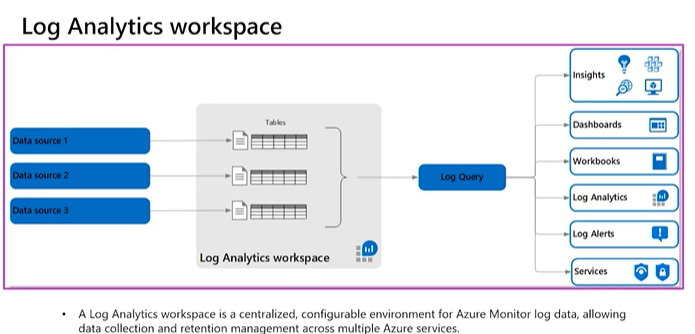

**Azure Monitor and Backup Resources**

**Azure Monitor**

 

Azure Monitor is an important tool that enables you to gather monitoring
and diagnostic information about the health of your services. You can
use this information to visualize and analyze the causes of problems
that might occur in your app.

 

Interpret metrics- Metrics are numerical values that describe some
aspect of a system at a particular point in time which helps you to
understand the health status, operation and performance of your system

 

\- Virtual machines have several charts displaying performance metrics
which can view the multiple charts in Metric explorer in the Azure
portal

\- Metrics are stored in a time-series database for analyzing
time-stamped data

\- you can combine them with logs to identify the root cause of issues

 

Azure Monitor logs- Logs contain different kinds of data organized into
records with different sets of properties for each type. They may be
events and trace such as activity logs, diagnostic logs, and telemetry
from monitoring solutions

 

\- Log data collected by Azure Monitor is stored in Log Analytics which
includes a rich query language to quickly retrieve, consolidate, and
analyze collected data

 

Data types

 

Azure Monitor collects data from each of the following tiers:

 

\- Application monitoring data: Data about the performance and
functionality of the code

\- Guest OS monitoring data: Data about the operating system

\- Azure resource monitoring data: Data about the operation of an Azure
resource.

\- Azure subscription monitoring data: Data about the operation and
management of an Azure subscription

\- Azure tenant monitoring data: Data about the operation of
tenant-level Azure services, such as Azure Active Directory

 

Azure Monitor can collect log data from any REST client using the Data
Collector API that don't expose data through above sources.

 

Azure activity log

 

\- The Azure Activity Log is a subscription log that provides insight
into subscription-level events that have occurred in Azure.

\- With the Activity Log, you can determine the ‘what, who, and when’
for any write operations (PUT, POST, DELETE) taken on the resources in
your subscription.

\- Activity logs are kept for 90 days

 

Query and analyze logs- analytics queries help with troubleshooting and
visualizations. Azure Monitor uses a version of the Data Explorer query
language for advanced functionality such as aggregations, joins, and
smart analytics.

 

You can use following to filter the activity log

 

\- Subscription. One or more Azure subscription names.

\- Timespan. The start and end time for events.

\- Event Severity. The severity level of the event (Informational,
Warning, Error, Critical).

\- Resource group. One or more resource groups within those
subscriptions.

\- Resource (name). The name of a specific resource.

\- Resource type. The type of resource, for example,
Microsoft.Compute/virtualmachines.

\- Operation name. The name of an Azure Resource Manager operation, for
example, Microsoft.SQL/servers/Write.

\- Event initiated by. The 'caller,' or user who performed the
operation.

 

Search. This is an open text search box that searches for that string
across all fields in all events.

 

Event categories

 

\- Administrative : This category contains the record of all create,
update, delete, and action operations performed through Resource Manager
and any changes to role-based access control in a subscription

\- Service Health : This category contains the record of any service
health incidents that have occurred in Azure. Service health events come
in five varieties: Action Required, Assisted Recovery, Incident,
Maintenance, Information, or Security.

\- Resource Health : This category contains the record of any resource
health events that have occurred to your Azure resources. Four health
statuses: Available, Unavailable, Degraded, and Unknown.

\- Alert. This category contains the record of all activations of Azure
alerts. For example, "CPU % on myVM has been over 80 for the past 5
minutes."

\- Autoscale : This category contains the record of any events related
to the operation of the autoscale engine based on any autoscale settings
you have defined in your subscription. For example, "Autoscale scale up
action failed."

\- Recommendation. This category contains recommendation events from
certain resource types, These events offer recommendations for how to
better utilize your resources.

\- Security: This category contains the record of any alerts generated
by Azure Defender for Servers. For example, "Suspicious double extension
file executed."

\- Policy: This category contains records of all effect action
operations performed by Azure Policy which includes Audit and Deny.

 

Azure Event Hub

\- You can start an automated logic app workflow when specific event
happens on Azure or third-party resource

\- These resources can publish the events to Azure event grid. In turn,
azure event grid pusheS those event to subscribers that have queues,
webhooks and event hubs as endpoints.

\- As subscriber, your logic app can wait for those events from event
grid before running automated workflow.

 

Azure Service Bus

 

\- fully managed enterprise message broker with message queues and
publish-subscribe topics

\- decouple applications and services from each other

\- Data is transferred between different applications and services using
messages. The data can be any kind of information, including structured
data encoded with the common formats such as the following ones: JSON,
XML, Apache Avro, Plain Text

\- The shipping must be handled by only ONE receiver at a time. Queue
does not mean only one receiver but only ONE AT A TIME to process the
message.

\- Queues offer First In, First Out (FIFO) message delivery to one or
more competing consumers. That is, receivers typically receive and
process messages in the order in which they were added to the queue.
And, only one message consumer receives and processes each message.

 

Azure Service Bus Topic

 

A queue allows processing of a message by a single consumer. In contrast
to queues, topics and subscriptions provide a one-to-many form of
communication in a publish and subscribe pattern. It's useful for
scaling to large numbers of recipients. Each published message is made
available to each subscription registered with the topic. Publisher
sends a message to a topic and one or more subscribers receive a copy of
the message, depending on filter rules set on these subscriptions.

 

Alerts and actions- Alerts notify you of critical conditions and
potentially take automated corrective actions based on triggers from
metrics or logs

 

\- All newer alerts use action groups, which are named groups of
notifications and actions

\- All alert creation for metrics, logs and activity log across Azure
Monitor, Log Analytics, and Application Insights is in one place.

\- Can observe Log Analytics alerts in your subscription

\- Alert Rules (the definition of the condition that triggers an alert),
and Fired Alerts (an instance of the alert rule firing) are
differentiated

 

 

Alert rules

 

Alerts proactively notify you when important conditions are found in
your monitoring data. Alerts consist of alert rules, action groups, and
monitor conditions. Alerts rule can be enabled or disabled where alerts
fire when enabled.

 

With Azure Monitor, you can specify one or more alert rules, and enable
or disable them, as needed.

 

The key attributes of an alert rule are:

 

RESOURCE

\- Target resource - A target can be any Azure resource. It's possible
to assign multiple target resources to a single alert rule. Example
targets: a virtual machine, a storage account, a virtual machine scale
set, a Log Analytics workspace, or an Application Insights resource.

 

CONDITION

\- Signal – Signals are emitted by the target resource and can be of
several types. Metric, Activity log, Application Insights, and Log.

\- Criteria – Criteria is a combination of Signal and Logic applied on a
Target resource. Examples: \* Percentage CPU \> 70%

 

ALERT DETAILS

\- Alert Name – A specific name for the alert rule configured

\- Alert Description – A description for the alert rule configured

\- Severity – The severity of the alert once the criteria specified in
the alert rule is met. Severity can range from 0 to 4.

 

\- 0: Critical

\- 1: Error

\- 2: Warning

\- 3: Informational

\- 4: Verbose

 

ACTION

\- Action – A specific action taken when the alert is fired.

 

Signal types

 

\- Metric alerts provide an alert trigger when a specified threshold is
exceeded. For example, a metric alert can notify you when CPU usage is
greater than 95 percent.

 

For metric alerts, there's an additional factor to define: the condition
type. It can be static or dynamic

 

Static metrics: you specify the threshold that will be used to trigger
the alert or notification

 

Dynamic metric alerts use machine learning tools that Azure provides to
automatically improve the accuracy of the thresholds defined by the
initial rule. However, you'll need to define two more parameters:

 

 

\- look-back period defines how many previous periods need to be
evaluated. For example, if you set the look-back period to 3, then in
the example used here, the assessed data range would be 30 minutes
(three sets of 10 minutes).

\- number of violations expresses how many times the logic condition has
to deviate from the expected behavior before the alert rule fires a
notification.

 

Dimension uses to define one metric alert rule, and have it applied to
multiple related instances. For example, you can monitor CPU utilization
across all the servers running your app. You can define the dimensions
by naming each target instance specifically. Or, you can define the
dimensions by using the asterisk (\*) wildcard,

 

\- Activity log alerts notify you when Azure resources change state or
its service health. For example, an activity log alert can notify you
when a resource is deleted.

 

There are two types of activity log alerts:

 

Specific operations: Apply to resources within your Azure subscription,
and often have a scope with specific resources or a resource group

 

Service health events: Include notice of incidents and maintenance of
target resources.

 

Activity log alerts have their own attributes:

 

\- Category: Administrative, service health, autoscale, policy, or
recommendation.

\- Scope: Resource level, resource group level, or subscription level.

\- Resource group: Where the alert rule is saved.

\- Resource type: Namespace for the target of the alert.

\- Operation name: Operation name.

\- Level: Verbose, informational, warning, error, or critical.

\- Status: Started, failed, or succeeded.

\- Event initiated by: Email address or Azure Active Directory
identifier (known as the "caller") for the user.

 

\- Log alerts are based on things written to log files. data can come
from any Azure resource: server logs, application server logs, or
application logs. For example, a log alert can notify you when a web
server has returned a number of 404 or 500 responses.

 

Every log alert has an associated log search rule. The composition of
these rules is:

\- Log query: Query that runs every time the alert rule fires.

\- Time period: Time range for the query.

\- Frequency: How often the query should run.

\- Threshold: Trigger point for an alert to be created.

 

Log search results are one of two types: number of records or metric
measurement.

 

Number of records

 

This type of log search returns a single alert when the number of
records in a search result reaches or exceeds the value for the number
of records (threshold)

 

Metric measurement

 

\- Aggregate function: The calculation that will be made against the
result data. An example is count or average. The result of the function
is called AggregatedValue.

\- Group field: A field by which the result will be grouped. This
criterion is used in conjunction with the aggregated value. For example,
you might specify that you want the average grouped by computer.

\- Interval: The time interval by which data is aggregated. For example,
if you specify 10 minutes, an alert record is created for each
aggregated block of 10 minutes.

\- Threshold: A point defined by an aggregated value and the total
number of breaches.

 

As you can see, metric measurements greatly reduce the volume of alerts
that are produced.

 

Scope of alert rules

 

You can get monitoring data from across most of the Azure services, and
report on it by using the Azure Monitor pipeline. you can create alert
rules for these items and more.

 

\- Metric values

\- Log search queries

\- Activity log events

\- Health of the underlying Azure platform

\- Tests for website availability

 

By default, the alert page shows a summary of all alerts and it doesn’t
show classic alerts. You can apply filters to the view by using one or
more of the following three categories.

 

\- Subscriptions: You're limited to reporting on a maximum of five
subscriptions.

\- Resource groups: You can have only one resource group.

\- Time ranges: These ranges support the past hour, the past 24 hours,
the past 7 days, and the past 30 days.

 

\- Smart groups: You can select this filter if it's enabled.

\- Resource type: Applies only when it's used with a resource group.

\- Resource: Applies only when a resource type has been specified.

\- Severity: Identifies the severity assigned by the alert rule.

\- Monitor condition: Set by the system and indicates if the alert is
fired or resolved.

\- Alert state: Typically, finds the New and Acknowledged alerts.

 

Alert states

 

\- When the criteria specified in the alert rule is met, an alert is
created or fired, it has a status of New

\- You can change the status when you acknowledge an alert and when you
close it

\- All state changes are stored in the history of the alert

 

New- The issue has been detected and has not yet been reviewed.

 

Acknowledged- An administrator has reviewed the alert and started
working on it

 

Closed- The issue has been resolved. After an alert has been closed, you
can reopen it by changing it to another state.

 

 

Action group

 

An action group is a collection of notification preferences defined by
the owner of an Azure subscription to notify users that an alert has
been triggered.

 

Notifications configure the method in which users will be notified when
the action group triggers.

 

\- Email Azure Resource Manager role – Send email to the members of the
subscription's role. Email will only be sent to Azure AD user members of
the role. Email will not be sent to Azure AD groups or service
principals.

\- Email/SMS message/Push/Voice - Specify any email, SMS, push, or voice
actions.

 

Actions configure the method in which actions are performed when the
action group triggers. You can run one or more actions for each
triggered alert.

 

The available actions are:

\- Send an email - 100 email message per hour

\- Send an SMS message - No more than one SMS per 5 minutes

\- Create an Azure app push notification.

\- Make a voice call to a number - No more than 1 voice call per 5
minutes

\- Call an Azure function.

\- Trigger a logic app.

\- Send a notification to a webhook.

\- Create an ITSM ticket.

\- Use a runbook (to restart a VM, or scale a VM up or down).

 

Rate limiting is a suspension of notification that occurred when too
many alerts are sent to particular phone number, email address or
device.

 

 

Automation runbook - An automation runbook is the ability to define,
build, orchestrate, manage, and report on workflows that support system
and network operational processes. A runbook workflow can potentially
interact with all types of infrastructure elements, such as
applications, databases, and hardware

 

Azure Function – Azure functions is a serverless compute service that
lets you run event-triggered code without having to explicitly provision
or manage infrastructure.

 

ITSM – Connect Azure and a supported IT Service Management (ITSM)
product/service. This requires an ITSM Connection.

 

Logic App – Logic apps connect your business-critical apps and services
by automating your workflows.

 

Webhook – A webhook is a HTTPS or HTTP endpoint that allows external
applications to communicate with your system.

 

IT Service Management Connector(ITSMC)

 

IT Service Management Connector (ITSMC) allows you to connect Azure to a
supported IT Service Management (ITSM) product or service.

 

Azure services like Azure Log Analytics and Azure Monitor provide tools
to detect, analyze, and troubleshoot problems with your Azure and
non-Azure resources. But the work items related to an issue typically
reside in an ITSM product or service. ITSMC provides a bi-directional
connection between Azure and ITSM tools to help you resolve issues
faster.

 

ITSMC supports connections with the following ITSM tools:

\- ServiceNow

\- Microsoft System Center Service Manager

 

With ITSMC, you can:

\- Create work items in your ITSM tool, based on your Azure alerts
(Metric Alerts, Activity Log Alerts, and Log Analytics alerts).

\- Optionally, you can sync your incident and change request data from
your ITSM tool to an Azure Log Analytics workspace.

 

Smart group

 

\- Smart groups enable you to address a group of alerts instead of each
alert individually.

\- By using machine learning algorithms, Azure Monitor joins alerts
based on repeat occurrence or similarity

\- The name of the smart group (its taxonomy), is assigned
automatically, and is the name of the first alert in the group

\- It's important to assign meaningful names to each alert that you
create, because the name of the smart group can't be changed or amended.

\- Using smart groups can reduce alert noise by more than 90 percent.

\- They can often identify a previously unseen root cause.

 

Smart group states

 

The smart group state shows the progress of the smart group in the
resolution process. Changing the state of a smart group doesn't alter
the state of the individual alerts.

 

\- New: The smart group has been created with a collection of alerts,
but it hasn't yet been addressed.

\- Acknowledged: When an admin starts the resolution process, they
change the state to this.

\- Closed: When the source of the alert is fixed, the admin changes the
state to this.

 

 

**Log Analytics**

 

\- Log Analytics is a service in that helps you collect and analyze data
generated by resources in your cloud and on-premises environments

\- You can create your own queries through log analytics tool by using
KQL

\- To quickly retrieve and consolidate data in the repository you will
create Kusto Query Language (KQL) queries which is optimized SQL-like
queries with visualization options

\- KQL states the query in plain text by using a data-flow model that's
designed to make the syntax easy to read, write, and automate

\- Use the Azure Demo Logs pane to practice writing queries which
includes pre-populated sample data

\- Operations Management Suite collects data from all customers
performing patches and uses that data to provide an average patching
time for specific missing updates.

\- Log Analytics helps to easily identify things like abnormal behavior
from a specific account, users installing unapproved software,
unexpected system reboots or shutdowns, evidence of security breaches,
or specific problems in loosely coupled applications.

\- Log analytics workspace will automatically use the Per GB pricing
plan.

 

1\. Create Log Analytics workspace( name of workspace, subscription,
resource group, location)

2\. Define connected source ( Resources that generate logs such as
agents installed in Windows or Linux, virtual or physical computers
hosted in cloud or on-premise, Systems Center Operation Manager
management group on management and Azure storage), collects data from
connected source and stores in the repository that is hosted in Azure.

 

 

 

Data sources include: Windows Event Logs, Windows Performance Counters,
Linux Performance Counters, IIS Logs, Custom Fields, Custom Logs, and
Syslog.

 

3\. Visualize the data, You can create and save Log Searches to directly
analyze data or run automatically to create an alert if the results of
the query indicate an important condition.

 

To analyze data outside of Log Analytics, you can export the data from
the repository into tools such as Power BI or Excel. You can also use
the Log Search API to build custom solutions.

 

4\. Structure log analytics queries, When you build query, each data
source and solution stores its data in dedicated tables in the Log
Analytics workspace.

 

Some common query tables are: Event, Syslog, Heartbeat, and Alert.

 

The basic structure of a query is a source table followed by a series of
operators separated by a pipe character \|. For example, this query
returns a count of the top 10 errors in the Event log during the last
day. The results are in descending order.

 

Event

\| where (EventLevelName == "Error")

\| where (TimeGenerated &gt; ago(1days))

\| summarize ErrorCount = count() by Computer

\| top 10 by ErrorCount desc

 

SecurityEvent

\| top 10 by TimeGenerated

 

Common operators

 

\- count - Returns the number of records in the input record set

\- limit - Return up to the specified number of rows.

\- summarize - Produces a table that aggregates the content of the input
table

\- top - Returns the first N records sorted by the specified columns.

\- where - Filters a table to the subset of rows that satisfy a
predicate.

 

This service supports Azure Lighthouse, which lets service providers
sign in to their own tenant to manage subscriptions and resource groups
that customers have delegated.

 

Azure Network watcher

 

Network Watcher uses to monitor, diagnose, and gain insight into their
network health and performance with metrics.

 

\- The elements can be broken down into four areas: monitoring, network
diagnostic tools, metrics, and logs

\- Provides tools to monitor, diagnose, view metrics and enable or
disable logs

\- It is a regional service

\- Automate remote network monitoring with packet capture without
logging into VM and trigger packet capture by setting alerts

\- Build a deeper understanding of your network traffic pattern using
Network Security Group flow logs which helps to gather data for
compliance, auditing and monitoring your network security profile

\- Diagnose common VPN Gateway and Connections issues

\- To use Network Watcher, you must be an Owner, Contributor, or Network
Contributor

 

IP Flow verify

 

\- Diagnose connectivity issues from or to the internet and from or to
the on-premises environment

\- The IP Flow Verify capability enables you to specify a source and
destination IPv4 address, port, protocol (TCP or UDP), and traffic
direction (inbound or outbound)

\- IP Flow Verify then tests the communication and informs you if the
connection succeeds or fails in which we can identify which security
rule allowed or denied the communication

 

Next hop

 

\- To determine if traffic is being directed to the intended destination
by showing the next hop

\- Next hop also returns the route table ID associated with the next hop
even when route is defined as user-defined route or system route

\- The next hop could be Internet, Virtual Appliance, Virtual Network
Gateway, VNet Local, VNet Peering, or None

\- All traffic from resources in virtual network are routed based on
Azure's default routes when you create virtual network

\- We should provide subscription, resource group, virtual machine,
network interface, source IP address, destination IP address to check
next hop

 

VPN troubleshoot

 

\- Troubleshoot VPN gateways and connections

\- It provides more detailed information in log files that are stored in
storage account and include things like connection statistics, CPU and
memory information, IKE security errors, packet drops, and buffers and
events.

 

NSG Flow Logs

 

\- NSG Flow Logs maps IP traffic through a network security group which
can be used in security compliance and auditing

\- NSG flow log capability allows you to log the source and destination
IP address, port, protocol whether traffic is allowed or denied by NSG

\- You can define a prescriptive set of security rules as a model for
security governance in your organization

 

Connection Troubleshoot

 

\- enables you to troubleshoot network performance and connectivity
issues in Azure.

\- test the connection at a point in time rather than monitoring it over
time

\- Validate outbound connectivity from VM in Azure portal to external
host(VM, FQDN, URI, IP address)

 

Connection monitor

\- Capable to monitor communication at a regular interval and provide
reachability, latency and topology changes between the VM and endpoints.

\- Feature in Azure network watcher that is generally available in all
public region

\- Provide RTT values per-minute granularity

\- Can monitor a direct TCP connection from VM to VM, FQDN, URI, IP
address

 

\*Region: Select a region for your connection monitor. You can select
only the source VMs that are created in this region. Here you see only
VMs or Virtual Machine Scale Sets that are bound to the region that you
specified when you created the connection monitor. By default, VMs and
Virtual Machine Scale Sets are grouped into the subscription that they
belong to

 

\* Destination can be anywhere as per this Destinations: You can monitor
connectivity to an Azure VM, an on-premises machine, or any endpoint (a
public IP, URL, or FQDN) by specifying it as a destination. In a single
test group, you can add Azure VMs, on-premises machines, Office 365
URLs, Dynamics 365 URLs, and custom endpoints.

 

Packet capture

\- Inspect 18000 seconds( 5 hours) network status

 

Network performance monitor

 

\- cloud-based hybrid network monitoring solution that helps you monitor
network performance between various points in network infrastructure

\- To monitor network connectivity to service and application endpoint
and monitor the performance of Azure ExpressRoute

\- network connectivity between cloud endpoint and on-premises
locations, multiple data centers, branch offices, mission-critical multi
tier application and microservices

\- Can detect network issue before users complains

 

Visualize the network topology

 

\- use the topology tool to visualize and understand the infrastructure
you're dealing with before you start troubleshooting

\- Network Watcher's Topology capability enables you to generate a
visual diagram of the resources in a virtual network, interconnection
and the relationships between the resources.

\- To generate the topology, you need a Network Watcher instance in the
same region as the virtual network.

 

Traffic Analytics

 

Traffic Analytics is a cloud-based solution that provides visibility
into user and application activity in cloud networks. Traffic analytics
analyzes Network Watcher network security group (NSG) flow logs to
provide insights into traffic flow in your Azure cloud.

 

To enable traffic analytics, the user must have following roles at the
subscription: owner, contributor, reader or Network contributor.

 

Traffic Analytics requires the following prerequisites:

 

\- A Network Watcher enabled subscription.

\- Network Security Group (NSG) flow logs enabled for the NSGs you want
to monitor.

\- An Azure Storage account, to store raw flow logs.

\- An Azure Log Analytics workspace, with read and write access.

 

 

Application insights

\- automatically detect performance anomalies, and includes powerful
analytics tools to help you diagnose issues and to understand what users
actually do with your app

\- Insights works on various platforms including .NET, Node.js and Java
EE, hosted on-premises, hybrid, or any public cloud.

\- connection points to a variety of development tools by integrating
with your DevOps process

 

It monitors,

 

\- Request rates, response times, and failure rates- Find out which
pages are most popular, at what times of day

\- Dependency rates, response times, and failure rates - Find out
whether external services are slowing you down

\- Exceptions- Both server and browser exceptions are reported.

\- Page views and load performance - reported by your users' browsers.

\- User and session counts.

\- Performance counters from your Windows or Linux server machines, such
as CPU, memory, and network usage.

\- Host diagnostics from Docker or Azure

 

Application Insights Agent

 

Application Insights Agent (formerly named Status Monitor V2) is a
PowerShell module published to the PowerShell Gallery. It replaces
Status Monitor. Telemetry is sent to the Azure portal, where you can
monitor your app.

 

The module currently supports codeless instrumentation of .NET and .NET
Core web apps hosted with IIS. Use an SDK to instrument Java and Node.js
applications.

 

The following are support for agent-based monitoring: .NET Core, .NET,
Java, Node.js

 

 

Implement backup and recovery

 

Backup vault

 

Configure backup policy

 

\- Azure backup policy only back up an Azure VM, SQL in Azure VM and
Azure File share

\- With latest update of Azure backup, users can retain their data for
up to 99 years in Azure

\- Backup policy defines matrix of when the data snapshots are taken,
how long snapshots are retained, policy name, backup frequency,
retention range(daily, weekly, monthly, yearly-99)

\- There is a limit of 100 VMs that can be associated to the same backup
policy

 

 

Azure backup options for VM

 

1\. Snapshots

2\. Azure backup

3\. Azure Site Recovery

 

Managed Disk snapshots

\- a quick and simple option for backing up VMs that use Managed Disks

\- A snapshot is a copy of a disk at the point in time the snapshot is
taken. It applies only to one disk(the OS disk)

\- These snapshots exist independent of the source disk and can be used
to create new managed disks

\- They are billed based on the used size. For example, if you create a
snapshot of a managed disk with provisioned capacity of 64 GiB and
actual used data size of 10 GiB, that snapshot is billed only for the
used data size of 10 GiB.

 

 

Virtual machine snapshot

 

An Azure backup job consists of two phases.

1\. Take virtual machine snapshot

2\. Transfer VM snapshot to Azure Recovery Service Vault

 

\- A recovery point is created after above steps are finished in order
to restore the backup.

\- You can identify the recovery point in the Azure portal by using
“snapshot” as the recovery point type.

\- After the snapshot is transferred to the vault, the recovery point
type changes to “snapshot and vault”

\- A backup policy defines a matrix of when the data snapshots are
taken, and how long those snapshots are retained and can trigger a
backup job once a day

\- The default snapshot retention value of snapshot locally is 2 days
and it is configurable to any value between 1 to 5 days in the backup
policy blade

\- The Azure VM Agent must be installed on the Azure virtual machine for
the Backup extension to work.

\- VMs that are migrated from on-premises data centers would not have
the VM Agent installed

\- Supports disk sizes up to 32 TB. Resizing of disks is not recommended
by Azure Backup

\- Supports Standard SSD disks along with Standard HDD disks and Premium
SSD disks.

\- Incremental snapshots are stored as page blobs.

 

Restore VM

 

Once you trigger the restore operation, the Backup service creates a job
for tracking the restore operation which temporarily displays
notifications, so you monitor how the backup is proceeding.

 

Images

 

\- Managed disks also support creating a managed custom image

\- can create an image from your custom VHD in a storage account or
directly from a generalized (sysprepped) VM

\- This image contains all managed disks associated with a VM, including
both the OS and data disks.

\- managed custom image enables creating hundreds of VMs using your
custom image

 

Azure Backup Server(DPM/MABS)

 

\- Another method of backing up virtual machines is using a Data
Protection Manager (DPM) or Microsoft Azure Backup Server (MABS) server

\- It uses to backup machines and apps to MABS/DPM storage, and then
backing up DPM/MABS storage to a vault

\- Use for specialized workloads( SharePoint, Exchange, and SQL Server),
virtual machines, or files, folders, and volumes and machine state
backups. Machine state backups can be bare-metal, or system state

\- For on-premises machines run the DPM/MABS protection agent, and the
MARS agent runs on the MABS/DPM only

\- You have more flexibility and granular scheduling options for running
backups

\- You can manage backups for multiple machines that you gather into
protection groups in a single console. Grouping machines is useful when
apps are tiered over multiple machines and you want to back them up at
the same time

\- linux support on Hyper-V and VMware VMs

\- Cannot backup Oracle workloads

\- always requires live Azure subscription

\- no support for tape backup

 

 

Backup steps for MABS/DPM

 

1\. Install the DPM or MABS protection agent on machines you want to
protect. You then add the machines to a DPM protection group.

 

To protect on-premises machines, the DPM or MABS server must be located
on-premises.

To protect Azure VMs, the MABS server must be located in Azure, running
as an Azure VM.

 

2\. select to back up to the MABS/DPM local disk for short-term storage
and to Azure for online protection. You also specify when the backup to
local DPM/MABS storage should run and when the online backup to Azure
should run.

3\. The disk of the protected workload is backed up to the local
MABS/DPM disks, according to the schedule you specified

4\. The DPM/MABS disks are backed up to the vault by the MARS agent
that's running on the DPM/MABS server.

 

Manage soft delete

 

Azure Storage now offers soft delete for blob objects and VMs so that
you can more easily recover your backed up data when it is erroneously
unintentionally modified or deleted by an application or other storage
account user.

 

Even after the backups are deleted, they're preserved in soft-delete
state for 14 additional days.

 

How soft delete works

 

1\. To delete the backup data of a VM, the backup must be stopped. Then
you can delete or retain the backup data

2\. If you choose delete backup data, the backup data will be retained
for 14 days in the soft deleted state.

3\. During those 14 days, in the Recovery Services vault, the soft
deleted VM will appear with a red soft-delete icon next to it. If any
soft-deleted backup items are present in the vault, the vault can't be
deleted at that time.

4\. To restore the soft-deleted VM, it must first be undeleted. To
undelete, choose the soft-deleted VM, and then select the option
Undelete. At this point, you can also restore the VM by selecting
Restore VM from the chosen restore point.

5\. After the undelete process is completed, the status will return to
Stop backup with retain data and then you can choose Resume backup where
it brings back the backup item in the active state, associated with a
backup policy selected

 

Azure backup

 

Azure Backup is the Azure-based service that uses to back up (or
protect) and restore your data in the Microsoft cloud as reliable,
secure, and cost-competitive manner.

 

All Azure Backup components (no matter whether you're protecting data
on-premises or in the cloud) can be used to back up data to a Recovery
Services vault in Azure.

 

Azure Backup creates recovery points that are stored in geo-redundant
recovery vaults. With recovery point, you can restore whole VM or
specific file.

 

If VM is affected with ransomware, the file recovery can be performed
only through affected VM itself.

To restore files and folders from recovery point, go to VM and select
desired recovery point.

 

Select VM\> Backup\> File recovery \> select recovery point that holds
file you want. By default, the latest recover point is already
selected\> Download executable( for Windows Azure VM) or script( for
Linux Azure VM, python script) to copy files from recovery point\> Copy
ten files from AzCopy

 

Azure backup supports;

 

\- 64 bit from Windows server 2008

\- 64 bit Windows 10

\- 64 bit from Unbuntu 12.04

\- VM that are shutdown or offline

\- VM that are not shutdown

\- VMs that run Debian 8.2+

 

If backup per-check status displays warning that might lead to back
failure, it happens when No having latest VM agent installed.

 

Benefits

\- Offload on-promise backup

\- Back up Azure IaaS VMs- Backups are stored in a Recovery Services
vault with built-in management of recovery points against accidental
destruction of original data

\- Get unlimited data transfer- Azure Backup does not limit the amount
of inbound or outbound data you transfer, or charge for the data that is
transferred

\- Keep data secure- Data encryption allows for secure transmission and
storage of your data in the public cloud. You store the encryption
passphrase locally, and it is never transmitted or stored in Azure.

\- Get app-consistent backups - An application-consistent backup means a
recovery point has all required data to restore the backup copy without
additional fixes

\- Retain short and long-term data- You can use Recovery Services vaults
for short-term and long-term data retention. Azure Backup has a limit of
9999 recovery points per protected instance

\- Automatic storage management- Azure backup manage storage in
on-premise and cloud. There is no cost for using on-premises storage
devices and it uses a pay-as-you-use model for cloud storage

\- Multiple storage options- Azure Backup offers LRS and GRS replication
to keep your storage/data highly available.

 

Azure Backup Center

\- a single unified management experience in Azure for enterprises to
govern, monitor, operate, and analyze backups at scale

\- use Backup Center to efficiently manage backups spanning multiple
workload types, vaults, subscriptions, regions, and tenants

\- admin can also filter views by datasource-specific properties. These
properties include datasource subscription, datasource resource group,
and datasource tags.

\- provides native integrations to existing Azure services that enable
management at scale.

\- Backup Center is currently supported for Azure VM backup, SQL in
Azure VM backup, SAP HANA in Azure VM backup, Azure Files backup, Azure
Blobs backup, Azure-managed disks backup, and Azure Database for
PostgreSQL Server backup.

 

Recovery Services vault(RSV)

\- a storage entity in Azure that stores copies of data or configuration
information for VMs, servers or workloads where it organizes your backup
data and recovery point you create over time, while minimizing
management overhead.

\- RSV supports for various Azure services such as IaaS VMs (Linux or
Windows) and Azure SQL databases, Azure File shares, on-promise files
and folders, System Center DPM, Windows Server, Azure Backup Server

\- The Recovery Services vault can be used to backup on-premises virtual
machines including: Hyper-V, VMware, System State, and Bare Metal
Recovery

\- you can create up to 25 Recovery Services vaults per region within an
Azure subscription

\- By default, Recovery Service Vault has geo-redundant storage as
replication

\- You can’t delete Recovery Service Vault if it is registered to a
server and holds the backup, remove vault dependencies and delete vault.
In backup items, you can stop and delete Azure VM, SQL server and Azure
File Share.

\- A virtual machine can backup to single RSV at a time, however a RSV
provide backup multiple resources at a time

 

Steps to backup a VM to recovery service vault;

1\. Create recovery service vault on Azure( Name, subscription, resource
group, location)

2\. Go to backup in RSV, create backup goal specifying where is workload
running, what you need to backup

3\. Create backup schedule; open Microsoft Azure Backup agent \> action
\> schedule backup \> backup \> add items \> select blob storage you
want to protect

4\. Specify backup schedule with the frequency of schedule, the time of
backup proceed

5\. Specify retention policy with the period

 

Possible dependencies for recovery service vault before it can be
deleted.

\- You can't delete a vault that contains protected data sources (for
example, IaaS VMs, SQL databases, Azure file shares).

\- You can't delete a vault that contains backup data. Once backup data
is deleted, it will go into the soft deleted state.

\- You can't delete a vault that contains backup data in the soft
deleted state.

\- You can't delete a vault that has registered storage accounts.

 

To properly delete a vault, you must follow the steps in this order:

 

\- Disable the soft delete feature

\- After disabling soft delete, check if there are any items previously
remaining in the soft deleted state, then you need to undelete and
deletethem again

\- Ensure there is no active protected data source

\- ensure all registered storage accounts are deleted

\- Ensure there are no Private endpoints created for the vault

 

Configure on-premises file and folder backup

 

 

 

1\. Create the recovery services vault for backup within Azure
subscription

2\. Download Azure Backup agent using the link that provides by recovery
service vault. There is also a credentials file that is required during
the installation of the agent. You must have the latest version of the
agent. Obsolete version of the agent can be upgraded by uninstalling and
reinstalling the agent.

3\. Installing the agent by providing the installation location, proxy
server, and passphrase information and register the agent using
downloaded credential file

4\. Create a backup policy including when to backup, what to backup, how
long to retain items, and settings like network throttling using the
agent

 

Microsoft Azure Recovery Service Agent(MARS Agent)

 

\- Back up files and folders on physical or virtual Windows OS (VMs can
be on-premises or in Azure).

\- No separate backup server required.

\- Not application aware; file, folder, and volume-level restore only.

\- No support for Linux

\- Back up and restore content.

 

Restore file to Windows server using MARS agent

 

To restore data from a backup vault, you use the Recover Data wizard in
the Microsoft Azure Recovery Services (MARS) Agent.

 

Use the Instant Restore feature to mount a writeable recovery point
snapshot as a recovery volume

 

Use Instant Restore with Recovery Services vaults in the Azure portal.
If you stored data in Backup vaults, they've been converted to Recovery
Services vaults.

 

\- Restore data to the same machine from which the backups were taken.

\- Restore data to an alternate machine.

 

Azure Site Recovery

 

\- Azure Site Recovery protects your VMs by keeping business apps and
workloads running from a major disaster scenario when a whole region
experiences an outage due to major natural disaster or widespread
service interruption

\- can recover your application with a single click in matter of minutes

\- Site Recovery replicates workloads running on physical and virtual
machines (VMs) from a primary site to a secondary location

\- When an outage occurs at your primary site, you fail over to
secondary location, and access apps from there. After the primary
location is running again, you can fail back to it.

\- can set up and manage replication, failover, and failback from a
single location in the Azure portal

\- Replication to Azure eliminates the cost and complexity of
maintaining a secondary datacenter.

\- Site Recovery orchestrates replication without intercepting
application data.

\- Site Recovery provides continuous replication for Azure VMs and
VMware VMs, and replication frequency as low as 30 seconds for Hyper-V

\- You can replicate using recovery points with application-consistent
snapshots

\- Site Recovery integrates with Azure for simple application network
management, including reserving IP addresses, configuring
load-balancers, and integrating Azure Traffic Manager for efficient
network switchovers.

\- BitLocker must be disabled before the replication is enabled

\- Azure site recovery can be used to manage migration of on-premise
machine to Azure

 

 

 

Replication scenarios

\- Replicate Azure VMs from one Azure region to another.

\- Replicate on-premises VMware VMs, Hyper-V VMs, physical servers
(Windows and Linux), Azure Stack VMs to Azure.

\- Replicate AWS Windows instances to Azure.

\- Replicate on-premises VMware VMs, Hyper-V VMs managed by System
Center VMM, and physical servers to a secondary site.

 

To migrate AWS EC2 instance that runs Windows Server 2016 to Azure,

 

1\. Use EC2 instance that’s running Windows server 2016 R2 to create
configuration server and register it with recovery vault

2\. Configure proxy on EC2 instance so that it can access service URL

3\. Install Azure Site Recovery Unified Setup on configuration server

4\. Enable replication on VMs that you need to migrate where site
recovery automatically install mobility service when replication enables

 

Replicate on-premise VM to Azure using Azure Site Recovery

 

\- Download the vault registration key which valid for only 5 days as it
needs to install Azure Site Recovery Provider

\- Download installation file of ASR provider

\- Install ASR provider on each VMs and register the servers where it
doesn’t need to install anything explicitly on hyper-V host

 

 

Backup reports

 

Linux diagnostic extension helps a user monitor the health of a Linux VM
running on Microsoft Azure. It has the following collection and
capabilities: - Metrics - Syslog - Files

 

Azure HDInsight is a managed, full-spectrum, open-source analytics
service in the cloud for enterprises. You can use open-source frameworks
such as Hadoop, Apache Spark, Apache Hive, LLAP, Apache Kafka, Apache
Storm, R, and more.

 

Azure Performance Diagnostics VM Extension is used for Windows VM only.

 

Azure Analysis Services is a fully managed platform as a service (PaaS)
that provides enterprise-grade data models in the cloud.
