**Azure Virtual Networking**

**Implement and manage virtual networking**

 

**Virtual networks(VNet)**

 

\- logical isolation of the Azure cloud dedicated to your subscription.

\- Manage virtual private networks (VPNs) in Azure to link the VNets
with other VNets in Azure, or with your on-premises IT infrastructure to
create hybrid or cross-premises solutions if the CIDR blocks do not
overlap of each VNets

\- A resource can only be created in a virtual network that exists in
the same region and subscription

\- Network Interface(NIC) can be assigned to virtual network that exists
in same location and subscription. You cannot change the location of NIC
once it is set up.

\- VNet can be used in many ways

 

1\. Create a dedicated private cloud-only VNet

2\. Securely extend your data center With VNets- S2S VPNs use IPSEC to
provide a secure connection between your corporate VPN gateway and Azure

3\. Enable hybrid cloud scenarios- can securely connect cloud-based
applications to any type of on-premises system

 

**Subnets**

 

Azure routes network traffic between all subnets in a virtual network,
by default

 

Services that needs dedicated subnets for deployment are:

 

\- Application gateway- WAF

\- Azure Bastion

\- Azure Firewall

\- Azure Route server

\- ExpressRoute gateway

\- VPN gateway

\- Redis cache

\- Azure SQL Managed Instance

\- Azure database for SQL

\- Azure database for PostgresSQL

\- Azure Container Instance

\- Azure Function

 

Network Virtual appliances

 

You can override Azure's default routing to prevent Azure routing
between subnets, or to route traffic between subnets in same virtual
network through a network virtual appliance(NVA).

 

\- NVAs are virtual machine that control and filter traffic inbound to a
virtual network, to lock malicious requests

\- NVA consists in various protection layer such a firewall, a WAN
optimizer, application-delivery controllers, router, loadIPS/IDS, proxy,
SD-WAN edge

\- You can deploy NVAs chosen from providers in Azure Marketplace. Such
providers include Check Point, Barracuda, Sophos, WatchGuard, and
SonicWall

\- With the micro segmentation approach, you can create dedicated
subnets for the firewall and then deploy web applications and other
services in other subnets. All traffic is routed through the firewall
and inspected by the NVAs

\- You can specify the private IP address of a NIC attached to a virtual
machine so that IP forwarding can be enabled. Or you can provide the
private IP address of an internal load balancer.

\- If IP forwarding isn't enabled, traffic that is routed through your
appliance will never be received by its intended destination servers.

\- It's important to include a highly available architecture in your NVA
deployment

 

Deploy a NVA;

 

az vm create \\

--resource-group \[sandbox resource group name\] \\

--name nva \\

--vnet-name vnet \\

--subnet dmzsubnet \\

--image UbuntuLTS \\

--admin-username azureuser \\

--admin-password \<password\>

 

Enable IP forwarding for Azure NIC;

 

1\. Get the ID of the NVA network interface

2\. Get the name of the NVA network interface

3\. Enable IP forwarding for the network interface

 

az network nic update --name \$NICNAME \\

--resource-group \[sandbox resource group name\] \\

--ip-forwarding true

 

Enable IP forwarding in the appliance

 

1\. To save the public IP address of the NVA virtual machine to the
variable NVAIP.

 

NVAIP="\$(az vm list-ip-addresses \\

--resource-group \[sandbox resource group name\] \\

--name nva \\

--query "\[\].virtualMachine.network.publicIpAddresses\[\*\].ipAddress"
\\

--output tsv)"

 

echo \$NVAIP

 

2\. To enable IP forwarding within the NVA

 

ssh -t -o StrictHostKeyChecking=no azureuser@\$NVAIP 'sudo sysctl -w
net.ipv4.ip_forward=1; exit;'

 

When prompted, enter the password you used when you created the virtual
machine.

 

You can use traceroute utility to verify whether traffic between subnets
are routed through NVA

 

ssh -t -o StrictHostKeyChecking=no azureuser@\$PRIVATEIP 'traceroute
public --type=icmp; exit'

 

When prompted, enter the password for the azureuseraccount.

 

Azure Route Server

 

Azure Route Server is a fully managed service and is configured with
high availability. Azure Route Server simplifies dynamic routing between
your network virtual appliance (NVA) and your virtual network. When BGP
Peering is set up with this, it eliminates the need to manually update
routes across all connected networks.

 

 

Service endpoints: You can limit access to Azure resources such as an
Azure storage account or Azure SQL database, to specific subnets with a
virtual network service endpoint. Further, you can deny access to the
resources from the internet. You may create multiple subnets, and enable
a service endpoint for some subnets, but not others.

 

Virtual network service endpoints are public and accessible via the
internet. The Azure Storage firewall provides the ability to control
access to your storage account over such public endpoints. When you
enable public network access to your storage account, all incoming
requests for data are blocked by default. Only applications that request
data from allowed sources that you configure in your storage account
firewall settings will be able to access your data. Sources can include
the source IP address or virtual network subnet of a client, or an Azure
service or resource instance through which clients or services access
your data. Requests that are blocked include those from other Azure
services, from the Azure portal, and from logging and metrics services,
unless you explicitly allow access in your firewall configuration.

 

Virtual Network (VNet) service endpoint policies allow you to filter
egress virtual network traffic to Azure Storage accounts over service
endpoint, and allow data exfiltration to only specific Azure Storage
accounts. Endpoint policies provide granular access control for virtual
network traffic to Azure Storage when connecting over service endpoint.

 

if i ADD vNET and chose subnet, the process will automatically create
Service-Endpoint and hence having SEP doesnt mean you automatically
granted access unless you are in the allow list of the FW otherwise
Private Endpoint is ONLY way to bypass the FW.

 

Network security groups: You can associate zero or one and the same of
different network security group or to each subnet in a virtual network.
Each network security group contains rules, which allow or deny traffic
to and from sources and destinations.

 

 

Azure reserves five IP addresses within each subnet.

 

\- x.x.x.0: Network address

\- x.x.x.1: Reserved by Azure for the default gateway

\- x.x.x.2, x.x.x.3: Reserved by Azure to map the Azure DNS IPs to the
VNet space

\- x.x.x.255: Network broadcast address

 

By default, you can create up to 50 virtual networks per subscription
per region. You can increase this limit to 500 by contacting Azure
support.

 

Plan to use an address space that is not already in use in your
organization, either on-premises or in the cloud

 

In Azure cloud shell, run the command to create virtual network.

 

az network vnet create \\

--resource-group \[sandbox resource group name\] \\

--name CoreServicesVnet \\

--address-prefixes 10.20.0.0/16 \\

--location westus

 

For subnet,

 

az network vnet subnet create \\

--resource-group \[sandbox resource group name\] \\

--vnet-name CoreServicesVnet \\

--name GatewaySubnet \\

--address-prefixes 10.20.0.0/27

 

To show all subnets;

 

az network vnet subnet list \\

--resource-group \[sandbox resource group name\] \\

--vnet-name CoreServicesVnet \\

--output table

 

You can use network security groups to filter traffic and control access
within and between virtual networks

 

IP addressing

 

Private IP addresses

\- Used for communication within an Azure virtual network (VNet) and
on-premise network

\- when you use a VPN gateway or ExpressRoute circuit to extend your
network to Azure

\- can be set to dynamic (DHCP lease) or static (DHCP reservation) which
persist if a resource is stopped or deallocated.

\- You can use private IP address that are assigned by IANA( 10.0.0.0/8,
172.16.0.0/12, 192.168.0.0/16)

 

 

Public IP addresses

\- Used for communication with the Internet, including Azure
public-facing services.

\- Azure public IPs are region specific, cannot be moved from one to
another

 

When create public IP address;

 

IP Version: Select IPv4 or IPv6 or Both(one IPv4 address and one IPv6
address)

 

SKU : You cannot change the SKU after the public IP address is created.
Virtual machines within an availability set, or virtual machine scale
sets can use Basic or Standard SKUs. SKU provides scale features and
pricing for load balancing traffic.

 

Basic

\- can be assigned by using static or dynamic allocation methods

\- Are open. Network security groups are recommended but optional for
restricting inbound or outbound traffic.

\- Are available for inbound only traffic.

\- Are available when using instance meta data service (IDMS).

\- Don't support Availability Zones.

\- Don't support routing preferences

 

Standard

\- Always use static allocation.

\- Secured with closing inbound traffic. You must enable inbound traffic
by using NSG

\- Are zone-redundant; and optionally zonal

\- Can be utilized with the routing preference to enable more granular
control of how traffic is routed between Azure and the Internet

\- Can be assigned to network interfaces, Standard public load
balancers, application gateways, or VPN gateways

\- Can be used as anycast frontend IPs for cross-region load balancers.

 

Name: The name must be unique within the resource group you select.

 

IP address assignment

 

Dynamic

\- Dynamic addresses are assigned only after a public IP address is
associated to an Azure resource, and the resource is started for the
first time.

\- Dynamic is the default allocation method

\- Dynamic addresses can change if they're assigned to a resource,
virtual machine is stopped (deallocated), and then restarted, or deleted

\- The address remains the same if a virtual machine is rebooted or
stopped (but not deallocated).

\- Dynamic addresses are released when a public IP address resource is
dissociated from a resource.

 

Static

\- Static addresses are assigned when a public IP address is created

\- Static addresses aren't released until a public IP address resource
is deleted.

\- If the address isn't associated to a resource, you can change the
assignment method after the address is created. If the address is
associated to a resource, you may not be able to change the assignment
method.

\- If you select IPv6 for the IP version, the assignment method must be
Dynamic for Basic SKU. Standard SKU addresses are Static for both IPv4
and IPv6

 

Static IP addressing

Static IP addresses are best for;

 

\- DNS name resolution, where a change in the IP address would require
updating host records.

\- IP address-based security models that require apps or services to
have a static IP address.

\- TLS/SSL certificates linked to an IP address.

\- Firewall rules that allow or deny traffic using IP address ranges.

\- Role-based VMs such as Domain Controllers and DNS servers.

 

Run the Set-AzureStaticVNetIP PowerShell cmdlet - sets the static
virtual network (VNet) IP address information for a virtual machine. If
you already set an IP address for the VM and you want to change it to a
different IP address, you need to remove the existing static IP address
before running these cmdlets,

 

Get-AzureVM -ServiceName StaticDemo -Name VM2 \| Set-AzureStaticVNetIP
-IPAddress 192.168.4.7 \| Update-AzureVM

 

 

Associate public IP address

 

A public IP address resource can be associated with virtual machine
network interfaces, internet-facing load balancers, VPN gateways, and
application gateways.( support both static and dynamic)

 

Associate private IP address

 

A private IP address resource can be associated with virtual machine
network interfaces, internal load balancers, and application gateways.
(support both static and dynamic)

 

Dynamic: Azure assigns the next available unassigned or unreserved IP
address in the subnet's address range.

 

Static: You select and assign any unassigned or unreserved IP address in
the subnet's address range

 

Public IP address prefix

\- reserved, static range of public IP addresses

\- a pool of available addresses that's unique to each region and can’t
be moved between regions

\- can be created as zone-redundant or associated with a specific
availability zone.

\- If you have data center in a region, can user public IP address
prefix

\- You can create public IP address prefix by specifying a name and
size(number of reserved addresses)

\- consist of IPv4 or IPv6 addresses

\- You can use technology like Azure Traffic Manager to balance
region-specific instances.

\- can't bring your own public IP addresses

\- Public IP address prefix is with a contiguous range which is assigned
by Azure

 

Azure network IP addressing and integration

 

\- On the routers facing the internet service provider (ISP), you have
public IP addresses that are used by your outbound internet traffic as
their source

\- These addresses also are used for inbound traffic across the internet

\- Azure virtual networks use private IP addresses that are same as for
on-premises IP addressing

 

In a typical Azure network design, we usually have these components:

\- Virtual networks

\- Subnets

\- Network security groups

\- Firewalls

\- Load balancers

 

\- The Azure network provides the ability to scale up and scale down
infrastructure based on demand unlike on-premise network

\- Network security groups filter internal and external traffic at the
network layer as well as a firewall has more extensive capabilities for
network layer filtering and application layer filtering

\- The smallest subnet that is supported uses a /29 subnet mask. The
largest supported subnet uses a /8 subnet mask

\- When integrate Azure with on-premise network, there can be no IP
address overlap for interconnected networks

 

Azure Network Routing

 

System routes

Azure uses system routes to direct network traffic for following
situations.

1\. Traffic between VMs in the same subnet.

2\. Between VMs in different subnets in the same virtual network.

3\. Data flow from VMs to the Internet.

 

\- Route table contains a set of rules, called routes, that specifies
how packets should be routed in a virtual network.

\- Route tables are associated to subnets

\- Packets are matched to routes using the destination. The destination
can be an IP address, a virtual network gateway, a virtual appliance, or
the internet

\- You can't create or delete system routes. But you can override the
system routes by adding custom routes

\- These address prefixes Virtual network, 0.0.0.0/0, 10.0.0.0/8,
172.16.0.0/12, 192.168.0.0/16, 100.64.0.0/10 route to followings next
hop types.

 

Virtual network: A route is created in the address prefix

Internet: The default system route 0.0.0.0/0 routes any address range to
the internet

None: Any traffic routed to this hop type is dropped and doesn't get
routed outside the subnet so that they are not globally routable

 

There are additional system routes. Azure will create these routes if
the following capabilities are enabled:

\- Virtual network peering

\- Service chaining

\- Virtual network gateway

\- Virtual network service endpoint

 

Custom routes

\- Create custom routes when you want to route traffic through an NVA or
through a firewall from partners and other

\- Creating a custom route is simplified with add route

\- It provides Name, Address prefix(subnet), Next hop type(virtual
network gateway, virtual network, internet, or virtual appliance)

\- You have two options for implementing custom routes:

 

1\. create a user-defined route

2\. use Border Gateway Protocol (BGP) to exchange routes between Azure
and on-premises networks

 

Create route table;

az network route-table create \\

--name publictable \\

--resource-group \[sandbox resource group name\] \\

--disable-bgp-route-propagation false

 

Create a custom route in a route table;

az network route-table route create \\

--route-table-name publictable \\

--resource-group \[sandbox resource group name\] \\

--name productionsubnet \\

--address-prefix 10.0.1.0/24 \\

--next-hop-type VirtualAppliance \\

--next-hop-ip-address 10.0.2.4

 

To crate virtual network and subnet in it;

az network vnet create \\

--name vnet \\

--resource-group \[sandbox resource group name\] \\

--address-prefixes 10.0.0.0/16 \\

--subnet-name publicsubnet \\

--subnet-prefixes 10.0.0.0/24

 

To create subnet in existing vnet;

az network vnet subnet create \\

--name privatesubnet \\

--vnet-name vnet \\

--resource-group \[sandbox resource group name\] \\

--address-prefixes 10.0.1.0/24

 

To show all of the subnets in the vnet virtual network;

az network vnet subnet list \\

--resource-group \[sandbox resource group name\] \\

--vnet-name vnet \\

--output table

 

Associate route-table with subnet;

az network vnet subnet update \\

--name publicsubnet \\

--vnet-name vnet \\

--resource-group \[sandbox resource group name\] \\

--route-table publictable

 

User-defined routes

Azure configure user-defined routes(UDRs) in these situations.

 

\- Use a user-defined route to override the default system routes so
that traffic can be routed through firewalls or NVAs without going
directly between the subnets or a subnet and the internet.

\- UDRs control network traffic by defining routes that specify the next
hop of the traffic flow

\- The next hop can be a virtual network gateway, virtual network,
internet, or network virtual appliance(NVA), None

\- With user-defined routes, you can't specify the next hop type
VirtualNetworkServiceEndpoint, which indicates virtual network peering

\- Each route table can be associated to multiple subnets, but a subnet
can only be associated to a single route table

\- no charges for creating route tables in Microsoft Azure.

 

Border Gateway Protocol

\- BGP is the standard routing protocol that is normally used to
exchange routing information among two or more networks on the internet
or between autonomous systems.

\- BGP uses to advertise on-premises routes to Azure when you're
connected to an Azure datacenter through Azure ExpressRoute or
site-to-site VPN

 

Route selection and priority

\- If multiple routes are available in a route table, Azure uses the
route with the longest prefix match.

\- You can't configure multiple user-defined routes with the same
address prefix.

\- If multiple routes share the same address prefix, Azure selects the
route based on its type in the following order of priority:

 

1\. User-defined routes

2\. BGP routes

3\. System routes

 

 

Create a routing table

\- Creating a routing table is straightforward which includes Name,
Subscription, Resource Group, and Location

\- decide to enable/disable Virtual network gateway route propagation

\- Routes are automatically added to the route table for all subnets
with Virtual network gateway propagation enabled

\- When you are using ExpressRoute, propagation ensures all subnets get
the routing information

 

 

Associate the route table

\- Each subnet can have zero or one route table associated

\- Using add subnet, you can associate a routing table created to subnet
with providing Name, Address range, NAT gateway, Network security group,
Route table

 

**Azure Service Endpoints**

 

A virtual network service endpoint provides the identity of your virtual
network when you need to access Azure service. Service endpoint is for
regional or same region virtual network integration.

 

\- Once service endpoints are enabled in your virtual network, you can
secure Azure service resources to your virtual network by adding a
virtual network rule to the resources.

\- Today, Azure service traffic from a virtual network uses public IP
addresses as source IP addresses. With service endpoints, service
traffic switches to use virtual network private addresses as the source
IP addresses when accessing the Azure service from a virtual network.

\- Existing Azure service firewall rules using Azure public IP addresses
will stop working and allow for this switch(from public IP address to
private address) before setting up service endpoints

\- You may also experience temporary interruption to service traffic
from this subnet while configuring service endpoints.

\- As you enable service endpoints, Azure creates routes in the route
table to direct this traffic.

 

- Quick access to Azure Storage or SQL from VNet.

- Suitable for internal apps with moderate security needs.

- Ideal for development or testing environments.

- Restrict access using VNet rules on the service.

- Use Service Endpoint Policies for granular control.

- Avoid exposing services to "All networks".

 

 

**Benefits of service endpoints**

 

\- Improved security for your Azure service resources: With virtual
network rule on Azure service resources, improves security by fully
removing public Internet access to resources, and allowing traffic only
from your virtual network.

\- Service endpoints provide optimal routing for Azure traffic from
virtual network

\- Adding service endpoints can take up to 15 minutes to complete

 

Service endpoint services

These services are available when you add service endpoint to virtual
network and they are supported in all regions.

\- Azure Active Directory

\- Azure Cosmos DB

\- EventHub

\- KeyVault

\- Service Bus

\- Azure SQL Database and Azure SQL Data Warehouse

\- Azure Database for PostgreSQL server and MySQL

\- Storage

 

**Azure Private links**

 

Azure Private Link provides private connectivity from a virtual network
to Azure platform as a service (PaaS), customer-owned, or Microsoft
partner services as well as to bring services delivered on Azure into
your private virtual network by mapping it to a private endpoint, so no
gateways, NAT devices, ExpressRoute or VPN connections, or public IP
addresses are needed.

 

- Access Azure Storage or SQL Database from on-premises or VNet without
  public exposure.

- Secure access to App Services, Key Vault, or Azure Web Apps.

- Required for compliance-sensitive workloads.

- Use when security is critical (e.g., financial, healthcare apps).

- Integrate with Private DNS Zones to resolve service names privately.

- Use NSGs and Firewall rules to control access.

- Monitor with Azure Monitor and Network Watcher.

 

-Private endpoint is a network interface that can be provisioned in
virtual network

\- simplifies network architecture

\- Private endpoint is to use private DNS integration

\- secure the connection between endpoints by eliminating data exposure
to public internet

\- Private Link is global and has no regional restrictions

\- Access private endpoints over private peering or VPN tunnels from
on-premises or peered virtual network

\- Protection against data exfiltration for Azure resources

\- Private Link works across Azure Active Directory (Azure AD) tenants
to help unify your experience across services where send, approve, or
reject requests directly, without permissions or role-based access
controls

 

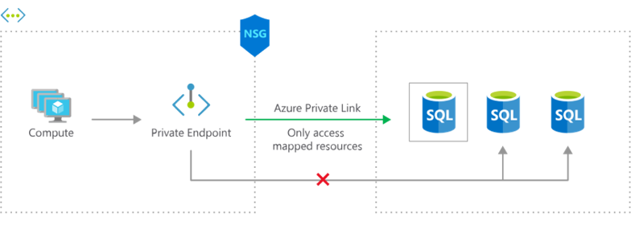

 

Traffic to the private endpoint bypasses NSG rules, allowing VM1 to
upload data to blobs. Network policy MUST be enabled for the vNET
specific to NSG, however in this case is NOT mentioned or enabled and
hence NSG rules are NOT affecting the private Endpoint.

 

This feature enhancement provides you with the ability to enable
advanced security controls on traffic destined to a private endpoint. In
order to leverage this feature, you will need to set a specific subnet
level property, called PrivateEndpointNetworkPolicies, to enable on the
subnet containing private endpoint resources.

 

A private endpoint uses a private IP address from your virtual network
to access a storage account over the Microsoft backbone network. With a
private endpoint, traffic between your virtual network and the storage
account are secured over a private link. Storage firewall rules only
apply to the public endpoints of a storage account, not private
endpoints. The process of approving the creation of a private endpoint
grants implicit access to traffic from the subnet that hosts the private
endpoint.

 

| **Feature** | **Private Endpoint** | **Service Endpoint** |
|----|----|----|
| Type | Network interface | Virtual network extension |
| Connectivity | Over private IP | Over public IP with VNet identity |
| Security | Highest (isolated, private) | Moderate (public IP, but restricted access) |
| Supported Services | Many (Storage, SQL, Web Apps, etc.) | Limited (Storage, SQL, Cosmos DB, etc.) |
| DNS Configuration | Requires private DNS zone | No DNS changes needed |
| Traffic Routing | Through Azure backbone | Public endpoint with VNet identity |
| Cost | Higher (per endpoint) | Lower (no endpoint cost) |
| Use Case | Secure, private access | Quick access control from VNet |

 

* *

 

 

 

**Azure Private Link Service**

 

Azure Private Link service is the reference to your own service that is
powered by Azure Private Link. Your service that is running behind Azure
Standard Load Balancer can be enabled for Private Link access so that
consumers to your service can access it privately from their own VNets.
Your customers can create a private endpoint inside their virtual
network and map it to this service.

 

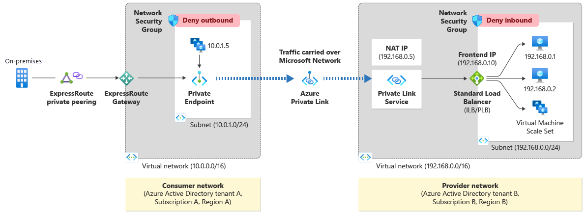

 

\- Configure your application to run behind a standard load balancer in
your virtual network. If you already have your application configured
behind a standard load balancer, you can skip this step.

\- Create a Private Link Service referencing the load balancer above. In
the load balancer selection process, choose the frontend IP
configuration where you want to receive the traffic. Choose a subnet for
NAT IP addresses for the Private Link Service. It's recommended to have
at least eight NAT IP addresses available in the subnet. All consumer
traffic will appear to originate from this pool of private IP addresses
to the service provider. Choose the appropriate properties/settings for
the Private Link Service.

\- Private Link service can be accessed from approved private endpoints
in any public region. The private endpoint can be reached from the same
virtual network, regionally peered VNets, globally peered VNets and on
premises using private VPN or ExpressRoute connections

 

You have two Azure subscriptions named Subscription1 and Subscription2.
Subscription1 contains a virtual network named Vnet1. Vnet1 contains an
application server. Subscription2 contains a virtual network named
Vnet2.

 

You need to provide the virtual machines in Vnet2 with access to the
application server in Vnet1 by using a private endpoint.

 

Step 1: Deploy an Azure Load Balancer in front of the application
server - Configure your application to run behind a standard load
balancer in your virtual network.

 

Step 2: In Subscription 1, create a private link service and attach the
service to the frontend IP configuration of the load balancer - Create a
Private Link Service referencing the load balancer above.

 

Step 3: In Subscription 2, create a private endpoint by using the
private link service.- Private Link service can be accessed from
approved private endpoints in any public region. The private endpoint
can be reached from the same virtual network, regionally peered VNets,
globally peered VNets and on premises using private VPN or ExpressRoute
connections.

 

Step 4: In Subscription1, accept the private endpoint connection
request. - Network connections can be initiated only by clients that are
connecting to the private endpoint.

 

 

**NAT Gateway**

 

NAT gateway provides outbound internet connectivity for one or more
subnets of a virtual network. Once NAT gateway is associated to a
subnet, NAT provides source network address translation (SNAT) for that
subnet. NAT gateway specifies which static IP addresses virtual machines
use when creating outbound flows. When you create an instance of the
Azure NAT Gateway service, your subnet is reconfigured so that it sends
all outbound traffic to the NAT gateway service. There’s no need to
create routes, because it happens automatically.

 

 

\- fully managed and highly resilient Network Address Translation (NAT)
service

\- simplifies outbound Internet connectivity for virtual networks

\- When configured on a subnet, all outbound connectivity uses the
Virtual Network NAT's static public IP addresses

\- A NAT gateway resource can be associated to a subnet and can be used
by all compute resources in that subnet

\- Multiple subnets within the same virtual network can either use
different NAT gateways or the same NAT gateway.

\- A NAT gateway can’t span multiple virtual networks.

\- Multiple NAT gateways can’t be attached to a single subnet.

\- A NAT gateway can’t be deployed in a gateway subnet.

\- Outbound connectivity can be scaled out by assigning up to 16 IP
addresses to NAT gateway, in any combination of: Public IP addresses,
Public IP prefixeS, Public IP addresses and prefixes derived from custom
IP prefixes (BYOIP)

\- NAT gateway can’t be associated to an IPv6 public IP address or IPv6
public IP prefix. It can be associated to a dual stack subnet, but will
only be able to direct outbound traffic with an IPv4 address.

\- NAT gateway can be used to provide outbound connectivity in a hub and
spoke model when associated with Azure Firewall. NAT gateway can be
associated to an Azure Firewall subnet in a hub virtual network and
provide outbound connectivity from spoke virtual networks peered to the
hub.

\- NAT gateway allows flows to be created from the virtual network to
the services outside your virtual network. Return traffic from the
internet is only allowed in response to an active flow.

\- Services outside your virtual network can’t initiate an inbound
connection through NAT gateway.

\- NAT gateway takes precedence over other outbound scenarios (including
Load balancer and instance-level public IP addresses) and replaces the
default Internet destination of a subnet.

\- The order of operations for outbound connectivity follows this order
of precedence: Virtual appliance UDR / ExpressRoute \>\> NAT gateway
\>\> Instance-level public IP addresses on virtual machines \>\> Load
balancer outbound rules \>\> default system

\- NAT gateway supports TCP and UDP protocols only. ICMP isn't
supported.

\- A NAT gateway can be created in a specific availability zone or
placed in 'no zone'. ZONAL NAT gateway provides internet connectivity
FROM a single zone.

\- NAT gateway can provide outbound connectivity for virtual machines
from other availability zones different from itself

\- NAT gateway can be isolated in a specific zone when you create zone
isolation scenarios. This deployment is called a zonal deployment. After
NAT gateway is deployed, the zone selection can't be changed.

 

Step 1 : Create a NAT gateway - create NAT gateway with a name specified
and create or add new Public IP address in outbound IP

Step 2 : Link subnets to NAT gateway- add NAT gateway to subnets
required

 

***Benefits***

 

\- Security: With a NAT gateway, individual VMs or other compute
resources, don't need public IP addresses and can remain private.
Resources without a public IP address can still reach external sources
outside the virtual network with NAT gateway's static public IP
addresses or prefixes.

\- Resiliency: A NAT gateway always has multiple fault domains and can
sustain multiple failures without service outage. Software defined
networking makes a NAT gateway highly resilient.

\- Scalability: When a NAT gateway is associated to a public IP prefix,
it automatically scales to the number of IP addresses needed for
outbound.

\- Performance: NAT gateway won't affect the network bandwidth of your
compute resources

 

***SNAT exhaustion*** occurs when a backend instance runs out of given
SNAT Ports. A load balancer can still have unused SNAT ports. If a
backend instance's used SNAT ports exceed its given SNAT ports, it will
be unable to establish new outbound connections.

 

Use a NAT gateway for outbound connectivity to the Internet Virtual
network NAT gateway is a highly resilient and scalable Azure service
that provides outbound connectivity to the internet from your virtual
network. A NAT gateway's unique method of consuming SNAT ports helps
resolve common SNAT exhaustion and connection issues.

 

 

Azure DNS

 

Azure DNS provides a reliable, secure DNS service to manage and resolve
domain names in a virtual network.

 

You can't use Azure DNS to register a domain name. You use a third-party
domain registrar to register your domain. Azure DNS doesn't support
Domain Name System Security Extensions.

 

Security features

 

\- Role-based access control, which gives you fine-grained control over
users' access to Azure resources.

\- Activity logs, which let you track changes to a resource, and
pinpoint where faults occurred

\- Resource locking, which gives a greater level of control to restrict
or remove access to resource groups, subscriptions, or any Azure
resources.

 

You can manage your domains and records by using the Azure portal, Azure
PowerShell cmdlets, or the Azure CLI.

 

Applications that require automated DNS management can integrate with
the service by using the REST API and SDKs.

 

Initial Domain Name

\- When you create an Azure subscription, an Azure AD domain is
automatically created. The form domainname.onmicrosoft.com

\- The initial domain name is intended to be used until a custom domain
name is verified

\- The initial domain name can't be changed or deleted

Custom Domain Name

\- Can add routable custom domain

\- User who creates custom domain must be global administrator who made
the subscription

\- Domain names in Azure AD are globally unique

\- Before a custom domain name can be used by Azure AD, the custom
domain name must be added to your directory and verified

 

Verify custom domain

\- Azure AD won't allow any directory resources to use an unverified
domain name

\- After adding the custom domain name, you must verify ownership of the
domain name

\- Verification is performed by adding MX or TXT records

\- Once records are added with several hours, Azure will query the DNS
domain for the presence of the record

 

Azure DNS Zones(Public DNS)

\- To start hosting your domain in Azure DNS, you need to create a DNS
zone for that domain name and create DNS records in DNS zone

\- Information for the DNS zone includes name, number of records,
resource group, location, subscription, and name servers

\- The name of the zone must be unique within the resource group, and
the zone must not exist already

\- The same zone name can be reused in a different resource group or a
different Azure subscription.

\- When multiple zone share the same name, each zone is assigned to
different name server addresses

\- Root/Parent domain is registered at the third-party registrar and
pointed to Azure NS by signing in to the domain management application
provided by your domain registrar which is called Domain Delegation

\- Child domains are registered in AzureDNS directly.

\- You do not have to own a domain name to create a DNS zone with that
domain name in Azure DNS, but to configure the domain, you have to own
the domain name

\- The SOA record represents your domain and will become the reference
point when other DNS servers are searching for your domain on the
internet.

 

 

nslookup -type=SOA wideworldimports.com

 

To verify configuration;

 

nslookup
[www.wideworldimportsXXXX.com](http://www.wideworldimportsXXXX.com)
\<name server address\>

 

Migrate zone from on-premise DNS to Azure DNS

 

\- Installing the DNS migration script- open elevated PowerShell
window(administrative mode) run the command install-script
PrivateDNSMigrationProject

\- Run script using the command- PrivateDNSMigrationScript.ps1

\- Azure DNS zone supports importing and exporting zone files by using
Azure CLI. Zone file import is not currently supported by Azure
PowerShell and Azure Portal

 

Delegate DNS Domain

\- To delegate your domain to Azure DNS, you need to know allocated name
servers from a pool when DNS zone is created

\- Once the Name Servers are assigned, Azure DNS automatically creates
authoritative NS records in your zone

\- The trailing period of name server address indicates the end of a
fully qualified domain name.

\- Thus, name servers assigned to zone can be shown through Azure portal
such as ‘ns1-02.azure-dns.com’, ‘ns2-02.azure-dns.net’,
‘ns3-02.azure-dns.org’, and ‘ns4-02.azure-dns.info’

\- Each registrar(the business that sells and registers domains) has
their own DNS management tools to edit and replace the name server
records for a domain with Azure name servers

 

Child domains

\- Setting up a subdomain follows the same process as typical delegation

\- For child zone partners.contoso.com, NS records must be created in
the parent zone contoso.com in Azure DNS, rather than in the domain
registrar

 

DNS Record Sets

\- A record set is a collection of records in a zone that have the same
name and are the same type

\- A record set cannot contain two identical records

\- Empty record sets (with zero records) can be created, but do not
appear on the Azure DNS name server

\- Record sets of type CNAME can contain one record at most

\- For type A record set, you will need TTL and IP address

\- SOA and CNAME records can't contain record sets.

 

The time to live, or TTL, specifies how long each record is cached by
clients before being deleted.

 

**Private DNS zones**

 

\- Private DNS zones provides name resolution for virtual machines (VMs)
within a virtual network and between virtual networks.

\- you can configure zones names with a split-horizon view, which allows
a private and a public DNS zone to share the name

\- The DNS records for the private zone are not viewable or retrievable,
however it will resolve successfully

\- Azure DNS supports A, AAAA, CNAME, MX, PTR, SOA, SRV, and TXT records

\- Along with hosting your custom DNS records, Azure automatically
maintains hostname records for the VMs in the specified virtual networks

\- Hostname resolution between virtual networks simplifies cross-network
and service-discovery scenarios, such as virtual network peering

\- this new offering uses well-established Azure DNS tools (PowerShell,
Azure Resource Manager templates, and the REST API)

\- Split-horizon DNS support: With Azure DNS, you can create zones with
the same name that resolve to different answers from within a virtual
network and from the public internet

\- Available in all Azure regions in the Azure Public cloud

 

Scenario 1 : Name resolution scoped to a single virtual network

 

When you create a Private Zone (contoso.lab) and link it to VNet1 that
contains 2 VMs using virtual network link , Azure DNS will automatically
create two A records as well as reverse DNS in the zone if you enable
auto registration in the link configuration.

 

Scenario 2 : Name resolution scoped for multiple virtual networks

 

\- VNet1 is designated as a Registration virtual network and VNET2 is
designated as a Resolution virtual network.

\- The intent is for both virtual networks to share a common zone
contoso.lab.

\- The Resolution and Registration virtual networks are linked to the
zone.

\- DNS records for the Registration VNet VMs are automatically created.
You can manually add DNS records for VMs in the Resolution virtual
network.

\- By default, registration VNet act as resolution VNet

\- A DNS query from a VM in the Resolution VNet, for a VM in the
Registration VNet, will receive a DNS response containing the Private IP
of VM.

\- A Reverse DNS (PTR) query from a VM in the Resolution virtual
network, for a VM in the Registration VNet, will receive a DNS response
containing the NXDOMAIN of the VM. But, a reverse DNS query from a VM in
the Resolution VNet, for a VM in the same VNet, will receive the FQDN.

 

Virtual network link

 

\- After you create a private DNS zone in Azure, you'll need to link a
virtual network to it. Once linked, VMs hosted in that virtual network
can access the private DNS zone

\- Every private DNS zone has a collection of virtual network link child
resources. Each one of these resources represents a connection to a
virtual network.

\- A virtual network can be linked to private DNS zone as a registration
or as a resolution virtual network.

 

Registration virtual network

 

\- Once auto registration is enabled at the creation of virtual network
link, virtual network gets capability to create DNS records
automatically for any virtual machines you deploy in the virtual
network.

\- DNS records will also be created for virtual machines already
deployed in the virtual network.

\- A private DNS zone can have multiple registration virtual networks.
However, every virtual network can only have one registration zone
associated with it.

 

Resolution virtual network

 

\- If you choose to link your virtual network with the private DNS zone
without auto registration

\- DNS records for virtual machines deployed this virtual network won't
be created automatically in the private zone. However, virtual machines
deployed in the virtual network can successfully query for DNS records
in the private zone.

\- One private DNS zone can have multiple resolution virtual networks
and a virtual network can have multiple resolution zones associated to
it

 

Domain lookup requests

 

\- Checks to see if the domain name is stored in the short-term cache.
If so, the DNS server resolves the domain request.

\- If the domain isn't in the cache, it contacts one or more DNS servers
on the web to see if they have a match. When a match is found, the DNS
server updates the local cache and resolves the request.

\- If the domain isn't found after a reasonable number of DNS checks,
the DNS server responds with a domain cannot be founderror.

 

In DNS instance , the DNS server will act as a start of authority (SOA)
for your domain. The SOA and NS records are created automatically when
you create a DNS zone by using Azure DNS.

 

The SOA record represents your domain, and is used when other DNS
servers are searching for your domain. SOA contains following
information.

 

\- Name of the server that supply the data

\- Administrator of the zone

\- Current version of the data file

\- Number of seconds a secondary server should wait before checking for
updates

\- Number of seconds a secondary server should wait before retrying
failed zone transfer

\- Maximum number of seconds that a secondary name server can use data
before it must either be refreshed or expire

\- Default number of seconds for the Time-To-Live on resource records

 

 

DNS record types

\- A is the host record, It maps the domain or host name to the IP
address.

\- CNAME is a Canonical Name record that's used to create an alias from
one domain name to another domain name

\- MX is the mail exchange record. It maps mail requests to your mail
server

\- TXT is the text record. It's used to associate text strings with a
domain name. Azure and Microsoft 365 use TXT records to verify domain
ownership

 

Apex domain

\- highest level of your domain which refer as zone apex or root apex

\- It's often represented by the @ symbol in your DNS zone records e.g
@combank.lk

\- NS and SOA are apex domain records

\- CNAME records that you might need for an Azure Traffic Manager
profile or Azure Content Delivery Network endpoints aren't supported at
the zone apex level.

\- Alias records are supported at the zone apex level.

 

Alias records

Azure alias records enable a zone apex domain to reference other Azure
resources from the DNS zone.

 

The Azure alias record can point to the following Azure resources:

\- A Traffic Manager profile

\- Azure Content Delivery Network endpoints

\- A public IP resource

\- A front door profile

 

Alias records provide lifecycle tracking of target resources, ensuring
that changes to any target resource are automatically applied to the DNS
zone and support for load-balanced applications in the zone apex.

 

Alias record set supports A, AAAA, CNAME

 

To create an alias record in zone apex,

 

Azure portal\>\> Resource group\>\> Select DNS zone \>\> add record set

 

Name - Leave the name blank for indicating apex domain

Type - A, AAAA, CNAME

Alias record set -Yes

Alias type - Azure resource

Azure resource - select from Azure resources

TTL

 

 

Advantages of alias records

 

\- Prevents dangling DNS records by by tightly coupling the lifecycle of
Azure resources : A dangling DNS record occurs when the DNS zone records
aren't up-to-date with changes to IP addresses

\- Updates DNS record set automatically when underlying IP addresses of
resource, service, or application is changed, the alias record ensures
that any associated DNS records are automatically refreshed.

\- Alias records allow for zone apex resource routing to Traffic Manager
and Azure CDN

 

**Azure DNS Private Resolver**

 

Azure DNS Private Resolver to simplify hybrid recursive Domain Name
System (DNS) resolution. You can use DNS Private Resolver for
on-premises workloads and Azure workloads. DNS Private Resolver
simplifies private DNS resolution from on-premises to the Azure private
DNS service and vice versa.

 

The following sections present alternatives for hybrid recursive DNS
resolution

 

 

Use a **DNS forwarder** VM

 

\- Before DNS Private Resolver is available, a DNS forwarder VM was
deployed so that an on-premises server could resolve requests to the
Azure private DNS service

\- A ***conditional forwarde*r** on the on-premises DNS server forwards
requests to Azure, and a private DNS zone is linked to a virtual
network.

\- Requests to the Azure service then resolve to the appropriate private
IP address.

\- you can't use the Azure public DNS service to resolve on-premises
domain names.

 

 

**Azure Traffic Manager**

 

\- Azure Traffic Manager is a DNS-based traffic load balancer

\- This service allows you to distribute traffic to your public facing
applications across the global Azure regions

\- uses DNS to direct the client requests to the appropriate service
endpoint based on a traffic-routing method

\- provides health monitoring for every endpoint

 

**Azure traffic manager routing method**

 

***Priority***

 

When you choose priority routing, a prioritized list of service
endpoints appears, with the primary service endpoint receiving the
highest priority for all traffic. If the primary service endpoint is
down, traffic is routed to the next highest priority endpoint, and so
on.

 

***Weighted***

 

When you want to distribute traffic uniformly or utilize pre-defined
weights across a collection of endpoints, you use the weighted routing
approach. In this traffic-routing approach, you assign a weight to each
endpoint in the Microsoft Azure Traffic Manager profile configuration,
which is an integer ranging from 1 to 1000.

 

***Performance***

 

When you wish to improve the responsiveness of several apps by routing
traffic to the place nearest to the user, this traffic routing strategy
is utilized. The 'closest' endpoint isn't always the one with the
shortest geographic distance. Instead, the 'Performance' traffic-routing
mechanism uses network latency to select the closest endpoint.

 

***Geographic***

 

Each endpoint linked with a profile must have a set of geographic
regions allocated to it in geographic routing. When a region or a group
of regions is assigned to an endpoint, all requests from that region or
set of regions are routed exclusively to that endpoint. With this
routing method, it enables you to be in compliance with scenarios such
as data sovereignty mandates, localization of content & user experience
and measuring traffic from different regions.

 

***Multivalue***

 

For Azure Traffic Manager profiles with only IPv4/IPv6 addresses as
endpoints, you can choose MultiValue. All healthy endpoints are returned
when a question for this profile is received.

 

The Multivalue traffic-routing method allows you to get multiple healthy
endpoints in a single DNS query response. This configuration enables the
caller to do client-side retries with other endpoints in case a returned
endpoint being unresponsive. This pattern can increase the availability
of a service and reduce the latency associated with a new DNS query to
obtain a healthy endpoint. MultiValue routing method works only if all
the endpoints of type ‘External’ and are specified as IPv4 or IPv6
addresses. When a query is received for this profile, all healthy
endpoints are returned and are subject to a configurable maximum return
count.

 

 

***Subnet***

 

To map sets of end-user IP address ranges to a specific endpoint within
an Azure Traffic Manager profile, utilize the Subnet traffic-routing
mechanism. When a request is received, the endpoint that is returned is
the one that is mapped to the source IP address of the request.

 

In this scenario, I'll present two virtual machines that have been
connected into Azure Traffic Manager and are prioritized

 

***Endpoint type***

 

• Azure endpoints are used for services hosted in Azure.

 

• External endpoints are used for services hosted outside Azure, either
on-premises or with a different hosting provider

 

. • Nested endpoints are used to combine Traffic Manager profiles to
create more flexible traffic-routing schemes to support the needs of
larger, more complex deployments.

 

Scenario 1:

You cannot combine both 'Weighted' and 'Geographic' traffic-routing in a
single profile. The parent profile still uses the Geographic
traffic-routing method and child profile uses the Weighted
traffic-routing method. This 'child' profile act as an endpoint to the
'parent' profile. Initially, there are only 3 endpoints with 1 TM
profile using Geographic routing-method. However, you need to deploy 10%
of traffic to Tokyo which requires Weighted TM routing-method. When you
create a Child TM, it is considered as endpoint. Therefore, 3
endpoints + 1 endpoint (child TM) is equal to 4 endpoints. 1 Parent TM
Profile + 1 Child Profile is equal to 2 Profiles.

 

 

CheckingEndpoint is a temporary state that usually occurs immediately
after adding or enabling an endpoint in the profile. An endpoint in this
state is included in DNS responses and can receive traffic.

 

**Front Door**

 

If you need to optimize global routing of your web traffic and optimize
top-tier end-user performance and reliability through quick global
failover.

 

Front Door is an application delivery network that provides global load
balancing and site acceleration service for web applications.

 

It offers Layer 7 capabilities for your application like SSL offload,
path-based routing, fast failover, caching, Support cookie-based
affinity etc. to improve performance and high-availability of your
applications.

 

The Azure Web Application Firewall (WAF) rate limit rule for Azure Front
Door controls the number of requests allowed from clients during a
one-minute duration.

 

The way that you configure Front Door depends on how many application
instances you deploy:

 

Single-region deployment: Create a single origin group. Within that
origin group, create a single origin to represent the App Service app.
Your App Service app might be configured to scale out across worker
instances, but from Front Door's perspective there's a single origin.

 

Multi-region active/passive deployment: Create a single origin group.
Within that origin group, create an origin for each of the App Service
apps. Configure each origin's priority to ensure that the primary
application has a higher priority than the secondary application.

 

Multi-region active/active deployment: Create a single origin group.
Within that origin group, create an origin for each of the App Service
apps. Configure each origin's priority to be the same. Configure each
origin's weight to set the proportion of requests that should go to that
origin.

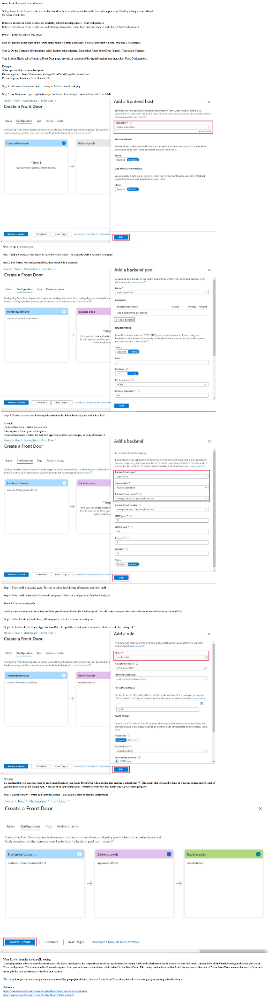

 

 

 

A web application delivered by Front Door can have only one WAF policy
associated with it at a time. One WAF policy can be associated with
multiple Frontend host.

 

Azure Front Door web application firewall protects web applications from
common vulnerabilities and exploits. Azure managed rule sets provide an
easy way to deploy protection against common set of security threats.

 

Plan:

Stage 1: Create WAF policy

Stage 2: Create a custom WAF Geo location rule that blocks all traffic
outside Canada

Stage 3: Create a custom WAF Geo location rule that allows from Canada

 

Stage 1: Create WAF policies with policy for regional WAF(Front Door)
and policy name, then associate specifying application gateway, HTTP
listener, route path

 

Stage 2: In the WAF policy by default it is detection mode. Change it to
prevention mode, matching rules defined in CRS by specifying custom rule
name, priority, match type: Geo location, match variable: ReloteAddr,
Operation: Is not, Country: Canada, Then: Deny traffic

 

Stage 3: defined in CRS by specifying custom rule name, priority, match
type: Geo location, match variable: ReloteAddr, Operation: Is , Country:
Canada, Then: Allow traffic

 

 

Add custom domain to Azure Front Door

 

When you use Azure Front Door for application delivery, a custom domain
is necessary if you want your own domain name to be visible in your
end-user request.

 

After you create a Front Door profile, the default frontend host is a
subdomain of azurefd.net. This name is included in the URL for
delivering Front Door content to your backend by default. For example,
<https://contoso-frontend.azurefd.net>

 

\- Before you can use a custom domain with your Front Door, you must
first create a canonical name (CNAME) record with your domain provider
to point to the Front Door default frontend host

\- In Azure Front Door, the source domain name is your custom domain
name and the destination domain name is your Front Door default
hostname. Once Front Door verifies the CNAME record gets created,
traffic to the source custom domain gets routed to the specified
destination Front Door default frontend host.

\- A custom domain can only be associated with one Front Door profile at
a time. However, you can have different subdomains of an apex domain in
the same or a different Front Door profile.

\- When you map an existing domain that is in production. a brief period
of downtime for the domain may occur while you're registering your
custom domain in the Azure portal. To avoid interruption of web traffic,
map your custom domain to your Front Door default frontend host with the
Azure afdverify subdomain first to create a temporary CNAME mapping,
example afdverify.\<custom domain name\> point to
afdverify.contoso-frontend.azurefd.net. If you've verified that the
afdverify subdomain has been successfully mapped to your Front Door, you
can then map the custom domain directly to your default Front Door
frontend host.

\- Associate the custom domain with front door. Azure verifies that the
CNAME record exists for the custom domain name you entered.

\- You must ensure that each of the frontend hosts (including custom
domains) in your Front Door has a routing rule with a default path
('/\*') associated with it. That is, across all of your routing rules
there must be at least one routing rule for each of your frontend hosts
defined at the default path ('/\*'). Failing to do so, may result in
your end-user traffic not getting routed correctly.

 

 

 

**Virtual network peering**

 

\- the simplest and quickest way to seamlessly connect two Azure virtual
networks

\- Once peered, the virtual networks appear as one, for connectivity
purposes

\- It takes advantage of the high bandwidth and low latency of the Azure
backbone network

\- Cannot add or delete address space into or from virtual network once
a virtual network is peered with another virtual network. Remove peering
and recreate it later is the option

 

Regional VNet peering connects Azure virtual networks in the same
region.

 

Global VNet peering connects Azure virtual networks in different
regions. When creating a global peering, the peered virtual networks can
exist in any Azure public cloud region or China cloud regions, but not
in Government cloud regions. You can only peer virtual networks in the
same region in Azure Government cloud regions.

 

Features of virtual network

 

\- Reciprocal Connection - When you create a virtual network peering
connection in only one virtual network to connect to a peer in another
network, you have to create connections in each virtual network

\- Cross-subscription virtual network peering- You can use virtual
network peering even when both virtual networks are in different
subscriptions where the subscriptions can use the same or different
Azure Active Directory tenants. To peer the virtual networks when both
subscriptions are in different Azure Active Directory tenants, the
administrators of each subscription must grant the peer subscription's
administrator the Network Contributor role on their virtual network.

\- Transitivity - Virtual network peering is nontransitive. However, you
can configure user-defined routes and service chaining to provide the
transitivity

\- Gateway transit- You can configure transitive connections on-premises
if you use virtual network gateways as transit points. To enable gateway
transit, configure the Allow gateway transit option in the hub virtual
network where you deployed the gateway connection to your on-premises
network. Also configure the Use remote gateways option in any spoke
virtual networks. A virtual network can configure only one at a time
either remote gateway or VPN gateway

\- Overlapping address spaces - IP address spaces of connected networks
within Azure and your on-premises system can't overlap

\- Alternative connectivity methods- The virtual networks that connect
to an ExpressRoute circuit are part of the same routing domain and can
communicate with each other. You can use a site-to-site configuration to
connect virtual networks together through VPN gateways. When virtual
networks are connected through both a gateway and virtual network
peering, traffic flows through the peering configuration

 

 

 

Create virtual network and subnet in the network;

 

az network vnet create \\

--resource-group \[sandbox resource group name\] \\

--name SalesVNet \\

--address-prefixes 10.1.0.0/16 \\

--subnet-name Apps \\

--subnet-prefixes 10.1.1.0/24 \\

--location northeurope

 

az network vnet list --output table ; Table the created virtual networks

 

Create a VM in virtual network;

 

az vm create \\

--resource-group \[sandbox resource group name\] \\

--no-wait \\ ; this command lets you continue working in Cloud Shell
while the VM is building.

--name SalesVM \\

--location northeurope \\

--vnet-name SalesVNet \\

--subnet Apps \\

--image UbuntuLTS \\

--admin-username azureuser \\

--admin-password \<password\>

 

watch -d -n 5 "az vm list \\

--resource-group \[sandbox resource group name\] \\

--show-details \\

--query '\[\*\].{Name:name, ProvisioningState:provisioningState,
PowerState:powerState}' \\

--output table". ; uses the Linux watch command, which is configured to
refresh every five seconds

 

To create the peering connection between the SalesVNet and MarketingVNet
virtual networks;

 

az network vnet peering create \\

--name SalesVNet-To-MarketingVNet \\

--remote-vnet MarketingVNet \\

--resource-group \[sandbox resource group name\] \\

--vnet-name SalesVNet \\

--allow-vnet-access

 

To create a reciprocal connection from MarketingVNet to SalesVNet;

 

az network vnet peering create \\

--name MarketingVNet-To-SalesVNet \\

--remote-vnet SalesVNet \\

--resource-group \[sandbox resource group name\] \\

--vnet-name MarketingVNet \\

--allow-vnet-access

 

Thus, you can create virtual network peering between virtual networks.

 

To check virtual network peering connection

 

az network vnet peering list \\

--resource-group \[sandbox resource group name\] \\

--vnet-name SalesVNet \\

--output table

 

In the PeeringState column, make sure the status is Connected.

 

Check effective routes

 

check the peering connection by looking at the routes that apply to the
network interfaces of the VMs

 

az network nic show-effective-route-table \\

--resource-group \[sandbox resource group name\] \\

--name SalesVMVMNic \\

--output table

 

You should see a route to networks prefix with Next Hop Type of
VNetPeering

 

Check virtual network peering connectivity by using SSH between Azure
VM;

 

1\. create a connection from Azure Cloud Shell to a target VM's publicIP
address, first you should get list of IP addresses that use to connect
to VMs

 

az vm list \\

--resource-group \[sandbox resource group name\] \\

--query "\[\*\].{Name:name, PrivateIP:privateIps, PublicIP:publicIps}"
\\

--show-details \\

--output table

 

2\. Connect VM using public IP address

 

ssh -o StrictHostKeyChecking=no azureuser@\<SalesVM public IP\>

 

3\. Connect other VM using private IP addres from connected VM

 

ssh -o StrictHostKeyChecking=no azureuser@\<MarketingVM private IP\>

 

Enter exit to close SSH session

 

Thus, The connection attempt will fail if you are trying to connect
between VMs that they are in virtual networks that is not peered. Up to
60 seconds might pass before the connection attempt times out. To force
the attempt to stop, use Ctrl+C.

 

 

**Benefits of virtual network peering**

 

\- Traffic between peered virtual networks is private and kept on
Microsoft backbone network where no public Internet, gateways, or
encryption is required

\- A low-latency, high-bandwidth connection between resources in
different virtual networks

\- The ability for resources in virtual networks to communicate each
other once virtual networks are peered

\- The ability to transfer data across Azure subscriptions, deployment
models, and across Azure regions

\- No downtime to resources in either peered virtual network

 

**Gateway transit and connectivity**

 

\- When virtual networks are peered, you configure a VPN gateway as a
transit point

\- A peered virtual network uses the remote gateway to gain access to
other resources

\- A virtual network can have only one gateway

\- Gateway transit is supported for both regional VNet Peering and
Global VNet Peering

\- With the Vnet peering, you can either open or close the network
security group rules between the virtual networks

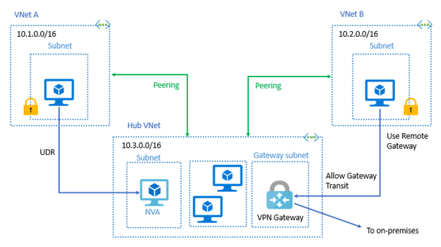

 

When you Allow Gateway Transit the virtual network can communicate to
resources outside the peering. For example, the gateway subnet could:

\- Use a site-to-site VPN to connect to an on-premises network.

\- Use a VNet-to-VNet connection to another virtual network.

\- Use a point-to-site VPN(User VPN) to connect individual device to
virtual network (point-to-site connect to Vnet must have client
certificate installed. You generate client certificate from self-signed
root certificate, the export and install the certificate. If no
certificate installed, authentication will fail)

 

Gateway transit allows peered virtual networks to share the gateway and
it doesn’t need to deploy a VPN gateway.

 

To configure the peering use the Add peering page. It contains
followings.

\- Peering link name

\- Traffic to remote virtual network(allow/block)

\- Traffic forwarded from remote virtual network(allow/block)

\- Virtual network gateway(use this gateway/use remote network’s
gateway/none)

 

When you add a peering on one virtual network, the second virtual
network configuration is automatically added.

 

Service chaining

\- VNet Peering is nontransitive. When you establish VNet peering
between VNet1 and VNet2 and between VNet2 and VNet3, VNet peering
capabilities do not apply between VNet1 and VNet3

\- However, you can configure user-defined routes and service chaining
to provide the transitivity

 

Service chaining allows;

\- Implement a multi-level hub and spoke architecture.

\- Overcome the limit on the number of VNet peerings per virtual
network.

 

Virtual network peering enables the next hop in a user-defined route to
be the IP address of a virtual machine in the peered virtual network, or
a VPN gateway.

 

Hub and spoke architecture

\- All the spoke virtual networks can then peer with the hub virtual
network

\- Hub virtual network hosts infrastructure components like network
virtual appliance and VPN gateway so that traffic can flow though them

 

Checking connectivity

\- Initiated: When you create the peering to the second virtual network
from the first virtual network, the peering status is Initiated

\- Connected: When you create the peering from the second virtual
network to the first virtual network, its peering status is Connected.
The peering is not successfully established until the peering status for
both virtual network peerings is Connected.

 

 

**Secure access to virtual networks**

 

**Network Security Group(NSG)**

 

\- can limit network traffic to resources in a virtual network using a
network security group (NSG)

\- NSG contains a list of security rules that allow or deny inbound or
outbound network traffic

\- NSG can be associated to a subnet or a network interface

\- A network security group can be associated multiple times

\- NSG has associated subnets, associated network interfaces, and
security rules.

-NSG cannot filter traffic based FQDN, only IP address and service tag
such as internet are supported

 

*Subnets*

 

\- Subnet can have zero, or one, associated network security group

\- By assigning NSG, create protected screened subnets (also called a
DMZ)

 

Network interfaces

\- can assign NSGs to a NIC to control all traffic

\- network interface that exists in a subnet can have zero, or one,
associated network security groups.

 

 

If similar inbound rule is applied at subnet and network interface, the
rule with higher priority will be applied.

 

*NSG Rules*

 

NSG rules are specified with followings.

 

\- Name

\- Priority

\- Port

\- Protocol (Any, TCP, UDP)

\- Source (Any, IP Addresses, Service tag)

\- Destination (Any, IP Addresses, Virtual Network)

\- Action (Allow or Deny)

 

Azure creates the default rules in each network security group that you
create. You cannot remove the default rules, but you can override them
by creating rules with higher priorities.

 

Inbound rules

\- Three default inbound security rules

\- The rules deny all inbound traffic except from the virtual network
and Azure load balancers.

\- For incoming traffic, the NSG set at the subnet level is evaluated
first, then the NSG set at the NIC level is evaluated.

 

Outbound rules

\- three default outbound security rules

\- the rules only allow outbound traffic to the Internet and the virtual
network

\- For outgoing traffic, the NSG set at the NIC level is evaluated
first, the NSG set at the subnet level is evaluated

 

If you have several NSGs and are not sure which security rules are being
applied, you can use the Effective security rules link.

 

Service-Service specifies the destination protocol and port range for
this rule

 

Port ranges - Port ranges can include a single port, a port range, or a
comma-separated list of ports

 

Priority- Rules are processed in priority order. The lower the number,
the higher the priority. The value is between 100-4096 and unique for
all security rules within the network security group.

 

**Application security groups**

 

\- enable you to configure network security as a natural extension of an
application's structure, allowing you to group virtual machines and
define network security policies based on those groups

\- reuse your security policy at scale without manual maintenance of
explicit IP addresses

\- The platform handles the complexity of explicit IP addresses and
multiple rule sets, allowing you to focus on your business logic.

\- The rules that specify an application security group as the source or
destination are only applied to the network interfaces that are members
of the application security group.

\- a network interface can be a member of multiple application security
groups

\- There are limits to the number of application security groups you can
have in a subscription

\- All network interfaces assigned to an application security group have
to exist in the same virtual network

\- If you specify an application security group as the source and
destination in a security rule, the network interfaces in both
application security groups must exist in the same virtual network.

 

To minimize the number of security rules you need, and the need to
change the rules, plan out the application security groups you need and
create rules using service tags or application security groups, rather
than individual IP addresses, or ranges of IP addresses, whenever
possible.

 

 

**Azure Firewall**

 

\- Azure Firewall is a managed, cloud-based network security service
that protects your Azure Virtual Network resources

\- It's a fully stateful firewall as a service, so it can distinguish
legitimate packets for different types of connections

\- built-in high availability as primary and secondary instances

\- unrestricted cloud scalability to accommodate changing network
traffic flows

\- Deploy to span multiple Availability Zones for increased availability
with 99.99% SLA

-You can filter traffic based on FQDN

\- limit outbound HTTP/S traffic or Azure SQL traffic to a specified
list of FQDN including wildcards

\- centrally create allow or deny network filtering rules by source and
destination IP address, port, and protocol ***across subscriptions and
virtual networks***

\- Azure Firewall uses a static public IP address for your virtual
network resources allowing outside firewalls to identify traffic
originating from your virtual network and use multiple public address

\- The service is fully integrated with Azure Monitor for logging and
analytics

\- It has built-in ***Threat intelligence-based filtering*** can be
enabled for your firewall to alert and deny traffic from/to known
malicious IP addresses and domains

\- Parent policy must be in the same region as child policy. Firewall
policy can be associated with Firewalls across regions regardless of
where they are stored." That's from Azure Portal, showed for the field
"Parent Policy" when creating a new policy or editing an existing one.
We can't associate existing child policies to the new parent policy if
their are not in the same region.

-Azure Firewall is created ***on a dedicated subnet*** in virtual
network, it should be named as **AzureFirewallSubnet** for Azure
firewall service

 

 

1.  Create Azure Firewall

 

Basic - Subscription, Resource group, name, Region, Availability zone,
Firewall SKU(Basic, Standard, Premium), Firewall management(Use a
Firewall policy to manage this firewall, Use a Firewall rules(classic)
to manage this firewall), Firewall policy, Virtual network(create a
virtual network and dedicated subnet), Public IP address, Forced
tunnelling(on/off)

 

-Only Standard firewall has options to choose firewall management

-Premium firewall needs to have firewall policy created in Firewall
Manager

 

2.  Create route table

3.  Create default route 0.0.0.0/0 towards next hop type-Virtual
    appliance and next hop address - private IP of Firewall

4.  Associate the VM subnet that needs to be routed via Azure Firewall
    service to route table

5.  Connect to the VM using the NAT facility which is available for
    Azure Firewall(Create NAT rule collection)

6.  Create application rule collection to access target FQDN

7.  Create network rule collection for connectivity between subnets

 

 

It's recommended to use a hub-spoke network topology when deploying a
firewall.

 

hub - virtual network in Azure that acts as a central point of
connectivity to your on-premises network

 

spokes - virtual networks that peer with the hub

 

Traffic flows between the on-premises datacenter and the hub through an
ExpressRoute or VPN gateway connection.

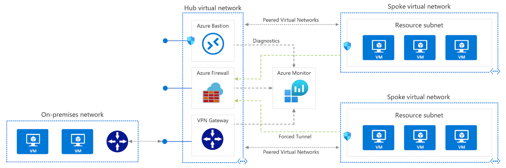

 

 

***Benefit of this topology***

 

\- Cost savings by centralizing services that can be shared by multiple
workloads, such as network virtual appliances (NVAs) and DNS servers

\- Overcome subscriptions limits by peering virtual networks from
different subscriptions to the central hub

\- Separation of concerns between central IT (SecOps, InfraOps) and
workloads (DevOps)

\- Workloads located in spoke virtual networks don’t require
connectivity to each other, make access to shared services

 

Create Firewall Rules

 

By default, Azure Firewall blocks all traffic, unless you enable it.

 

***NAT Rule***

 

\- Destination Network Address Translation (DNAT) to translate and
filter inbound traffic to your subnets by publishing SSH, RDP, or
non-HTTP/S applications to the Internet.

\- A NAT rule that routes traffic must be accompanied by a matching
network rule to allow the traffic

\- Name, protocol, source address, Destination address: The external
address of the firewall, Destination port: The TCP or UDP ports that the
rule will listen, Translated Address: The IP address of the service
(virtual machine, internal load balancer, and so on) that privately
hosts, Translated Port: The port that the inbound traffic will be routed

 

***Network Rule***

 

\- When non-HTTP/S traffic that will be allowed to flow through the
firewall. For example, resources in one subnet must communicate with
resources in another subnet

\- Name, Protocol: TCP, UDP, ICMP (ping and traceroute) or Any, Source
Address, Destination Address, Destination ports

 

***Application Rule***

 

\- Application rules define fully qualified domain names (FQDNs) that
can be accessed from a subnet. For example, specify the Windows Update
network traffic through the firewall.

\- Name, Source Addresses, Protocol: HTTP/HTTPS, Port that web server is
listening on, Target FQDNs: The domain name of the service or wildcard,
An FQDN tag represents a group of FQDNs associated.

 

***Precedence of rule processing***

 

The rules are processed in this order:

1\. Network Rules

2\. Application Rules (network and application)

 

Once a rule is found that allows the traffic through, no more rules are
checked.

 

**Azure Firewall DNS proxy** is an option to meet this DNS forwarding
requirement, applicable with a hub-and-spoke model. To do this,
configure your on-premises DNS server to conditionally forward requests
to Azure Firewall for the required zone name. Ensure that your private
DNS zone is linked to the Virtual Network within which the Azure
Firewall resides. Configure Azure Firewall to use the default Azure DNS
for lookups, and enable DNS proxy in Azure Firewall DNS settings.

 

Azure Firewall with Standard SKU is recommended for customers looking
for Layer 3–Layer 7 firewall and needs autoscaling to handle peak
traffic periods of up to 30 Gbps. It supports enterprise features like
threat intelligence, DNS proxy, custom DNS, and web categories.

 

 

**Configure Load Balancing**

 

**Azure Load Balancer**

 

The Azure Load Balancer delivers high availability and scalable network
performance to your applications.

 

\- distribute incoming network traffic across a group of back-end
resources or services such as virtual machines (VMs) using
load-balancing rules and health probes, it is about Layer 4 load
balancing

\- Support inbound and outbound scenarios scaling your applications
while maintaining throughput and keeping response times low

\- Load balancers use a hash-based distribution algorithm

\- you can use availability sets ( SLA - 99.95%, Protection from
hardware failures within datacenters) and availability zones( SLA-
99.99%, Protection from entire datacenter failure) to ensure that
virtual machines are always available

\- A standard load balancer is required for HA ports

 

**Distribution mode**

 

By default, Azure Load Balancer distributes network traffic equally
among virtual machine instances.

 

***Five-Tuple hash***

 

\- The default distribution mode for Load Balancer

\- The tuple is composed of source IP, source port, destination IP,
destination port, and protocol type

\- The source port is included in the hash and the source port changes
for each session, clients might be directed to a different virtual
machine for each session.

 

***Source IP affinity***

 

\- also known as session affinity or client IP affinity

\- To map traffic to the available servers, the source IP affinity mode
uses a ***two-tuple hash*** (from the source IP address and destination
IP address) or a ***three-tuple hash*** (from the source IP address,
destination IP address, and protocol type)

\- The hash ensures that requests from a specific client are always sent
to the same virtual machine behind the load balancer.

\- Use source IP affinity for load balancing with your Remote Desktop
gateway service

\- Use source IP affinity for media upload where TCP and UDP connections
to different destination IP addresses, media upload won’t be
successfully completed

 

Set distribution mode;

 

\$lb = Get-AzLoadBalancer -Name MyLb -ResourceGroupName MyResourceGroup

\$lb.LoadBalancingRules\[0\].LoadDistribution = 'sourceIp'

Set-AzLoadBalancer -LoadBalancer \$lb

 

Change the value for Session persistence to Client IP.

 

 

Load-balancing rules determine how traffic is distributed to the backend

Health probes ensure the resources in the backend are healthy

 

\- The Load Balancer can be used for inbound and outbound scenarios and
scales up to millions of TCP and UDP application flows

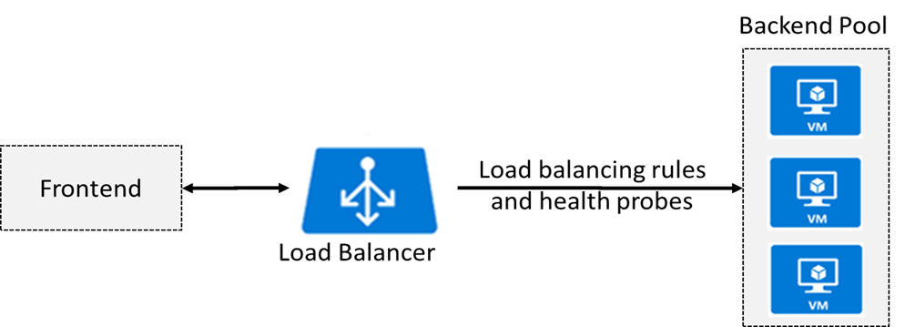

 

 

**Public load balancer(External load balancer)**

 

\- A public load balancer maps the public IP address and port number of
incoming traffic from clients in internet to the private IP address and
port number of the VM.

\- The traffic might come from browsers, mobile apps, or other sources.

\- Mapping is also provided for the response traffic from the VM.

\- Load balancer and the public IP address SKU must match when you use
them with public IP addresses. Only Basic SKU IPs work with the Basic
SKU load balancer and only Standard SKU IPs work with Standard SKU load
balancers.

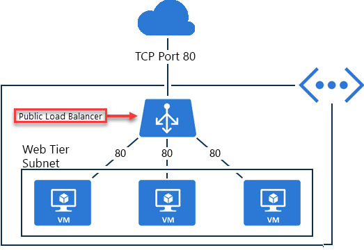

 

\- You can configure Azure Load Balancer by using the Azure portal,
PowerShell, or the Azure CLI

 

**Create load balancer**

 

\- Create a new public IP address

 

az network public-ip create \\

--resource-group \[sandbox resource group name\] \\

--allocation-method Static \\

--name myPublicIP

 

\- Create the load balancer

 

az network lb create \\

--resource-group \[sandbox resource group name\] \\

--name myLoadBalancer \\

--public-ip-address myPublicIP \\

--frontend-ip-name myFrontEndPool \\

--backend-pool-name myBackEndPool

 

\- To monitor status of VM servers, create a health probe. The health
probe dynamically adds or removes VMs from the load balancer rotation
based on their response to health checks

 

az network lb probe create \\

--resource-group \[sandbox resource group name\] \\

--lb-name myLoadBalancer \\

--name myHealthProbe \\

--protocol tcp \\

--port 80

 

\- a load balancer rule that's used to define how traffic is distributed
to the VMs. You define the front-end IP configuration for the incoming
traffic and the back-end IP pool to receive the traffic, along with the
required source and destination port. To make sure only healthy VMs
receive traffic, you also define the health probe to use

 

az network lb rule create \\

--resource-group \[sandbox resource group name\] \\

--lb-name myLoadBalancer \\

--name myHTTPRule \\

--protocol tcp \\

--frontend-port 80 \\

--backend-port 80 \\

--frontend-ip-name myFrontEndPool \\

--backend-pool-name myBackEndPool \\

--probe-name myHealthProbe

 

\- Connect the VMs to the back-end pool by updating the network
interfaces you created in the script

 

**Internal Load Balancer**

 

\- directs traffic to resources that are inside a virtual network or
that use a VPN to access Azure infrastructure

\- Frontend IP addresses and virtual networks are never directly exposed
to an internet endpoint

\- Assign a private IP address instead of a public IP address for the
front end of the load balancer.

\- Place the internal load balancer in the protected virtual network

\- Load balancing from VMs in the virtual network to a set of VMs that
reside within the same virtual network.For example, an internal load
balancer could receive database requests that need to be distributed to
backend SQL servers.

\- Load balancing from on-premises computers to set of VMs in virtual
network

\- Load balancing for internet-facing multi-tier applications where the
backend tiers are not internet-facing. In this case, A public load
balancer could be placed in front of the internal load balancer to
create a multi-tier application.

\- Load balancing for line-of-business applications that are hosted in
Azure where on-premise server traffic is load balanced

\- You can use the default distribution mode of a five-tuple hash and
don’t need to use source IP affinity

 

Basic Load Balancer: Backend pool endpoints for Virtual machines in a
single availability set or virtual machine scale set.

 

**Load balancer SKUs**

 

\- The load balancer supports both Basic and Standard SKUs, each
differing in scenario scale, features, and pricing

\- Standard load balancer has granular feature set over Basic Load
Balancer

\- When you create LB instance, it includes Name, Region,
Type(Internal/Public), SKU(Basic/Standard), Virtual network name,
subnet, IP address assignment (Static/Dynamic)

\- The Basic SKU can be upgraded to the Standard SKU, but Standard
should use for new design

\- For the Standard SKU you can connect to an Availability set, multiple
virtual machine, or a virtual machine scale set

 

Basic load balancers allow:

 

\- Port forwarding

\- Automatic reconfiguration

\- Health probes

\- Outbound connections through source network address translation
(SNAT)

\- Diagnostics through Azure Log Analytics for public-facing load
balancers

\- can be used only with availability sets.

\- For the Basic SKU you can connect to an Availability set, single
virtual machine, or a virtual machine scale set. If you have multiple
virtual machines in backends, they should be part of either an
Availability set or a virtual machine scale set

 

Standard load balancers support all of the basic features with:

 

\- HTTPS health probes

\- Availability zones

\- Diagnostics through Azure Monitor, for multidimensional metrics

\- High availability (HA) ports

\- Outbound rules

\- A guaranteed SLA (99.99% for two or more virtual machines)

\- For the Standard SKU you can connect to an Availability set, multiple
virtual machine, or a virtual machine scale set

-Standard Load Balancer is secure by default

 

***SKUs capabilities***

 

\- Instance count in backend pool(300/1000)

\- Health probes(HTTP,TCP/ HTTPS,HTTP,TCP)

\- Availability zone

\- Multiple front ends(Inbound/Outbound)

\- Secure by default (whether implement NSG)

\- SLA(none/99.99%)

 

**Backend pool**

 

\- a back-end address pool contains the IP addresses of the virtual NICs
that are connected to the load balancer in order to distribute traffic

\- Backend pool endpoint includes a blend of virtual machines,
availability sets, and virtual machine scale sets

\- When you create backend pool, it includes Name, associated to(
Unassociated, single virtual machines, availability sets, and virtual
machine scale sets)

\- Before backend pool or VM connect to LB, create NSG and assign it to
backend pool or VM

-NSG on subnet or NIC of virtual machines is required to allow traffic
from internet when standard load balancer is used, NSG does not need for
basic load balancer

 

**Load balancing rule**

 

\- The rule maps a given frontend IP and port combination to a set of
backend IP addresses and port combination

\- Before configuring the rule, create the frontend, backend pool, and
health probe

\- When you add load balancing rule, it includes Name, IP
version(IPV4/IPV6), Frontend IP address(you should create first),
Protocol(TCP/UDP), Port, Backend port, backend pool(you should create
first), Health probe, Session persistence, Idle timeout(minutes),
Floating IP(direct server return)

\- you could use NAT rule from the load balancer’s public address to TCP
3389 on a specific virtual machine

 

Azure PowerShell;

 

New-AzureRmLoadBalancerRuleConfig

 

**Session persistence**

 

\- By default, Azure Load Balancer distributes network traffic equally
among multiple VM instances.

\- LB uses a five-tuple (source IP, source port, destination IP,
destination port, and protocol type) hash to map traffic to available
servers

\- Session persistence specifies how traffic from a client should be
handled

 

None (default) specifies any virtual machine can handle the request.

Client IP specifies that successive requests from the same client IP
address will be handled by the same virtual machine.

Client IP and protocol specifies that successive requests from the same
client IP address and protocol combination will be handled by the same
virtual machine.

 

**Floating IP**

 

Some application scenarios prefer or require the same port to be used by
multiple application instances on a single VM in the backend pool.
Common examples of port reuse include:

\- clustering for high availability

\- network virtual appliances

\- exposing multiple TLS endpoints without re-encryption.

 

If you want to reuse same backend port across multiple rules, you must
enable Floating IP in the rule definition.

 

When Floating IP is enabled, Azure changes the IP address mapping to the
Frontend IP address of the Load Balancer instead of backend instance's
IP.

 

To configure Azure internal load balancer as a listener for availability
group.

 

Floating IP" is Azure's terminology for a portion of what is known as
Direct Server Return (DSR). DSR consists of two parts: a flow topology
and an IP address mapping scheme. At a platform level, Azure Load
Balancer always operates in a DSR flow topology regardless of whether
Floating IP is enabled or not. This means that the outbound part of a
flow is always correctly rewritten to flow directly back to the origin.

 

**Health probe**

 

\- allows the load balancer to monitor the status of your app

\- The health probe dynamically adds or removes VMs from the load
balancer rotation based on their response to health checks

\- When a probe fails to respond, the load balancer stops sending new
connections to the unhealthy instances

\- two main ways to configure health probes HTTP and TCP

\- When you add health probe, it specifies Name, Protocol, Port, Path,
Interval(seconds), Unhealthy threshold(consecutive failures)

\- There is also a guest agent probe where the probe uses the guest
agent inside the VM. It is not recommended when HTTP or TCP custom probe
configurations are possible

 

The Load Balancer backend pool VMs may not be responding to the probes
due to any of the following reasons: -

 

Load Balancer backend pool VM is unhealthy.

Load Balancer backend pool VM is not listening on the probe port

Firewall, or a network security group is blocking the port on the Load
Balancer backend pool VMs

Other misconfigurations in Load Balancer.

 

***HTTP custom probe***

 

\- The load balancer regularly probes your endpoint every 15 seconds, by
default

\- The instance is healthy if it responds with an HTTP 200 within the
timeout period default of 31 seconds

\- Any status other than HTTP 200 causes the probe to fail

\- specify the port (Port), the URI for requesting the health status
from the backend (URI), amount of time between probe attempts
(Interval), and the number of failures that must occur for the instance
to be considered unhealthy (Unhealthy threshold)

 

***TCP custom probe***

 

\- This probe relies on establishing a successful TCP session to a
defined probe port

\- If the specified listener on the VM exists, the probe succeeds. If
the connection is refused, the probe fails

\- You can specify the Port, Interval, and Unhealthy threshold

 

\*\*VM in the backend pool automatically gets the front end IP address
of public load balancer once backend pool configures on load balancer

 

 

**Azure Application Gateway**

 

This service is an application layer load balancer that is used to
distribute traffic to web applications.

 

\- Uses application layer routing to route traffic to a pool of web
servers based on the URL of a request

\- The back-end pool can include Azure virtual machines, Azure virtual
machine scale sets, Azure App Service, and even on-premises servers.

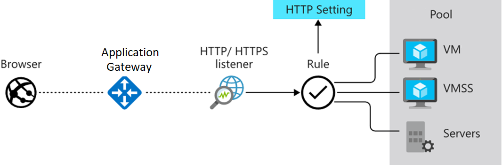

 

\- uses round robin to send load balance requests to the servers in each
back-end pool.

-Enable ***session persistence*** is also known session affinity, source
IP affinity, or client IP affinity which allows to ensure client
requests in the same session are routed to the same back-end server. If
the state of the user session is stored on the server, then this can be
a useful feature

\- Load balancing requests use routing parameters such as hostname and
path using application gateway rule

\- Support for the HTTP, HTTPS, HTTP/2 and WebSocket protocols

\- Enabling ***Web Application Firewall*** protects against web
application vulnerabilities such OWASP attacks

\- Support end-to-end request encryption (***SSL/TLS termination***).
The request to the backend pool resources can go unencrypted, the
decryption of requests can be done by the application gateway instead
performing decrypting request by backend pool to avoid the burden of
backend pool

\- ***Autoscaling***, to dynamically scale capacity as your web traffic
load patterns change with demand.

-You can also distribute the deployment of the Application Gateway
across multiple zones to ensure better availability of the Azure
Application Gateway service

-Application gateway is created ***on a dedicated subnet*** in virtual
network

 

**Create Application gateway**

 

Basic - Subscription, Resource group, Application gateway name, Region,
Tier(Standard V2, WAF V2), Enable autoscaling, Minimum instance count,
Maximum instance count, Availability zone, Virtual network(create a
virtual network and dedicated subnet)

 

Frontends - Frontend IP address type(Public, Private, Both), Choose the
IP address based on the Frontend IP address type(Name, SKU, Assessment,
Availability zone)

 

Backends - Add backend pool with Name and backend targets ; Target
type(IP address or FQDN, Virtual Machine, VMSS, App service)

 

Configuration : Create a routing rule with Listener and backend
targets(backend target, backend settings)

 

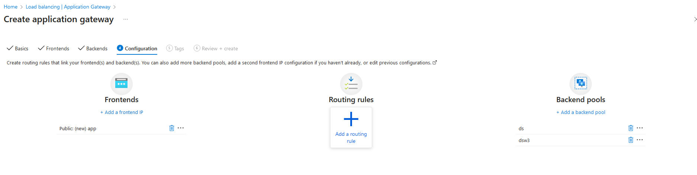

 

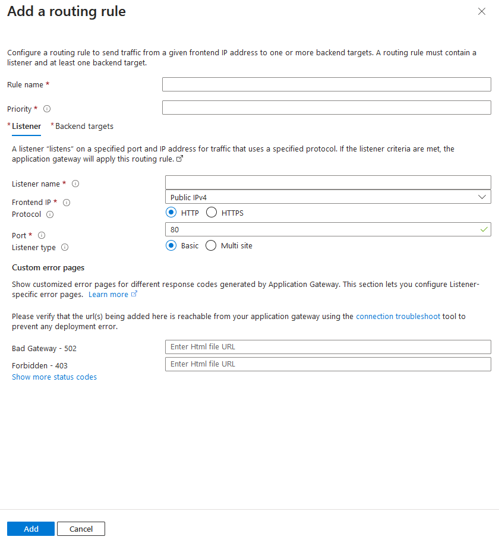

 

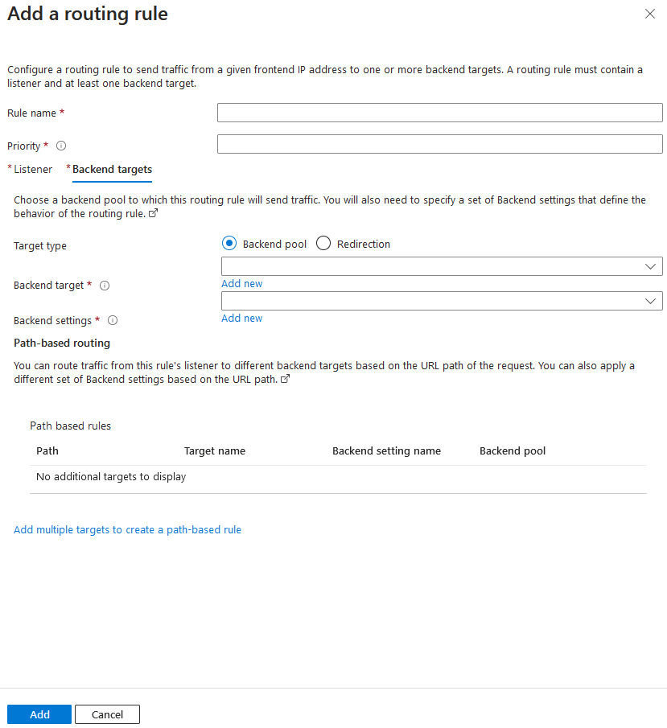

Application gateway currently have seven metrics to view performance
counters.

 

1\. Total requests

2\. Failed requests

3\. Current connections

4\. Healthy host count

5\. Response status

6\. Throughput

7\. Unhealthy host count

 

 

**Application gateway routing**

 

The gateway routes requests to a selected web server in the back-end
pool, using a set of rules. There are two primary methods of routing
traffic as follows.

 

***URL Path-based routing***

 

\- sends requests with different URL paths different pools of back-end
servers

 

path /video/\*- to pool of servers that handle video streaming

path /images/\* - to a pool of servers that handle image retrieval

 

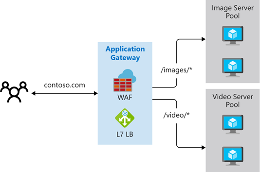

 

***Multiple site routing***

 

\- configures more than one web application on the same application
gateway instance

\- register multiple DNS names (CNAMEs) for the IP address of the
Application Gateway, specifying the name of each site

\- uses separate listeners to wait for requests for each site and passes
the requests to a servers in different backend pool

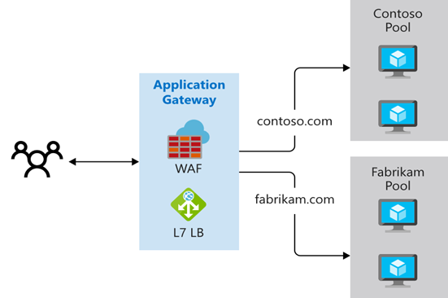

 

 

\- Supports for multi-tenant applications, where each tenant has its own
set of virtual machines and other resources hosting a web application

 

Redirection can be used to another site, or from HTTP to HTTPS

 

***Rewrite HTTP headers***. HTTP headers allow the client and server to
pass parameter information with the request or the response.

 

***Custom error pages.*** Application Gateway allows you to create
custom error pages with own branding and layout instead of displaying
default error pages.

 

**Application gateway components**

 

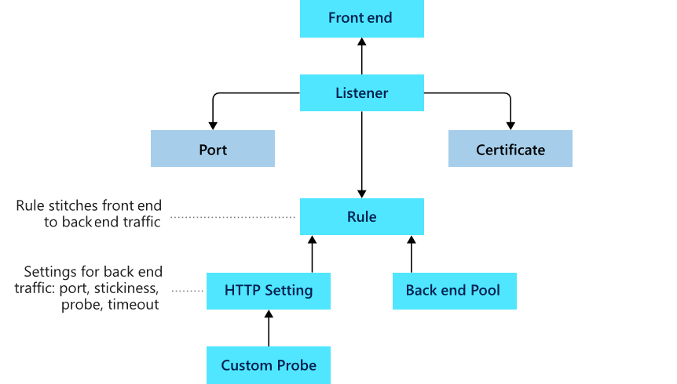

 

***Front-end IP address***

 

\- Client requests will hit the front-end IP address

\- can configure Application Gateway to have a public IP address, a
private IP address, or both

\- However, can't have more than one public and one private IP address

 

***Listeners***

 

-A logical entity that checks for incoming connection requests

\- uses one or more listeners to receive incoming requests and accepts
traffic arriving on a specified combination of protocol, port, host, and
IP address

\- Each listener routes requests to a back-end pool of servers following
routing rules that you specify

\- A listener can be Basic or Multi-site

\- ***Basic listener*** only routes a request based on the path in the
URL and attaches to single domain site

\- ***Multi-site listener*** can also route requests using the hostname
element of the URL and attaches to multiple domain site

\- handle TLS/SSL certificates for securing your application between the
user and Application Gateway

 

***Routing rules***

 

-To route traffic from the listener to the backend pool

\- A rule specifies how to interpret the hostname and path elements in
the URL of a request, and then direct the request to the appropriate
back-end pool

-There are 2 types of routing rules

\-***Basic routing*** rules routes to backend pool directly

\-***Path-based routing*** rules routes to backend pool based on the URL
in the request

\- A routing rule is associated with HTTP settings which indicates how
traffic is encrypted between application gateway and backend servers

\- Other configuration information are Protocol, Session stickiness,
Connection draining, Request timeout period, and Health probes.

 

***Back-end pools***

 

\- Fixed collection of Network Interface Cards or virtual machines, a
virtual machine scale-set, public or internal IP address, FQDN or
backends such as Azure App Services, or a collection of on-premises
servers

\- provide the IP address of each web server and the port on which it
listens for requests when configuring the pool

\- Each back-end pool has an associated load balancer that distributes
work across the pool

 

***Health Probes***

 

\- monitor and determine health of servers that are available for
load-balancing in a back-end pool

\- When the server returns an HTTP response with a status code between
200 and 399, the server is considered healthy

\- Application Gateway creates a default probe that waits for 30 seconds
before deciding that a server is unavailable

 

***Rewrite HTTP header and URL***

 

\- can translate URLs, query string parameters as well as modify request
and response headers

\- allows you to add conditions to ensure that the URL or the specified
headers are rewritten only

\- when certain conditions are met

\- HTTP header and URL rewrite features are only available for the
Application Gateway v2 SKU

 

\- You can apply as many WAF policies as you like to both App gateway
or/and listeners and/or path-based routing rule.

\- If you want to apply the same policy to all or some listeners than
you apply it at the Global level in this case the Application Gateway

\- If you want to apply specific policy to certain website than apply to
specific listener of that web site and the rest can be applied globally
i.e. to application gateway

\- This is where you need to pay attention, the Global Policy i.e.
policy applied to Application Gateway will only IMPACT /EFFECT the
listeners that DO NOT have any specific policy applied to them BUT if a
listener has policy applied to it, it will take affect and the Global
one will NOT apply to this listener

 

**Azure Web Application Firewall (WAF)**

 

-You can enable WAF tier on existing Application gateway and create WAF
policy using managed rule or custom rule, the associate the WAF policy
with application gateway and listeners

\- The malicious actor’s probe will continue finding potential
vulnerabilities on the app throughout lifetime of the app

\- optional component that handles incoming requests before they reach a
listener

\- checks each request for many common exploits, based on the Open Web
Application Security Project (OWASP) as well as from bots, crawlers and
scanners

\- Common threats include SQL-injection, Cross-site scripting(XSS),
Command injection, HTTP request smuggling, HTTP response splitting,
Remote file inclusion, Bots, crawlers, and scanners, and HTTP protocol
violations and anomalies

\- OWASP has defined a set of generic rules for detecting attacks which
is referred as ***Core Rule Set (CRS)***. The rule sets are under
continuous review under Microsoft team as attacks evolve in
sophistication. These rules are automatically updated to ensure all the
latest threats are included in the rules

\- WAF supports two rule sets, CRS 2.2.9 and CRS 3.0.L is the default
and more recent of these rule sets. If necessary, you can opt to select
only specific rules in a rule set, targeting certain threats. The CRS 3
rule sets are a big improvement over CRS 2 because they reduce false
positives by more than 90 percent and include many new exploits.

\- You can't modify or delete the managed rules offered by Azure Web
Application Firewall. However, if a particular rule is problematic for
your environment—for example, it blocks legitimate traffic to your web
app, you can disable the rule.

\- can customize the firewall to specify which elements in a request to
examine, and limit the size of messages to prevent massive uploads from
overwhelming your servers.

\- WAF is enabled on your Application Gateway by selecting the WAF tier
when you create a gateway

 

Modes. Azure Web Application Firewall can operate in one of two modes:
detection mode only logs requests that violate a rule, while prevention
mode both logs and blocks requests that violate a rule

 

 

Exclusion lists. You can configure Azure Web Application Firewall to
ignore specific attributes when it checks requests.

 

Policies. You can combine a set of managed rules, custom rules,
exclusions, and other Azure Web Application Firewall settings into a
single element called an Azure Web Application Firewall policy.

 

 

You can apply as many WAF policies as you like to both App gateway
or/and listeners and/or path-based routing rule

 

. • If you want to apply the same policy to all or some listeners than
you apply it at the Global level in this case the Application Gateway

 

• If you want to apply specific policy to certain website than apply to
specific listener of that web site and the rest can be applied globally
i.e. to application gateway

 

• This is where you need to pay attention, the Global Policy i.e. policy
applied to Application Gateway will only IMPACT /EFFECT the listeners
that DO NOT have any specific policy applied to them BUT if a listener
has policy applied to it, it will take affect and the Global one will
NOT apply to this listener

 

Request size limits. You can configure Azure Web Application Firewall to
flag requests that are either too small or too large.

 

***Deployment options***

 

\- When you create your Azure Web Application Firewall policy, you
associate it with an existing Azure Front Door profile.

\- You can choose a Web Application Firewall tier when you create your
application gateway.

 

When to use Azure WAF;

\- You have web apps that contain sensitive or proprietary data.

\- You have web apps that require users to sign in.

\- Your web app developers lack security expertise and priorities

\- You have web app development budget and time constraints.

 

Monitor and troubleshoot virtual networking

 

Integrate on-premise networks with an Azure virtual networks

 

| **Azure Application Gateway** | **Azure load balancer** |
|----|----|
| Route the traffic to backend based on application layer data | Route the traffic to backend based on network layer data |
| Slower as it processes data from physical layer to application layer | Much faster as it processes data from physical layer to network layer |
| More intelligent |   |

 

 

**Azure VPN gateway**

 

A VPN gateway is a specific type of virtual network gateway that is used
to send encrypted traffic between an Azure virtual network and an
on-premises location over the public Internet.

 

\- use a VPN gateway to send encrypted traffic between Azure virtual
networks over the Microsoft network

\- Each virtual network can have only one VPN gateway

\- can create multiple connections to the same VPN gateway where all VPN
tunnels share the available gateway bandwidth

\- When a virtual network getaway creates two or more VMs that are
deployed to a specific subnet that called the gateway subnet.

\- Virtual network gateway VMs contain routing tables and run specific
gateway services

\- VPN gateways can be deployed in Azure Availability Zones by
physically and logically separating gateways within a region, while
protecting your on-premises network connectivity to Azure from
zone-level failures

\- Creating a virtual network gateway can take up to 45 minutes to
complete

 

Create site-to-site connections

 

These steps should follow for Vnet-to-Vnet and site-to-site connection.

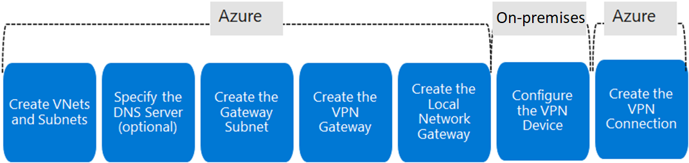

 

 

Create VNets and Subnets : plan IP address for virtual network as if
duplicate address doesn’t exist either sides

 

Specify the DNS server(optional): if you need name resolution for
resources that are deployed to your virtual network

 

Create the gateway subnet :

 

\- Before creating a virtual network gateway for your virtual network,
you first need to create the gateway subnet with suitable CIDR block.

\- When you create your gateway subnet, gateway VMs are deployed to the
gateway subnet and configured with the required VPN gateway settings.

\- Never deploy other resources to the gateway subnet

\- The gateway subnet must be named GatewaySubnet

\- When you create gateway subnet, Subnet address range, NAT gateway,
Routing table, service endpoints(create service endpoint policies to
allow traffic to specific azure resources from your virtual network),
subnet delegation are specified

 

Create VPN gateway:

 

The VPN gateway settings includes;

1\. Name

2\. Region

3\. Gateway type(VPN or ExpressRoute)

4\. VPN type(Route-based or Policy-based)

5\. SKU(Basic, VpnGw1, VpnGw4, VpnGw5)

6\. Generation(Generation1 or Generation2 )

7\. Virtual network( list of VNets created in subscription)

8\. Enable active-active mode

9\. Configure BGP ASN

 

 

\- A virtual network cannot be associated with more than one gateway.

\- can view the IP address assigned to the gateway

\- The gateway should appear as a connected device

 

Every Azure VPN gateway consists of two instance in an active-standby
configuration. For any planned maintenance and unplanned interruption
that happen on active instance, standby instance would failover
automatically and resume S2S VPN and Vnet-to-Vnet connection.

 

 

Determine the VPN type

 

\- choose depends on the connection topology that you want to create

\- Type of VPN depends on make and model of your VPN device.

\- Once a virtual network gateway has been created, you can't change the
VPN type.

 

Route-based VPN

 

\- use routes in the IP forwarding or routing table to direct packets
into their corresponding tunnel interfaces

\- It is typically built on router platform where each IPSec tunnel is
modeled as network interface or VTI(virtual tunnel interface)

\- The tunnel interfaces then encrypt or decrypt the packets in and out
of the tunnel

\- scenarios include point-to-site, inter-virtual network, or multiple
site-to-site connections

\- Route-based is also selected when you coexist with an ExpressRoute
gateway or if you need to use IKEv2

 

Policy-based VPNs

 

\- Policy-based VPN devices use the combinations of prefixes from both
networks to define how encrypt and direct packets through IPsec tunnels
based on the IPsec policies configured

\- It is typically built on firewall device that perform packet
filtering

\- The policy (or traffic selector) is defined as an access list in the
VPN device configuration

\- Can only be used on basic gateway SKUs

\- can have only one tunnel when using a Policy-based VPN

\- can only use Policy-based VPNs for S2S connections, and only for
certain configurations

\- support only IKEv1.

 

SKU

 

\- Select the SKU that satisfies your requirements based on the types of
workloads, throughputs, features, and SLAs

\- SKU affect the number of tunnels you can have in single gateway is
the aggregate throughput benchmark which is S2S and P2S combined.

 

Generation

 

\- You cannot change generations or SKUs across generations

\- Basic and VpnGw1 SKUs are only supported in Generation1

\- VpnGw4 and VpnGw5 SKUs are only supported in Generation2.

 

Create local network gateway

 

\- The local network gateway typically refers to the on-premises
location

\- specify the IP address prefixes or FQDN of the on-premises VPN device
in order to route through VPN gateway

\- It specifies Name, endpoint(IP address/FQDN), IP address(public
address of the local gateway), address space(BGP can also be enabled
with host address of your BGP Peer IP address on your VPN device)

 

Configure on-premises VPN gateway

 

\- validated list of standard VPN devices that work well with the VPN
gateway like Cisco, Juniper, Ubiquiti, and Barracuda Networks

\- To configure your VPN device,

 

A shared key- The same shared key that you specify when creating the VPN
connection.

The public IP address of your VPN gateway

 

Create VPN connection

\- Once VPN gateways are created in Azure and on-premise, we can create
VPN connection between them

\- When create VPN connection, following should specify.

 

Name - name for your connection

Connection type- select site-to-site(IPSEC) from the drop down

Virtual network gateway- select from created VPN gateway

Local network gateway- select from created local network gateway

Shared key (PSK) - the key you use is the same for your on-premises
device and your virtual network gateway connection

 

\- verify the connections either in the portal, or by using PowerShell

 

In P2S VPN, also SSTP and IKEv2 don't support all client devices:

 

SSTP limited to Windows

IKEv2 limited to Mac devices

 

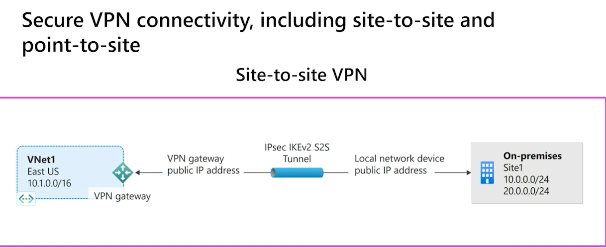

 

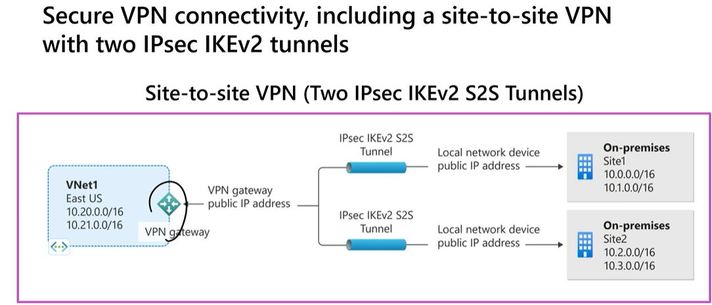

 

 

**Determine high availability**

 

Active/standby

 

\- Every Azure VPN gateway consists of two instances in an
active-standby configuration

\- In planned maintenance or unplanned disruption to active instance,
the standby instance failover automatically and resume the S2S VPN or
VNet-to-VNet connections

\- The switch over will cause a brief interruption

\- For planned maintenance, the connectivity should be restored within
10 to 15 seconds

\- For unplanned issues, the connection recovery will be longer, about 1
minute to 1 and a half minutes

\- For P2S VPN client connections to the gateway, the users will need to
reconnect from the client machines

 

Active/active

 

\- In an active-active configuration, both instances of the gateway VMs
will establish IPSEC/IKE S2S VPN tunnels to your on-premises VPN device
specified in local network gateway and connection

\- Each Azure gateway instance will have a unique public IP address

\- configure your on-premises VPN device to accept or establish two S2S
VPN tunnels

\- Traffic/ TCP and UDP flow between Azure virtual network and
on-premise network will be routed through both tunnels simultaneously

\- When planned and unplanned event happens, tunnel between instance and
VPN device will be disconnected and corresponding routes will be
switched over other active IPSec tunnel

\- From Azure side, switch over will happen automatically on from the
affected instance.

 

Set-AzureRmVirtualNetworkGatewayDefaultSite cmdlet assigns forced
tunneling default site to virtual network gateway. Default site can be
changed later.

 

Forced tunneling provides a way for you to redirect internet-bounding
traffic from Azure VM to on-premise network. This enables you to inspect
and audit traffic before releasing it. Forced tunneling is carried out
by VPN tunnel which requires default site(local gateway) to redirect
traffic.

 

New-AzureRmVirtualNetworkGatewayConnection cmdlet to create site-to-site
VPN connection between virtual network gateway and on-prem VPN device

 

IKEDiagnosticLog = The IKEDiagnosticLog table offers verbose debug
logging for IKE/IPsec. This is very useful to review when
troubleshooting disconnections, or failure to connect VPN scenarios.

 

GatewayDiagnosticLog = Configuration changes are audited in the
GatewayDiagnosticLog table.

 

TunnelDiagnosticLog = The TunnelDiagnosticLog table is very useful to
inspect the historical connectivity statuses of the tunnel.

 

RouteDiagnosticLog = The RouteDiagnosticLog table traces the activity
for statically modified routes or routes received via BGP.

 

P2SDiagnosticLog = The last available table for VPN diagnostics is
P2SDiagnosticLog. This table traces the activity for Point to Site.

 

 

**Azure ExpressRoute**

 

 

\- Azure ExpressRoute lets you extend your on-premises networks over WAN
into the Microsoft cloud

\- The connection is facilitated by a connectivity provider.

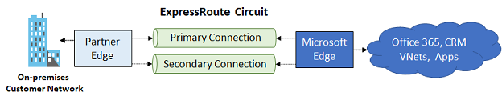

 

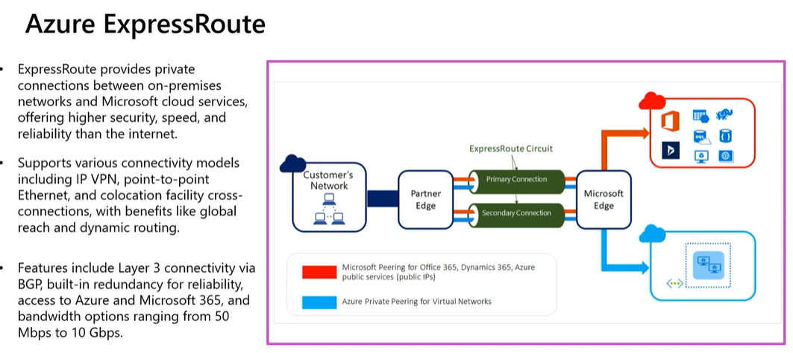

 

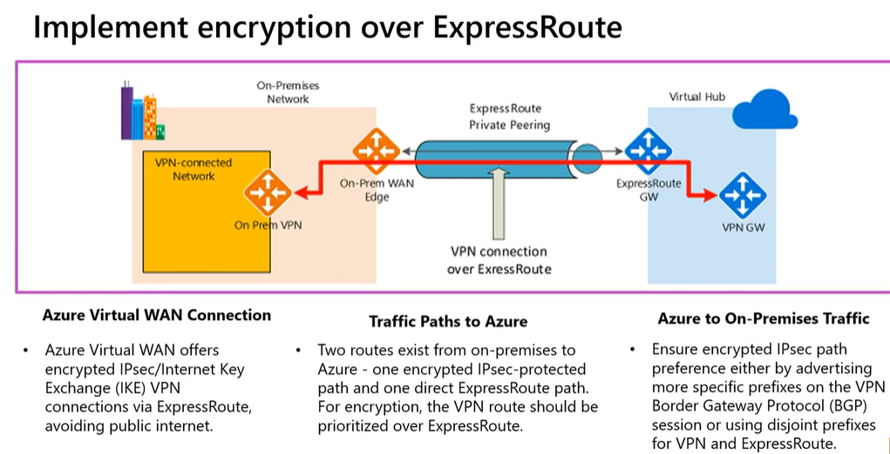

 

\- It offers more reliability, faster speeds, and lower latencies unlike
route over the internet

\- With ExpressRoute, establish connections to Azure at an ExpressRoute
location, such as an Exchange provider facility, or directly connect to
Azure from your existing WAN network such as MPLS VPN that is provided
by a network service provider

\- Cost-effective option for transferring large amounts of data,
periodic data migration, replication for business continuity, and
disaster recovery

\- Build applications that span on-premises infrastructure and Azure
without compromising privacy or performance. For example, run a
corporate intranet application in Azure that authenticates your
customers with an on-premises Active Directory service

\- ExpressRoute is supported across all Azure regions and locations

\- With ExpressRoute, virtual network must be configured as gateway
subnet when connect to on-premise network

 

ExpressRoute locations are where Microsoft peers with several service
providers. When you connected to at least one ExpressRoute location
within the geopolitical region, you will access Azure services across
all regions within a geopolitical region.

 

**ExpressRoute benefits**

 

Layer 3 connectivity- Microsoft uses BGP to exchange routes between your
on-premises network, your instances in Azure, and Microsoft public
addresses. Multiple BGP sessions are created for different traffic
profiles.

 

Redundancy - Each ExpressRoute circuit consists of two BGP connections
to two Microsoft Enterprise edge routers (MSEEs) from the connectivity
provider/your network edge.

 

Connectivity to Microsoft cloud services- ExpressRoute connections
enable access to Microsoft Azure services, Microsoft 365 services, and
Microsoft Dynamics 365

 

Connectivity to all regions within a geopolitical region- For example,
if you connect to Microsoft in Amsterdam through ExpressRoute, you'll
have access to all Microsoft cloud services hosted in Northern and
Western Europe.

 

Global connectivity with ExpressRoute premium add-on- You enable the
ExpressRoute premium add-on feature to extend connectivity across
geopolitical boundaries

 

Across on-premises connectivity with ExpressRoute Global Reach- With
ExpressRoute Global Reach, you can connect your private data centers
together through two ExpressRoute circuits. Your cross-data-center
traffic will traverse through Microsoft's network

 

Bandwidth options- purchase ExpressRoute circuits for a wide range of
bandwidths.

 

Flexible billing models

\- Unlimited data- Billing is based on a monthly fee; all inbound and
outbound data transfer is included free of charge

\- Metered data- Billing is based on a monthly fee; all inbound data
transfer is free of charge. Outbound data transfer is charged per GB of
data transfer

\- ExpressRoute premium add-on- This add-on includes increased routing
table limits, increased number of VNets, global connectivity, and
connections to Microsoft 365 and Dynamics 365

 

Coexist site-to-site and ExpressRoute

\- This is about configure Site-to-Site VPN and ExpressRoute connections
for the same virtual network

\- You configure a Site-to-Site VPN as a secure failover path for
ExpressRoute or use Site-to-Site VPNs to connect to sites that are not
part of your network, but that are connected through ExpressRoute

\- The deployment options for S2S and ExpressRoute coexisting
connections are only possible through PowerShell, and not the Azure
portal.

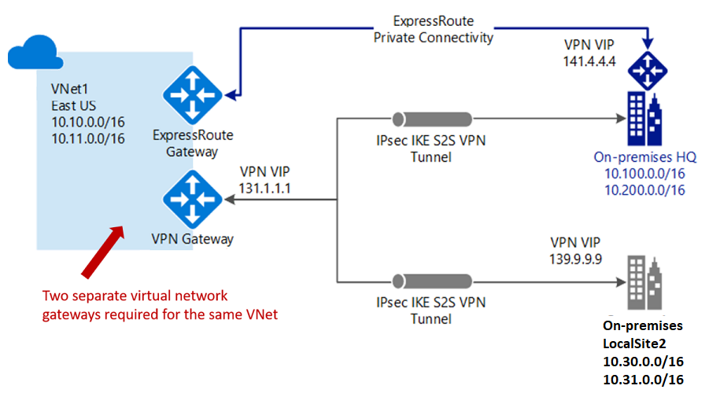

 

ExpressRoute connection models

 

Connectivity providers offer one or more connectivity models.

1\. Colocated at a cloud exchange : Colocation provider’s Ethernet
exchange offers either Layer 2 cross-connections, or managed Layer 3
cross-connections between your infrastructure in the colocation facility
and the Microsoft cloud.

2\. Point-to-point Ethernet Connection : Point-to-point Ethernet
providers offer Layer 2 connections, or managed Layer 3 connections
between your site and the Microsoft cloud.

3\. Any-to-any (IPVPN) Connection: IPVPN providers, typically
Multiprotocol Label Switching (MPLS) VPN, offer any-to-any connectivity
between your branch offices and datacenters as well as managed Layer 3
connectivity

 

ExpressRoute/VPN Gateway coexist configuration requires a larger gateway
subnet than most other configurations. Further more, you may want to
make sure your gateway subnet contains enough IP addresses to
accommodate possible future configurations.

While you can create a gateway subnet as small as /29, we recommend that
you create a gateway subnet of /27 or larger (/27, /26 etc.). If you
plan on connecting 16 ExpressRoute circuits to your gateway, you must
create a gateway subnet of /26 or larger. If you're creating a dual
stack gateway subnet, we recommend that you also use an IPv6 range of
/64 or larger. This set up will accommodate most configurations

 

 

 

 

ExpressRoute local, standard, global offer unlimited data plans.

 

ExpressRoute local: access azure region locally

 

ExpressRoute Standard: access azure multiple regions within a
geopolotical location.

 

ExpressRoute Global: access azure regions globally/all over the world

 

 

ExpressRoute Direct gives you the ability to connect directly into the
Microsoft global network at peering locations strategically distributed
around the world. ExpressRoute Direct provides dual 100-Gbps or 10-Gbps
connectivity, that supports Active/Active connectivity at scale. You can
work with any service provider to set up ExpressRoute Direct.

 

Key features that ExpressRoute Direct provides include, but not limited
to:

\- Large data ingestion into services like Azure Storage and Azure
Cosmos DB.

\- Physical isolation for industries that regulates and require
dedicated or isolated connectivity such as banks, government, and retail
companies.

\- Granular control of circuit distribution based on business unit.

 

 

You can share an ExpressRoute circuit across multiple subscriptions. The
circuit owner is the administrator/coadministrator of the subscription
in which the ExpressRoute circuit is created. The circuit owner can
authorize administrators/coadministrators of other subscriptions,
referred to as circuit users, to use the dedicated circuit that they
own. The Circuit owner creates the authorization code and provides it to
the the circuit user (sub2), circuit user uses the authorization code
and resource ID during the create connection process to be able to
successfully connect via express route circuit

 

1 scale unit of VPN = 500 Mbps

1 scale unit of ExpressRoute = 2 Gbps

 

 

Zone-redundant gateway SKUs

 

 

You can also deploy ExpressRoute gateways in Azure Availability Zones.
This configuration physically and logically separates them into
different Availability Zones, protecting your on-premises network
connectivity to Azure from zone-level failures.

 

 

Zone-redundant gateways use specific new gateway SKUs for ExpressRoute
gateway.

\- ErGw1AZ

\- ErGw2AZ

\- ErGw3AZ

 

The new gateway SKUs also support other deployment options to best match
your needs. When creating a virtual network gateway using the new
gateway SKUs, you can deploy the gateway in a specific zone. This type
of gateway is referred to as a zonal gateway. When you deploy a zonal
gateway, all the instances of the gateway are deployed in the same
Availability Zone.

 

 

FastPath

 

 

ExpressRoute virtual network gateway is designed to exchange network
routes and route network traffic. FastPath is designed to improve the
data path performance between your on-premises network and your virtual
network. When enabled, FastPath sends network traffic directly to
virtual machines in the virtual network, bypassing the gateway.

 

ErGw3Az and Ultra Performance SKU supports FastPath.

 

Virtual network (VNet) Peering FastPath will send traffic directly to
any VM deployed in a virtual network peered to the one connected to
ExpressRoute, bypassing the ExpressRoute virtual network gateway. This
feature is available for both IPv4 and IPv6 connectivity.

 

Azure Virtual WAN

 

Azure Virtual WAN is a networking service that provides optimized and
automated branch connectivity to, and through, Azure with hub and spoke
architecture.

 

\- Azure Virtual WAN and Virtual WAN hubs, used across Azure regions

\- Azure Virtual WAN brings together many Azure cloud connectivity
services such as site-to-site VPN for branches, point-to-site VPN for
remote users, virtual network, and ExpressRoute for main sites into a
single operational interface

\- Enables any-to-any connectivity to workloads distributed globally in
virtual networks.

\- It can see the end-to-end flow within Azure for intuitive
troubleshooting

\- A basic Azure virtual WAN does not support express route. You have to
upgrade to standard.

 

Azure Virtual WAN Hub

\- sophisticated software-defined hub

\- The Virtual WAN hubs can be connected to your branches, virtual
networks, and remote users.

\- Can deploy in any Azure region, but only one per region, per
subscription

\- Multiple hubs are automatically interconnected using hub-to-hub
connectivity through the Azure global network

\- To convert the virtual hub to a secure virtual hub, use Azure
Firewall Manager

\- Supported partners that currently have integration into Azure
Firewall Manager's API to set up security policies

\- By default, all connections are associated to a Default route table
in a virtual hub. Each virtual hub has its own Default route table,
which can be edited to add a static route(s). Routes added statically
take precedence over dynamically learned routes for the same prefixes.

 

Virtual hub router

\- Supports custom route tables for virtual networks

\- Acts as default route table for branches (P2S, S2S, ER)

 

Virtual WAN types

 

\- Basic - Site-to-site VPN only

\- Standard- Full mesh connectivity, ExpressRoute, User VPN (P2S), VPN
(site-to-site), Inter-hub, Virtual Network-to-Virtual Network transiting
through the virtual hub, Azure Firewall, NVA in a virtual WAN

 

A Basic Virtual WAN can be upgraded to a Standard Virtual WAN. A
Standard Virtual WAN cannot be downgraded to a Basic Virtual WAN.

 

Gateway Scale Units: A scale unit is a unit defined to pick an aggregate
throughput of a gateway in Virtual hub.

 

1 scale unit of VPN = 500 Mbps.

1 scale unit of ExpressRoute = 2 Gbps

 

Configuration:

 

1\. Create Azure Virtual WAN

2\. Create Virtual Hub

3\. Create VPN sites

4\. Connect VPN sites to virtual hub

 

 

**Add NSG rule invoking the public IP address**

 

\# Get the public IP address

try {

\$publicIP = (Invoke-WebRequest -Uri
"<http://ifconfig.me/ip>").Content.Trim()

} catch {

Write-Error "Failed to retrieve public IP address."

exit

}

 

\# Azure details

\$resourceGroupName = "USZ-MGMT"

\$nsgName = "USZ-MGMTSRV-nsg"

\$ruleName = "RDP"

 

\# Log in to Azure

try {

Update-AzConfig -EnableLoginByWam \$false

Connect-AzAccount

Set-AzContext -Subscription "74e67324-ebc5-4077-a3ec-d8b50d6d1b65"

} catch {

Write-Error "Failed to authenticate to Azure."

exit

}

 

\# Get the NSG

try {

\$nsg = Get-AzNetworkSecurityGroup -ResourceGroupName
\$resourceGroupName -Name \$nsgName

} catch {

Write-Error "Failed to retrieve NSG."

exit

}

 

\# Find the rule

\$rule = \$nsg.SecurityRules \| Where-Object { \$\_.Name -eq \$ruleName
}

 

if (\$rule -eq \$null) {

Write-Error "Rule \$ruleName not found in NSG \$nsgName."

exit

}

 

\# Check if the IP address already exists

\$existingIPs = \$rule.SourceAddressPrefix

if (\$existingIPs -contains \$publicIP) {

Write-Output "Public IP \$publicIP already exists in NSG rule
\$ruleName."

} else {

\# Append the new IP address to the existing ones

\$ipList = New-Object System.Collections.Generic.List\[string\]

\$existingIPs \| ForEach-Object { \$ipList.Add(\$\_) }

\$ipList.Add(\$publicIP)

\$rule.SourceAddressPrefix = \$ipList

 

\# Update the NSG with the modified rule

try {

Set-AzNetworkSecurityGroup -NetworkSecurityGroup \$nsg

} catch {

Write-Error "Failed to update NSG."

exit

}

 

Write-Output "Public IP \$publicIP has been added to NSG rule
\$ruleName."

}

 

\# Log the public IP with date and time to a text file

\$logFilePath = "C:\RDP\AzureRDPlogfile.txt"

\$logEntry = "\$(Get-Date -Format 'yyyy-MM-dd HH:mm:ss') - \$publicIP"

Add-Content -Path \$logFilePath -Value \$logEntry

 

Write-Output "Public IP \$publicIP has been logged to \$logFilePath"

 

\# Wait for 10 seconds

Start-Sleep -Seconds 10

 

\# Check the connection

\$retryCount = 0

\$maxRetries = 5

\$connectionSuccess = \$false

 

while (\$retryCount -lt \$maxRetries -and -not \$connectionSuccess) {

\$result = Test-NetConnection -ComputerName
"uszermgmtsrv.australiaeast.cloudapp.azure.com" -Port 8426

if (\$result.TcpTestSucceeded) {

\$connectionSuccess = \$true

} else {

\$retryCount++

Start-Sleep -Seconds 5

}

}

 

if (\$connectionSuccess) {

Write-Output "Connection successful. Launching RDP session."

Start-Process "C:\RDP\USZ-MGMTSRV.rdp"

} else {

Write-Error "Connection failed after \$maxRetries attempts. Stopping
script."

exit

}

 

 
